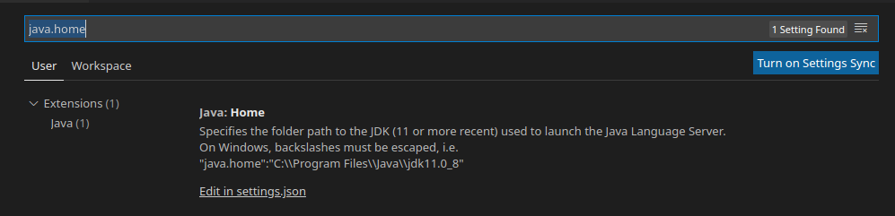
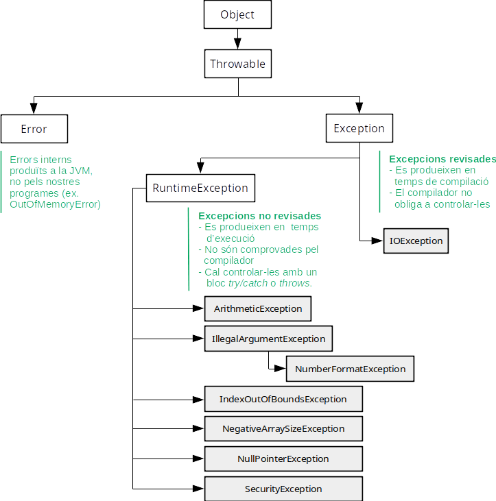
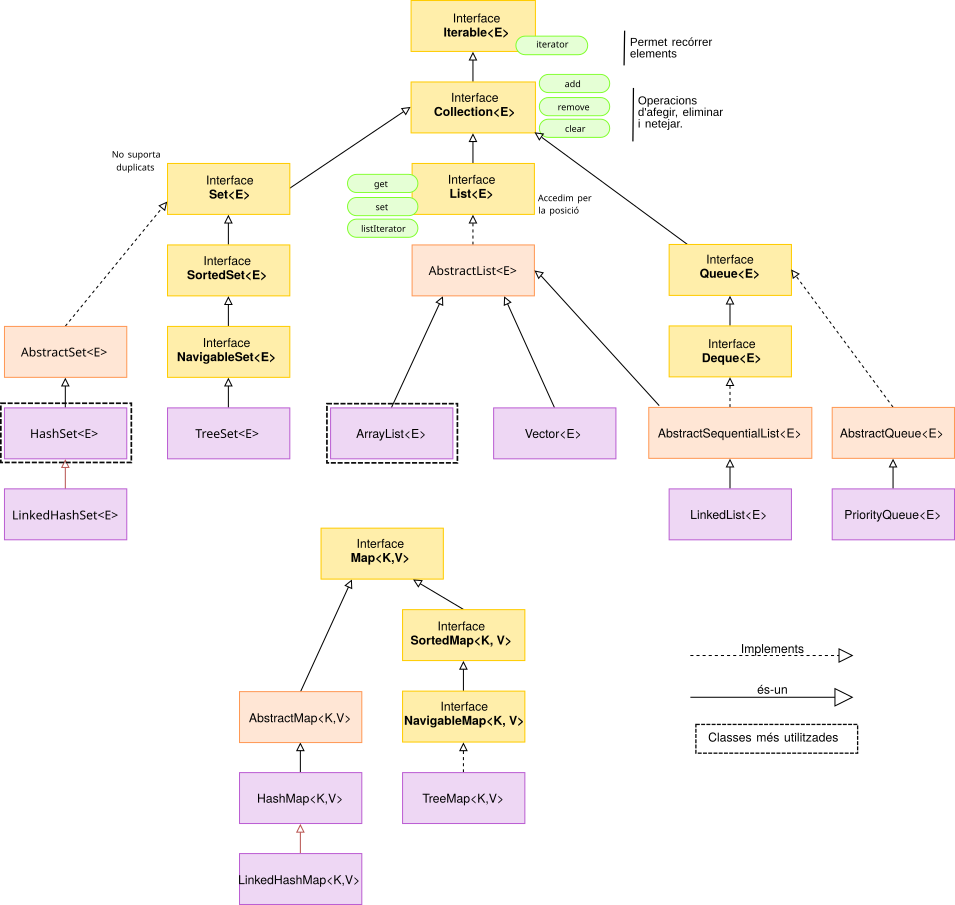
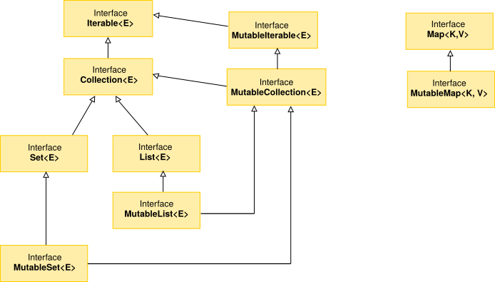

# 1. Introducció a Kotlin

Kotlin és un llenguatge de programació multiplataforma, en el sentit més ample del terme, creat per JetBrains (els creadors dels IDEs IntelliJ Idea i GoLand). 

El seu compilador suporta le generació de codi per a diverses plataformes, entre les que es troba la màquina virtual de Java (JVM) o fins i tot, javascript. El fet de compilar directament sobre JVM, fa que siga totalment compatible amb Java. De fet, va ser adoptat recentment per Google com a llenguatge oficial per a la plataforma Android[^1] 

[^1]:https://apiumhub.com/es/tech-blog-barcelona/por-que-kotlin) i https://www.xatakandroid.com/programacion-android/no-hara-falta-aprender-java-para-programar-android-kotlin-pasa-a-ser-preferido-google

En general, Kotlin presenta els següents avantatges respecte a Java:

* Es tracta d'un llenguatge més concís, pel que s'estalvia codi (evita tant com puga codi innecessari i repetitiu)
* És un llenguatge segur, ja que evita errors a l'hora de programar (com el `NullPointerException`),
* És totalment interoperable amb Java, pel que podem utilitzar llibreries java, Android, etc. fins i tot utilitzar ambdos llenguatges en un mateix projecte.

En aquest document anaem a fer un repàs als conceptes de Java vistos en primer, i una introducció a partir d'estos al llenguatge Kotlin.

## 1.1. Instal·lació de Kotlin

Per tal d'instal·lar el llenguatge Kotlin al nostre sistema, la forma més senzilla és fent ús l'eina *Ubuntu Make* (ordre `umake`), de la següent forma:

```
$ umake kotlin kotlin-lang
```

Açò ens demanarà la contrassenya d'administrador i el path on volem instal·lar-lo. Per omissió, s'instal·la al nostre directori personal `/home/usuari/.local/share/umake/kotlin/kotlin-lang`.

Una vegada instal·lat **cal que eixim de la sessió d'usuari per poder-lo utilitzar**. 

Per utilitzar kotlin, podrem fer-ho de dues formes; la primera amb la shell interactiva, llançant des de la terminal:

```
$ kotlin
Welcome to Kotlin version 1.4.0 (JRE 11.0.8+10-post-Ubuntu-0ubuntu120.04)
Type :help for help, :quit for quit
>>> 
```

Fixeu-vos que us indica la versió de Kotlin i també la del JRE, ja que és l'entorn en què s'executa. En aquesta shell podrem realitzar declaracions i llançar ordres de forma interactiva.

I per altra banda, fent ús del compilador `kotlinc`, per compilar fitxers, i executar-los amb `kotlin`. Ho veurem un poc més avant.

## 1.2. Extensions per a VSCode

Per altra banda, anem a instal·lar les extensions del llenguatge Kotlin per a Visual Studio. Per a això anem a la part d'extensions de la barra esquerra, i busquem l'extensió *Kotlin on VSCode*, que és un pack d'extensions amb el suport per al llenguatge:

{ width=400px }

Recordeu, si no ho teniu instal·lat prèviament que també ens serà d'utilitat el pack d'extensions *Java Extension Pack*, per treballar també amb Java des de VSCode. A més, una vegada instal·lades les extensions de Java, cal que ajustem la variable `java.home`. Per a això necessitarem saber on tenim instal·lada la JVM. Ho podem comprovar amb la variable d'entorn `$JAVA_HOME`:

```
$ echo $JAVA_HOME
/usr/lib/jvm/java-11-openjdk-amd64/
```

Anem a *File* > *Preferences* > *Settings* (o premem `Ctrl+,`), per accedir a la pestanya de preferències, i busquem `java.home` al quadre de cerca. 

{ width=450px }

Fem clic en *Edit in settings.json*, i establim la variable amb el valor que hem obtingut del `$JAVA_HOME` del sistema. Al nostre cas:

```js
   "java.home": "/usr/lib/jvm/java-11-openjdk-amd64/"
```

Una vegada editat, guardem el fitxer i ja ho tindrem tot configurat.

# 2. Estructura i execució d'un programa: Hello World

Recordem l'estructura general d'un programa en Java:

```java
public class hello {
   public static void main(String[] args) {
      System.out.println("Hello, World");
   }
}
```
Recordeu que el nom de la classe ha de ser el mateix que el del fitxer, sense l'extensió java (Fitxer hello.java).

Aquest codi, en Kotlin l'expressaríem així (nomenarem al fitxer `helloworld.kt`):

```kotlin
fun main() {
    println("Hello World")
}
```

Com veiem, les principals diferències són:

* La funció principal (main) es declara com una funció de primer nivell, sense necessitat que estiga dins una classe. Per tant, Kotlin no requereix que tot siguen classes, a diferència de Java, i ens permet treballar com en C o C++, amb funcions.
* Aquesta funció `main` pot rebre arguments, però no és necesasri indicar-ho.
* Tampoc cal indicar la visibilitat de la funció (`public`), ni si és estàtica (`static`).
* La funció `println` la tenim disponible directament, sense passar per `System.out`.
* Els `;` de final de línia són opcionals, i solen evitar-se per convenció

## 2.1. Compilació i execució

Amb java, des de la línia d'ordres, compilem amb:

```shell
$ javac hello.java
```

Aquesta ordre ens crea el fitxer en bytecode hello.class, que executem amb:

```shell
$ java hello
```

De la mateixa manera que amb java, disposem d'una ordre per compilar i altra per executar.

Per compilar el programa, utilitzem l'ordre `kotlinc`:

```bash
$ kotlinc helloworld.kt
```

Amb açò es genera un fitxer bytecode `HelloworldKt.class`. Fixeu-vos que afig la primera lletra en majúscula, i completa el nom de la classe amb Kt. 


Per executar aquest bytecode:

```bash
$ kotlin HelloworldKt
```
Per comprovar que es tracta de bytecode totalment compatible amb Java, podem llançar-lo amb:

```
$ java HelloworldKt
```

## 2.2. Ús d'arguments

Recordem que els arguments amb els què s'invoca el programa esw recullen en un vector d'strings:

```java
/*
Fitxer hello.java
*/

public class hello {
    // Mètode principal
    public static void main(String[] args) {
       if (args.length!=0)
        System.out.println("Hello "+args[0]);
       else
        System.out.println("Hello World");
    }
 }
```

En Kotlin, aquest exemple seria:

```kotlin
/*
Fitxer hello.kt
*/

// funció principal, de primer nivell.
fun main(args: Array<String>) {
    if (args.size>1)
        println("Hello "+args[0])
    else
        println("Hello World")
}
```

Com podem veure, la forma de rebre arguments és lleugerament diferent. Als paràmetres per a les funcions en Kotlin expressem primer el nom i després el tipus. En aquest cas, per indicar que es tracta d'un vector d'Strings ho fem amb `Array<String>`.

Per altra banda, en lloc d'utilitzar la propietat `length` utilitzem `size`, i accedim de la mateixa manera al vector. Per altra banda, el primer `println` podria haver-se expressat també de la següent manera:

```kotlin
println("Hello ${args[0]}")
```

Que recorda una sintaxi més semblant a *Bash*, i fa ús del que es coneixen com *expressions de plantilla*, que veurem més avant.

Per taltra banda, a l'exemple, podeu veure un parell de comentaris. Aquests s'expressen de la mateixa manera, tant en Java com en Kotlin:

```java
// Comentari d'una línia
```

```java
/* 
Comentaris de més d'una línia 
*/
```

## 2.3. Gradle, Java i Kotlin

El sistema d'automatització de construcció de projectes *Gradle* suporta, a més de Java, projectes en Kotlin, així com projectes on es combinen amdós llenguatges.

Per fer un exemple il·lustratiu, anem a fer un projecte Gradle, de tipus aplicció Kotlin, però que també utilitze codi java. Utilitzarem la versió 6.6.1 de Gradle, inclosa a JustiX, i disponible a través dels repositoris del centre.

Per crear el projecte de manera senzilla, farem ús de l'ordre `Gradle init`, en un directori per al projecte anomenat `helloGradle`, que haurem de crear:

```
$ mkdir helloGradle
$ cd helloGradle
helloGradle$ gradle init

Welcome to Gradle 6.6.1!

Here are the highlights of this release:
 - Experimental build configuration caching
 - Built-in conventions for handling credentials
 - Java compilation supports --release flag

For more details see https://docs.gradle.org/6.6.1/release-notes.html

Starting a Gradle Daemon (subsequent builds will be faster)

Select type of project to generate:
  1: basic
  2: application
  3: library
  4: Gradle plugin
Enter selection (default: basic) [1..4] 2
```

Com veiem, ens indica la versió de Gradle, i en primer lloc ens demana el tipus de projecte que volem. Indicarem que volem generar una aplicacio `2: applicaction`.

Tot seguit ens demanarà el llenguatge d'implementació. Triarem `4: Kotlin`.

```
Select implementation language:
  1: C++
  2: Groovy
  3: Java
  4: Kotlin
  5: Swift
Enter selection (default: Java) [1..5] 4
```

I per a l'script de configuració del projecte, tot i que podem utilitzar una notació Kotlin, farem ús de *Groovy*, amb el què ja hem treballat habitualment.

```
Select build script DSL:
  1: Groovy
  2: Kotlin
Enter selection (default: Kotlin) [1..2] 1
```

Ara ens queda per indicar el nom del projecte, on triarem el que ens suggereix per defecte (helloGradle), i com a paquet font, indicarem `com.ieseljust.dam`:

```
Project name (default: helloGradle): 
Source package (default: helloGradle): com.ieseljust.dam 

BUILD SUCCESSFUL in 1m 20s
2 actionable tasks: 2 executed
```

Recordeu que `gradle init` també admet paràmetres per configurar el projecte, de manera que ens podem estalviar l'assistent anterior amb:

```
$ gradle init   --type kotlin-application \ 
                --dsl groovy \
                --project-name helloGradle \
                --package com.ieseljust.dam
```


Amb qualsevol de les dues formes, haurem generat la següent estructura de directoris:

```
helloGradle/
|-- build.gradle
|-- gradle
|   `-- wrapper
|       |-- gradle-wrapper.jar
|       `-- gradle-wrapper.properties
|-- gradlew
|-- gradlew.bat
|-- settings.gradle
`-- src
    |-- main
    |   |-- kotlin
    |   |   `-- com
    |   |       `-- ieseljust
    |   |           `-- dam
    |   |               `-- App.kt
    |   `-- resources
    `-- test
        |-- kotlin
        |   `-- com
        |       `-- ieseljust
        |           `-- dam
        |               `-- AppTest.kt
        `-- resources

```

Com a fitxers i carpetes interessants tenim el fitxer `build.gradle`, amb la configuració del projecte, i la carpeta `src`. Fixeu-vos que ara, dins la carpeta `src/main`, en lloc del directori `java` tenim el directori `kotlin`, amb l'estructura de directoris determinada pel nom del paquet que li hem dit (`com/ieseljust/dam`).

Ens queda per veure el contingut del fitxer de configuració `build.gradle`:

```groovy
/*
 * This file was generated by the Gradle 'init' task.
 *
 * This generated file contains a sample Kotlin application project to get you started.
 */

plugins {
    // Apply the Kotlin JVM plugin to add support for Kotlin.
    id 'org.jetbrains.kotlin.jvm' version '1.3.72'

    // Apply the application plugin to add support for building a CLI application.
    id 'application'
}

repositories {
    // Use jcenter for resolving dependencies.
    // You can declare any Maven/Ivy/file repository here.
    jcenter()
}

dependencies {
    // Align versions of all Kotlin components
    implementation platform('org.jetbrains.kotlin:kotlin-bom')

    // Use the Kotlin JDK 8 standard library.
    implementation 'org.jetbrains.kotlin:kotlin-stdlib-jdk8'

    // Use the Kotlin test library.
    testImplementation 'org.jetbrains.kotlin:kotlin-test'

    // Use the Kotlin JUnit integration.
    testImplementation 'org.jetbrains.kotlin:kotlin-test-junit'
}

application {
    // Define the main class for the application.
    mainClassName = 'com.ieseljust.dam.AppKt'
}

```

Revisem les seccions de què consta aquest fitxer:

* ***plugins***, on s'inclouen els plugins de suport per a Kotlin a la JVM i per generar una aplicació de tipus CLI,
* **repositories**, on s'afigen els repositoris `jcenter()` per defecte. Recordeu que aci podem afegir també els de `mavenCentral()`, igual que als projectes amb Java,
* **depencencies**, on s'inclouen algunes dependències necessàries per a Kotlin i els seus tests, 
* **application**, on s'indica el nom, completament qualificat (amb el prefix del paquet), de **la classe que llançarà l'aplicació: `AppKt`**.

Veiem ara el contingut del fitxer font `App.kt`:

```kotlin
/*
 * This Kotlin source file was generated by the Gradle 'init' task.
 */
package com.ieseljust.dam

class App {
    val greeting: String
        get() {
            return "Hello world."
        }
}

fun main(args: Array<String>) {
    println(App().greeting)
}
```

Com veiem, presenta una sintaxi molt semblant a Java, però amb algunes peculiaritats a destacar:

* S'ha definit la classe `App`, amb un atribut `greeting`, de tipus *String*, i que és definit com un *atribut immutable*. Un *atribut immutable* seria equiparable a una constant en Java, i es defineix amb `val`, mentre que els atributs mutables es definiran amb `var`. A més, hi ha un mètode `get()`, definit a continuació d'aquest atribut, i que és el mètode accessor, per a lectura d'aquest atribut. Com que es tracta d'un atribut només de lectura, només té el mètode `get` i no `set`.
* Es defineix la funció `main`, com a funció de primer nivell, pel que no està definida dins de cap classe. Aquesta funció el que fa és escriure el valor de l'atribut `greeting` d'un objecte de la classe `App`. Veiem alguns detalls d'esta línia que ens poden resultar curiosos:
    * No hem utilitzat l'operador `new` per declarar un objecte de tipus App, sinò que hem utilitzat el nom de la classe com si fos una funció. En Kotlin, l'operador `new` no existeix.
    * Accedim al valor de `greeting` com si estiguérem accedint directament a l'atribut. Tot i que no ho indiquem explícitament, el que està fent Kotlin realment és invocar al mètode `get` associat a aquest atribut.
* Per altra banda, recordem que la classe principal que hem indicat al fitxer `build.gradle` és `com.ieseljust.dam.AppKt`. Aquest fitxer `com/ieseljust/dam/AppKt.class` serà el resultat de la compilació d'aquest fitxer `App.kt`. Però... si la funció main no està dins de cap classe, per què s'indica com a classe principal? Aprofundirem més avant en açò, però de moment, avancem que Kotlin, en fer la compilació per a la JVM, generarà automàticament la classe per nosaltres, per tal que el fitxer *bytecode*  siga compatible totalment amb la JVM.


Ara només ens quedaria veure el resultat de la compilació i execució. Ens situem en l'arrel del projecte, i llancem:

```
$ gradle build
```

La primera vegada que el llancem, veurem que tarda una miqueta a descarregar totes les llibreríes necessàries. 

Si donem una ullada a l'arbre del projecte (`tree`) veurem que genera moltes més coses que quan treballàvem amb Java, ja que necessita tot l'entorn per treballar amb Kotlin des de Gradle. Anem a centrar-nos en part de la carpeta `build`:

```
.
|-- build
|   |-- classes
|   |   `-- kotlin
|   |       |-- main
|   |       |   |-- com
|   |       |   |   `-- ieseljust
|   |       |   |       `-- dam
|   |       |   |           |-- App.class
|   |       |   |           `-- AppKt.class
...
```

Aci veiem que s'han generat dues classes: la classe `App`, que és exactament la classe que hem generat creat al fitxer `App.kt`, i la classe `AppKt.class`, que és la que conté el mètode `main` i si es fixeu, la que es llança des del `build.gradle` (`com.ieseljust.dam.AppKt`). Com hem comentat, és una classe que genera Kotlin automàticament, amb el nom del fitxer sense extensió *App* més la cadena *Kt*.

Ara llancem l'aplicació i veurem que ens mostra el misstge esperat:

```
$ gradle run

> Task :run
Hello world.
```

### Afegint codi Java

Anem a veure ara com afegiríem codi Java a la nostra aplicació. Per a això, anem a eliminar la classe *App* del fitxer *App.kt*, i la definirem en un fitxer Java.

En primer lloc, crearíem el directori `java` dins la carpeta `src/main`, amb l'estructura de directoris del paquet:

```
$ cd src/main
$ mkdir -p src/main/java/com/ieseljust/dam
```

I creem el fitxer `src/main/java/com/ieseljust/dam/App.java` amb:

```java
package com.ieseljust.dam;

public class App {
  public String greeting = "Hola Kotlin, des de Java";

  public String getGreeting() {
    return this.greeting;
  }
}
```

I modifiquem el fitxer `App.kt` amb:

```kotlin
package com.ieseljust.dam

fun main(args: Array<String>) {
    println(App().getGreeting());
}
```

Com que es tracta del mateix `package`, no hem d'importar la classe `App`.

L'estructura de fonts quedaria:

```
src/
|-- main
|   |-- java
|   |   `-- com
|   |       `-- ieseljust
|   |           `-- dam
|   |               `-- App.java
|   |-- kotlin
|   |   `-- com
|   |       `-- ieseljust
|   |           `-- dam
|   |               `-- App.kt

```

Com veiem, dupliquem l'estructura de directoris per a Java i per a Kotlin, duplicitat que també es vorà en les classes que generem en construir el paquet:

```
.
|-- build
|   |-- classes
|   |   |-- java
|   |   |   `-- main
|   |   |       `-- com
|   |   |           `-- ieseljust
|   |   |               `-- dam
|   |   |                   `-- App.class
|   |   `-- kotlin
|   |       |-- main
|   |       |   |-- com
|   |       |   |   `-- ieseljust
|   |       |   |       `-- dam
|   |       |   |           `-- AppKt.class
...
```

I l'execució seria l'esperada:

```
$ gradle run

> Task :run
Hola Kotlin, des de Java
```

A partir del següent apartat, anem a començar a repassar els diferents elements del llenguatge de Java i Kotlin.

# 3. Variables i tipus de dades

## 3.1. Variables i tipus bàsics en Java

Els tipus de dades *primitius* o bàsics en Java són els següents:

* **Lògic**: `Boolean`
* **Caràcter**: `char`
* **Enter**: `byte`, `short`, `int`, `long`
* **Reals**: `float`, `doube`

Com sabem, aquests tipus tenen una classe de cobertura (*wrapper*), que serveix per tractar les dades primitives com objectes (`Integer`, `Float`...)

Per tal de declarar una variable en Java, féiem:

```java
TipusBasic NomVariable;
```

En aquest cas, la variable estaría declarada, però no tindría cap contingut. Si accedim a aquesta variable sense assignar-li un valor obtindriem un error`.

Si volem assignar-li valor directament, podem fer:

```java
TipusBasic NomVariable=valorVariable;
```

Les variables es poden modificar al codi Java. Si volem que una variable siga immutable, és a dir, **per tal de definir una constant** farem ís de la paraula `final` al davant:


```java
final float PI=3.14f;
```
## 3.2. Variables i tipus bàsics en Kotlin

En Kotlin els tipus de dades són classes, de manera que podem accedir a les seues *propietats i funciuns membre* -Recordeu que amb Java per fer açò utilitzem *wrappers*- . Alguns d'aquests tipus, com els números, caràcters o valors lògics poden representar-se de forma especial internament, com a valors primitius en temps d'execució, però tot això de manera transparen a l'usuari.

Per definir valors en Kotlin fem ús de les paraules reservades `var`o `val`:

* Utilitzarem `var` per tal de definir **variables mutables**
* Utilitzarem `val` per tal de definir **variables immutables**, o el que en Java sería **valors constants**.

En general, es recomana utilitzar valors constants sempre que sapiguem que no van a haver de ser modificats, per disposar de major seguretat i rendiment quan treballem en diversos fils d'execució.

Les següents assignacions serien correctes:

```kotlin
val pi = 3.14   // Constant

val modul       // Constant
modul = "PMDM"  // Encara que siga altra línia, és una única assignació

var x = 1       // Valor variable
x=x+1
```

Si ens fixem, veurem que **no hem definit el tipus de les variables**. Kotlin és capaç d'inferir el tipus de les variables a partir dels valors amb les què les inicialitzem, pel que no cal indicar-los explícitament. Només serà necessari indicar el tipus d'una variable si no li donem valor en la declaració. Per tal d'indicar el tipus farem:

```kotlin
var nomVariable: Tipus
```

O bé podem indicar el tipus i donar també valor:

```kotlin
val nomVariable: Tipus = valor
```

Com hem dit, en Kotlin tots els tipus de dades són classes. Totes estes classes descendeixen de la superclasse genèrica `Any`, que podría equiparar-se a la classe `Object` de Java o C#.

### Tipus numèrics

En Kotlin tenim els següents tipus numèrics:

| Tipus | Exemple | Longitud | Conversió al tipus |
|-------|---------|------------|-----------------|
| Byte  |  `val byte: Byte = 8` | 8 bits | `toByte(): Byte` |
| Short | `val short: Short = 16` | 16 bits | `toShort(): Short` |
| Int | `val int: Int = 32`  \newline `val hexadecimal: Int = 0x16` \newline `val binary: Int = 0b101`  | 32 bits | `toInt(): Int` |
! Long | `val long: Long = 64L` | 64 bits | `toLong(): Long` |
| Foat | `val float: Float = 32.0F` | 32 bits | `toFloat(): Float` |
| Double | `val double: Double = 64.0` | 64 bits | `toDouble(): Double` |

La inferència dels tipus quan no els especifiquem, es fa en base als valors que li donem, de manera que podem especificar de forma indirecta el tipus, per exemple:

```kotlin
val myVar=1 //Inferiria el tipus de myVar com a Int
```

```kotlin
val myVar=1L //Inferiria el tipus de myVar com a Long
```

```kotlin
val myVar=1.0 //Inferiria el tipus de myVar com a Double
```

```kotlin
val myVar=1.0F //Inferiria el tipus de myVar com a Float
```

Per altra banda, podem afegir guions baixos (`_`) quan escrivim números per tal que es puguen llegir millor, per exemple:

```kotlin
val milio = 1_000_000
```

### Caràcters

El tipus caràcter a Kotlin es representa amb `char`, i a diferència de Java, no es representa com un número.

Per definir un tipus caràcter fem:

```kotlin
var char:caracter = 'a'
```
I per er la conversió a caràcter, utilitzem:

```kotlin
toChar(): Char
```

Per indicar caràcters epecials, farem ús de seqüències d'escapament, mitjançant la barra invertida: `'\t'`, `'\b'`, `'\n'`, `'\r'`, `'\''`, `'\"'`, `'\\'`, `'\$'`.


## 3.3. Cadenes de caràcters

A Java, les cadenes de caràcters es representen amb la classe `java.lang.String`. 

Per declarar una cadena de caràcters, podem indicar-no directament o creant un instància de la classe *String*:

```java
String cadena="contingut";
String cadena=new String("contingut");
```

En Kotlin la representació de cadenes de caràcters és molt semblant a Java. També s'utilitzen les cometes dobles, i podem escapar caràcters amb la barra invertida `\`.

```kotlin
val cadena="contingut"
val cadena:String="contingut"
```

Alguns dels mètodes interessants per a tractar amb cadenes de caràcters són, en Java i Kotlin:

| Mètode de String en Java | Funció/Propietat membre en Kotlin |
|--------------------------|-------------------------|
| `cadena.concat(cadena2)` |  `cadena1.plus(cadena2)` |
| `cadena.length()` | `cadena.length` |
| `cadena.charAt(pos)` | `cadena[pos]` |
| `cadena.substring(pos_ini[, pos_fy])` | `cadena.substring(pos_ini[, pos_fy])` |
| `cadena.equals(cadena2)` | `cadena.equals(cadena2)` |
| `cadena.startsWith(cadena2)` | `cadena.startsWith(cadena2)` |

A més, per a la concatenació (*concat/plus*) i per a la comparació (*equals*), disposem dels operadors sobrecarregats `+` i `==` respectivament, tant en Java com en Kotlin. També podrem concatenar valors d'altres tipus, sempre que algun element siga una cadena (per exemple: `val cadena="hola"+1`).

### Cadenes sense format o Raw String

Les cadenes sense format es delimiten amb triples cometes, i ens permeten escriure un *String* en diverses línies. Aquestes podran contenir tant noves línies com qualsevol altre caràcter:

```kotlin
val fragment="""
El miedo es el camino hacia el Lado Oscuro;
el miedo lleva a la ira,
la ira lleva al odio,
el odio lleva al sufrimiento.
        
        Maestro Yoda
                    ____
                 _.' :  `._
             .-.'`.  ;   .'`.-.
    __      / : ___\ ;  /___ ; \      __
  ,'_ ""--.:__;".-.";: :".-.":__;.--"" _`,
  :' `.t""--.. '<@.`;_  ',@>` ..--""j.' `;
       `:-.._J '-.-'L__ `-- ' L_..-;'
         "-.__ ;  .-"  "-.  : __.-"
             L ' /.------.\ ' J
              "-.   "--"   .-"
             __.l"-:_JL_;-";.__
"""
```


Amb aquestes cadenes podem utilitzar el mètode `trimMargin()` que elimina els espais en blanc abans del caràcter `|`. Açò ens pot ser d'utilitat quan volem mantindre la indentació a l'hora de definir una cadena sense format. Per exemple si fem:

```kotlin
fun main(args: Array<String>) {
  println("""El miedo es el camino hacia el Lado Oscuro;
            el miedo lleva a la ira,
            la ira lleva al odio,
            el odio lleva al sufrimiento.
                        
                    Maestro Yoda
        """)
}
```

Obtindríem l'eixida: 

```
El miedo es el camino hacia el Lado Oscuro;
            el miedo lleva a la ira,
            la ira lleva al odio,
            el odio lleva al sufrimiento.
                        
                    Maestro Yoda
```

Per tal de manternir la indentació i escriure el fragment correctament, fariem:


```kotlin
fun main(args: Array<String>) {
  println("""El miedo es el camino hacia el Lado Oscuro;
            |el miedo lleva a la ira,
            |la ira lleva al odio,
            |el odio lleva al sufrimiento.
                        
            |        Maestro Yoda
        """.trimMargin())
}
```

El caràcter `|` amb el que podem indicar fins on eliminar espais inicials, pot ser reemplaçat per altre passant-lo com a argument al mètode. Per exemple, per a que siga `#`, fariem: `.trimMargin("#")`.

### String templates

Els *String Templates* o literals de cadena poden contindre expressions de plantilla (*template expressions*): fragments de codi que serà avaluat i el seu resultat concatenat a la cadena. Amb això podem incloure valors, variables o fins i tot expressions dins una cadena.

Les expressions de plantilla comencen amb el signe dòlar `$` i consisteixen en un nom de variable o una expressió entre claus `{}`.

A l'apartat sobre l'ús d'arguments ja hem vist una expressió d'aquest tipus:

```kotlin
println("Hello ${args[0]}")
```

Però podem utilitzar altres construccions com:

```kotlin
val nom="maestro Yoda"
println("$nom te ${nom.length} caràcters")
```

```kotlin
val temperatura = 27
println("Amb ${temperatura}º fa ${if (temperatura > 24) "calor" else "fred"}")
```

Per mostrar la variable `temperatura` podriem haver utilitzat `$temperatura` sense claus, però com hem afegir el símbol `º` al darrere, hem hagut d'utilitzar les claus per delimitar el nom de la variable.

Per altra banda, aquestes plantilles es poden utilitzar dins de qualsevol tipus de cadena, tant sense processar com escapades, pel que si volem escriure *literalment* una expressió fariem (representem `$` amb `${'$'}`):

```kotlin
val temperatura=27
println("""El valor de ${'$'}{temperatura} és ${temperatura}º""")
```

## 3.4. Valors nuls o *Nullable Types*

Hem comentat que Kotlin és un llenguatge segur, i entre altres coses, ens evita errors a l'hora de programar com el *NullPointerException* ja que no permet que els valors de les variables siguen nuls per defecte.

Si volem especificar que una variable puga contindre un valor `nul`, cal definir-la explícitament com a *nullable*. Per a això, quan la definim, afegim un interrogant `?` al seu tipus:

```kotlin
>>> val nom: String?=null
```

Si no haverem definit la variable com a *nullable* haverem obtingut l'error:

```kotlin
>>> val nom:String=null
error: null can not be a value of a non-null type String
```

### L'operador *Safe Call Operator* `?.`

Per tindre un plus de seguretat a les variables *nullables* i poder d'accedir a les propietats o mètodes d'un objecte d'aquest tipus, Kotlin ens ofereix l'operador *Safe Call Operator* `?.`. Amb aquest operador, només podrem accedir a atributs o mètodes d'un objecte si té un valor no nul. En cas que aquest siga nul, s'ignorarà, evitant així una excepció de tipus `NullPointerException`. Veiem alguns exemples:


* Definició d'un string *nullable* amb valor **diferent** a `nul`, i accés a la seua propietat `length`, que ens diu la longitud d'aquest:

```kotlin
>>> val nom:String?="Jose"
>>> nom?.length
res1: kotlin.Int? = 4
```

* Definició d'un string *nullable* amb valor **igual** a `null`, i accés a la seua propietat `length`, que ens retornarà `null`, però sense tornar cap error.

 ```kotlin
>>> val nom:String?=null
>>> nom?.length
re24: kotlin.Int? = null
```

* En canvi, si definim un string sense indicar que siga nullable, si li assignem el valor `null` obtindrem un error:

```kotlin
>>> val nom:String=null
error: null can not be a value of a non-null type String
```

Per altra banda, podem encadenar *crides segures*, fent ús de l'operador `?.`. Per exemple:

```kotlin
// La funció ObtenirNomPaisSegur retorna un String corresponent
// al país en què viu la persona (objecte de tipus Prsona)
// que li passem com a argument.
fun ObtenirNomPaisSegur(persona: Persona?): String? {
    // Obtenim el nom del país on viu la pesona "navegant"
    // a través de les diferents classes
    return persona?.direccio?.ciutat?.pais?.nom
}
```

Amb l'ús de l'operador `?.` ens estem assegurant que si algun dels objectes intermitjos és *nul*, el valor de retorn de la funció siga *nul* i no llance cap error.

### L'operador *Elvis* `?:`

Kotlin també ens proporciona l'operador `?:`, conegut com l'operador *Elvis*, per tal d'especificar un valor alternatiu quan la variable és nul·la. Veiem un exemple d'ús des de la consola de kotlin:

```kotlin
>>> val nom:String?="Jose"
>>> nom?.length ?: -1
res39: kotlin.Int = 4

>>> val nom:String?=null
>>> nom?.length ?: -1
res41: kotlin.Int = -1
```

En aquest exemple, si la cadena *nom* té valor, quan accedim a la seua longitud, ens mostrarà aquesta sense problemes. En canvi, si *nom* no té valor (aquest és `null`), obtindrem el valor de *-1*, en lloc d'un error.

### Operador d'aserció no-nul `!!`

Aquest operador `!!` convertirà qualsevol valor de tipus *nullable* a un tipus **no nul**, i tornarà una excepció *NullPointerException* en cas que el valor siga nul.

* Definim un string *nullable*, amb valor nul:

```kotlin
>>> val nom1:String?=null
```

* Si accedim a la seua propietat length obtindrem un error:

```kotlin
>>> nom1.length
error: only safe (?.) or non-null asserted (!!.) calls are allowed on a nullable receiver of type String?
nom1.length
    ^
```

Aquest error ens indica que estem intentant accedir a les propietats d'un objecte que és nul. Per evitar-lo, ens diu que o bé utilitzem l'operador de crida segura (`?.`) o el convertim a un tipus no nul amb l'operador d'asserció no nul (`!!`).

* Utilitzant aquest operador d'asserció no nul, veurem com ara Kotlin ens torna una excepció:

```kotlin
>>> nom1!!.length
kotlin.KotlinNullPointerException
```

La utilitat d'aquest operador és per forçar que es produisca una excepció `NullPointerException` quan accedim a un valor nul.

Podeu trobar més informació sobre els tipus segurs a la documentació de Kotlin: https://kotlinlang.org/docs/reference/null-safety.html

## 3.5. Detalls sobre l'emmagatzemament de variables

L'emmagatzemament de variable en **Java** es realitza de la següent forma:

* Les variables de ***tipus bàsic*** (int, float,...) s'emmagatzemen tal qual en l'adreça de memòria a la que apunta la variable.
* Per a les variables de ***tipus no bàsic*** (objectes, vectors i matrius), l'adreça de memòria a la que apunta el nom de la variable és una referència a l'adreça de memòria on realment es guarda l'objecte.

En **Kotlin** el mecanisme és pràcticament igual, amb la diferència que els tipus bàsics s'implementen també com a objectes.

Amb açò, anem a tindre algunes consideracions sobre el pas de paràmetres i la comparació d'objectes:

* Quan s'invoca un mètode en Java, el pas de paràmetres és sempre **per valor.** Ara bé:

    * Quan passem una variable de tipus bàsic, es fa una còpia del valor d'aquesta, i si es modifica, no afecta a la variable real.
    * Quan passem una variable de tipus no bàsic, es fa una còpia, però de la referència a l'objecte, pel que els canvis sí que afecten a l'objecte original.

A l'hora de **comparar objectes** en Java, si utilitzàrem l'operador `==`, compararíem la referència en memòria, el que voldria dir que comprovariem si és el mateix objecte, no si té el mateix valor. Per tal de fer la comparació d'objectes, **caldría implementar un mètode específic** en la pròpia classe que comprovara que es tracta d'objectes de la mateixa classe, i comparara un per un tots els atributs d'aquest.

En Kotlin, tot i que els tipus bàsics s'implementen també com a objectes, i per tant s'emmagatzemen les seues referències, es tracten d'una forma més intel·ligent, i podem utilitzar els operadors de comparació de la mateixa manera que en Java. Al següent apartat ho veurem amb més detall.

# 4. Operadors

Als següent apartats, veurem les taules amb els diferents operadors que podem utilitzar tant en Java com en Kotlin i el seu significat.

* **Operador d'assignació**

S'utilitza per donar valor a una variable.

| Operador  | Significat | Exemple     |
|-----------|------------|-------------|
|  =        | Assignació | n=4         |

* **Operadors aritmètics**

Serveixen per realitzar operacions aritmètiques amb les variables. El resultat serà un valor numèric.

| Operador  | Significat | Exemple     |
|-----------|------------|-------------|
|  -        | Canvi de signe (unari) | -4         |
|  +        | Suma | 5 + 3         |
|  ++        | Increment | 5++         |
|  +=        | Suma Combinada | a+=b (a=a+b)         |
|  -        | Resta | 5 - 3         |
|  --        | Decrement | 5--         |
|  -=        | Resta Combinada | a-=b (a=a-b)         |
|  *        | Producte | 5 * 3 |
|  *=        | Producte Combinat | a*=b (a=a*b)         |
|  /        | Divisió | 5/3   5.0/3.0        |
|  /=        | Divisió Combinada | a/=b (a=a/n)     |
|  %        | Resta de la divisió entera | 5 % 3    |
|  %=        | Resta de la divisió combinada| a%=b (a=a%b)  |

* **Operadors relacionals**

Serveixen per realitzar comparacions entre variables, i retornen un valor lògic.

| Operador  | Significat | Exemple     |
|-----------|------------|-------------|
|  ==        | igual que |  a==b         |
|  !=        | diferent que |  a!=b         |
|  <        | menor que |  a<b         |
|  >        | major que |  a>b         |
|  <=        | menor o igual |  a<=b         |
|  >=        | major o igual |  a>=b         |

A més, amb ***Kotlin***, podem utilitzar:

| Operador  | Significat | Exemple     |
|-----------|------------|-------------|
|  ===        | És el mateix objecte |  a===b         |
|  !==        | No és el mateix objecte |  a!==b         |

En Kotlin el diferencia la igualtat *estructural* i la igualtat *referencial*:

* La igualtat **estructural** serveix per tal de comprovar si dos valors o variables són iguals (com un `equals()` en Java), i utilitza els operadors `==` per comprovar si tenen el mateix valor i `!=` per comprovar si són valors diferents.
* La igualtat **referencial**, per la seua banda, comprova si dues referències apunten o no al mateix objecte. Amb `===` comprovem si s'apunta al mateix objecte, i amb `!==` si dos referències apunten a objectes diferents.

Per altra banda, tot i que a Kotlin tot són objectes (per tant, referències) amb els tipus bàsics (int, float...) es fa una excepció, i es tracten de manera més intel·ligent, de manera que la igualtat referencial `===` compara valors en lloc de comparar les referències.

* **Operadors lògics**

Serveixen per realitzar operacions entre variables de tipus lògic. El seu resultat és també de tipus lògic.

| Operador  | Significat | Exemple     |
|-----------|------------|-------------|
|  !        | Negació |  !(a==b)         |
|  \|\|       | OR |  (a==b)\|\|(a==c)  |
|  &&       | AND |  (a==b)&&(a==c)  |

* **Operador condicional ternari**

En Java existeix l'operador condicional ternari:

| Operador  | Significat | Exemple     |
|-----------|------------|-------------|
|  ? :       | Operador Condicional Ternari |  a= (b==0 ? a : a/b ) |

```java
valor = ( condició ? expressió_1 : expressió_1);
```

Que sería equivalent a:

```java
if (condició)
    valor = expressió_1;
else
    valor = expressió_2;
```

Cal dir, que en aquest punt, Java, a l'igual que altres llenguatges com Javscript o C#, tracta les sentències condicionals com una declaració, el que vol dir que no es resolen a un valor. Per això, cal utilitzar aquest operador ternari si volem assignar un valor de forma condicional a una variable.

En Kotin, una sentència condicional no és una declaració, sinò una expressió, de manera que pot assignar-se directament a una variable, de manera que no és necessari aquest operador, i podem fer coses com:

```kotlin
var valor = if (condició) expressió_1 else expressió_2
```

Veiem-ho amb un exemple més clar:

```java
// En Java:
major = ( x>y ? x : y);
```

```kotlin
// En Kotlin:
var major = if (x>y) x else y
```

Com veiem, resulta una miqueta més clar el codi en Kotlin que en Java.


* **Separadors**

Els separadors són caràcters amb significat especial.

| Operador  | Significat |
|-----------|------------|
|  ()      | Permet especificar la prioritat dins les expressions i fer conversions de tipus (Java). També s'usa per especificar la llista d'arguments de funcions i/o mètodes |
| {} | Defineix blocs de codi |
|  [] | Per declarar i referenciar elements de vectors o matrius |
| ; | Separador de sentències (opcional en Kotlin) |
| , | Separa identificadors en la declaració de variables i llistes de paràmetres, o encadenar sentències dins un for |
| . | Separa el nom d'un atribut/mètode de la seua instància de referència. També separa l'identificador d'un paquet dels subpaques i classes |

# 5. Estructures de control

Veiem les diferents estructures de control que podem utilitzar tant a Java com a Kotlin:

## 5.1. Estructures condicionals

### if-else

Aquesta estructura de control és igaul en Java que en Kotlin:

```kotlin
if (expressióLògica) {
    bloc_de_sentències_si_expressió_avalua_a_true;
} else {
    bloc_de_sentències_si_expressió_avalua_a_false;
}
```

Recordeu, que a més, l'estructura `if-then-else` pot usar-se a Kotlin com a una expressió.

### Switch i When

Els `switch` s'utilitzen en Java, i **no existeixen a Kotlin**. La seua sintaxi és:

```java
switch (variable)
    case valor_1:
        sentències_si_variable==valor_1;
        break;
    case valor_2:
        sentències_si_variable==valor_2;
        break;
    ...
    case valor_n:
        sentències_si_variable==valor_n;
        break;
    default:
        sentències_si_cap_valor_es_compleix;
        break;
        }
    }
}
```

L'estructura que més s'assemblaria al `switch` de Java en Kotlin és el `when`. Els `when` en Kotlin podriem dir que es tracten de *`switch` supervitaminats*. Es tracta d'una construcció que pot utilitzar-se tant com a sentència com a expressió.

La sintaxi bàsica del `when` podría expressar-se de les formes següents:

* **Com a sentència**: Més o menys com fariem un `switch` amb altres llenguatges, però amb sintaxi diferent:

```kotlin
when (expressióValor){
    valor1 -> sentencies_si_Valor1
    valor2 -> sentencies_si_Valor2
    ...
    valorN -> sentencies_si_ValorN
    else -> sentencies_default
}
```

En aquesta construcció l'`else` seria com el `default` al `switch` de Java, i el seu ús no és obligatori.

* **Com a expressió**: Kotlin suporta el paradigma de la **programació funcional** de forma bastant bàsica. Als llenguatges de programació funcional, les estructures de control són expressions, de manera que el resultat de la seua avaluació pot ser retornat a qui l'invoca. Si aquest valor s'assigna a una variable, el compilador comprovarà que el tipus retornat és compatible amb l'esperat i ens informarà si no és el cas. Així doncs, podem utilitzar:

```kotlin
var x=when (expressióValor){
    valor1 -> valor_per_a_x_si_valor1
    valor2 -> valor_per_a_x_si_valor2
    ...
    valorN -> valor_per_a_x_si_valor1
    else -> valor_per_a_x_per_defecte
}
```

En aquest cas, s'avaluarà `expressióValor`, i en funció del resultat (`valor1`, `valor2`...) s'assignarà un o altre valor a `x`. En aquest cas, l'ús de `else` sí que és necessari, ja que necessàriament caldrà assignar un valor a `x`.

Veiem algun exemples d'ús per veure-ho més clar:

**Exemple**: Ús de `when` com a sentència. Suposant que estem dins un `main` amb arguments:

```kotlin
when (args[0]){
    "Hola Don Pepito" -> println("Hola Don José")
    "Pasó usted por mi casa" -> println("Por su casa yo pasé")
    "Y vio usted a mi abuela" -> println("A su abuela yo la vi")
    "Adiós don Pepito" -> println("Adiós don José")
}
```

**Exemple**: Ús de `when` com a expressió:

```kotlin
var resposta=when (args[0]){
    "Hola Don Pepito" -> "Hola Don José"
    "Pasó usted por mi casa" -> "Por su casa yo pasé"
    "Y vio usted a mi abuela" -> "A su abuela yo la vi"
    "Adiós don Pepito" -> "Adiós don José"
    else -> "No entenc la pregunta"
}
println(resposta)
```

Per altra banda, és possible que volgam afegir més d'una sentència segons les condicions. Aleshores, podriem utilitzar les claus `{}` per delimitar blocs de sentències:

```kotlin
resposta=when (args[0]){
    "Hola Don Pepito" -> {
        println("coincidència al bloc 1")
        "Hola Don José"}
    "Pasó usted por mi casa" -> {
        println("coincidència al bloc 2")
        "Por su casa yo pasé"}
    "Y vio usted a mi abuela" -> {
        println("coincidència al bloc 3")
        "A su abuela yo la vi"}
    "Adiós don Pepito" -> {
        println("coincidència al bloc 4")
        "Adiós don José"}
    else -> {
        println("coincidència al bloc del else -default-")
        "No entenc la pregunta"}
}
println(resposta)
```

Però `when` encara ens guarda algunes funcionalitats més bastant potents:

**When sense arguments**

When pot utilitzar-se sense arguments, de manera que ens servisca com a alternativa al `if-then-else`:

```kotlin
when{
    temperatura < 15 -> println("Fa fred")
    temperatura in 15..24 -> println("S'està bé")
    temperatura > 25 -> println("Fa calor")
}
```

**Operadors `is` i `in`**

* Amb l'operador `is` podem determinar la classe d'una variable. Quan l'utilitzem a la part esquerra de la `->`, a la part dreta ja tindrem el càsting fet. Cal dir que per tal de fer aquest *smart cast* correctament i sense errors, la variable ha de ser de tipus *Any*.

```kotlin
var variable:Any=Valor

when(variable){
    is Int -> println("${variable} és un enter")
    is Char -> println("${variable} és un caràcter")
    is String -> println("${variable} és una cadena")
    else -> println("${variable} és d'altre tipus")

}
```

* Amb l'operador `in` podem comprovar si el valor està dins un rang. Per exemple:

```kotlin
when (mes){
    in 1..3 -> println("Estem en hivern")
    in 4..6 -> println("Estem en primavera")
    in 7..9 -> println("Estem en estiu")
    in 10..12 -> println("Estem en tardor")
}
```

Veiem en aquest exemple com és de senzill definir rangs amb Kotlin fent ús de l'operador `..`.

* A més, també podem especificar valors concrets dins un mateix cas:

```kotlin
var dia = 4
when(dia) {
    1, 2, 3, 4, 5 -> println("Hui es treballa")
    6, 7 -> println("Hui és cap de setmana")
    else -> println("El dia no és correcte")
}
```

Podeu trobar més informació sobre el `when` a Kotlin  a l'article [https://devexperto.com/expresion-when-kotlin/](https://devexperto.com/expresion-when-kotlin/)

## 5.2. Estructures repetitives

### Bucles for

* Es repeteix un bloc de sentències mentre es compleix la condició de repetició.
* La inicialització, la condició i la iteració es realitzen en la mateixa instrucció.

En ***Java***, la sintaxi del `for` és la següent:

```java
for (inicialització; condició_de_repetició; iteració)
    Bloc_de_sentències
```

En **Kotlin**, la sintaxi és lleugerament diferent, i fa ús de l'operador `in`:

```kotlin
for (element in conjuntDeValors)
    Instruccions
```

Anb açò podem fer coses com:

* Recórrer una cadena de caràcters o un vector:

```kotlin
for (caracter in "Hola Mon")  println(caracter)
```

* Recórrer un rang de valors:

```kotlin
for (i in 1..10) {
    println(i)
}
```

O bé, fent ús de la funció d'extensió `rangeTo()`, que seria equivalent:

```kotlin
for (i in 1.rangeTo(10)) {
    println(i)
}
```

* Recórrer un rang de valors saltejant valors:

```kotlin
for (i in 1..10 step 2) {
    println(i)
}
```

* Utilitzar les expressions `downTo` per iterar números en ordre invers:

```kotlin
for (i in 10 downTo 0 step 3) {
    println(i)
}
```

Finalment, fixeu-vos que no hem indicat en cap moment el tipus de la variable que fa d'índex dels bucles. Aquest tipus és inferit per Kotlin segons els valors que li donem, i de fet, **no ens permet indicar-lo en la declaració**.

### Bucles while i do-while

Els bucles `while` i `do-while` tenen la mateixa sintaxi a Kotlin que a Java. 

Recordeu que als bucles `while`:

* La inicialització es realitza prèviament a la sentència while.
* Si la primera vegada l'expressió s'avalúa a fals, no s'executa el bloc de sentències cap vegada.

```java
[inicialització;]
while (expressió) {
    Bloc_de_sentències;
    [iteració]
}
```

Per la seua banda, als bucles `do-while`

* El bloc de sentències s'exeuta al menys una vegada, ja que l'expressió s'avalúa al finalitzar aquest.

```java
do {
    Bloc_de_sentències;
    [iteració]
} while (expressió);
```

### Sentències break i continue

* Poden trobar-se dins el bloc de sentències dels bucles.
* **break** força l'eixida del bucle.
* **continue** fa que es passe a la següent iteració, sense acabar d'executar la resta de sentències.

Amb Kotlin, a més podem fer ús d'***etiquetes*** per a aquestes sentències. Una etiqueta no és més que un identificador seguit del signe `@`, al que podem fer referència quan fem un `break` o un `continue`, posant l'`@` dvant. Veiem-ho amb alguns exemples:

```kotlin
bucleExtern@ for (i in 1..10) {
    for (j in 1..10) {
        if (condició) break@bucleExtern
    }
}
```

El següent codi:

```kotlin
for (i in 1..5){
  for (j in 1..5){
      println("${i}, ${j}")
      if (j>2) break
  }
}
```

Tindrà l'eixida:

```
1, 1
1, 2
1, 3
2, 1
2, 2
2, 3
3, 1
3, 2
3, 3
4, 1
4, 2
4, 3
5, 1
5, 2
5, 3
```

Mentre que si fem:

```kotlin
bucleExt@ for (i in 1..5){
  for (j in 1..5){
    println("${i}, ${j}")
      if (j>2) break@bucleExt
  }
}
```

Obtindrem:

```
1, 1
1, 2
1, 3
```
   
# 5.3. Tractament d'excepcions

Les excecions representen situacions anòmales o problemes al nostre codi. En Java, podem distingir en general dos tipus d'excepcions:

* Els errors: situacions irrecuperables que provoquen l'aturada del programa.
* Les excepcions en sí, provocades per alguna situació anòmala, i que podem controlar.

Al següent diagrama de classes podem vore la jerarquía de les diferents classes d'errors que ens podem trobar a Java:

{ width=600px }

Veiem com totes les excepcions deriven de la classe `Throwable`, i d'aquesta deriven les classes `Error` i `Exception`.

A més, podem distingir dos tipus diferents d'excepcions a partir de la classe `Exception`:

* Les excepcions **revisades**, que hereten directament de `java.lang.Exception` i que són **detectades en temps de compilació**, de manera que el compilador ens obliga a controlar-les amb un bloc *try/catch* o rellançar-les amb *throws*. Els mètodes que puguen provocar aquest tipus d'excepcions ho han d'indicar amb la paraula clau `throws`, així com els mètodes que invoquen a mètodes que puguen llançar estes excepcions, hauran bé de capturar-les o rellançar-les. Exemples d'aquest tipu sd'excepcions són `IOException`, `ClassNotFoundException`, `FileNotFoundException`, `SQLException`, `NoSuchMethodException`.

* Les excepcions **no revisades**, que hereten de la classe `java.lang.RuntimeException`, són errades de codi, i es detecten **en temps d'execució**. Aquestes no són controlades pel compilador, pel que no ens obliga a tractar-les. Les excepcions no revisades més comunes inclouen:

    * **ArithmeticException**: Desbordament o divisió per zero.
    * **NumberFormatException**: Conversió il·legal de tipus.
    * **IndexOutOfBoundsException**: Accés a un element inexistent d'un vector.
    * **NegativeArraySizeException**: Intent de creació d'un vector de longitud negativa.
    * **NullPointerException**: Intent d'ús d'una referència nul·la.
    * **SecurityException**: Violació de la seguretat en temps d'execució.

Les excepcions no revisades poden previndre's codificant correctament el codi, pel que, com hem dit, no necessiten ser capturades. 

La manera de tractar les excepcions amb Java és amb els blocs *try/catch*:

```java
try {
    bloc_de_sentències_que_pot_llençar_excepcions
} catch (ClasseExcepció_1 objecteExcepció) {
    bloc_de_sentències_per_tractar_excepció_1;
} catch(ClasseExcepció_2 objecteExcepció) {
    bloc_de_sentències_per_tractar_excepció_1;
} finally {
    bloc_de_tasques_comunes;
}
```

### Tractament d'Excepcions a Kotlin

La principal diferència en Kotlin respece a Java és que en Kotlin **totes les excepcions són no revisades**. A nivell pràctic, això implica que no s'han d'incloure *throws* a les declaracions de funcions on es puguen produir.

Això no vol dir que no es puguen tractar excepcions ni llançar excepcions al nostre codi.

Per exemple, tenim el següent codi:

```kotlin
import java.io.File

fun mostraFitxer (fitxer:String){
    File(fitxer).forEachLine() { println(fitxer) }
}

fun main() {
    mostraFitxer("/tmp/noexisteix.txt");
}
```

Com a peculiaritats, en primer lloc, podem vore com podem utilitzar indistintament les llibreríes de Java dins els nostres projectes. Per altra banda, també podem fixar-nos amb com de senzill resulta llegir el contingut d'un fitxer amb Kotlin.

De tota manera, el que ens interessa és que en compilar aquest programa amb Kotlin no ens mostra cap missatge. Si havérem fet l'equivalent amb Java ens diría que el nostre codi podría disparar una excepció del tipus IOException, aquesta hauria d'haver segut llançada per la funció `mostraFitxer()`, i capturada per `main`. però Kotlin no ens diu res, ja que no revisa les excepcions.

En canvi, quan executem el programam, aquest s'interromp i  ens mostra el missate:

```
Exception in thread "main" java.io.FileNotFoundException: /tmp/noexisteix.txt (No such file or directory)
```

Com veiem, el fet que no es revisen les possiles excepcions en temps de compilació no significa que aquestes no puguen ocórrer. Per tractar-les, tenim els mateixos mecanismes que amb Java, amb el *try-catch-finally*.

L'exemple anterior podríem haver-lo expressat de les següents maneres, segons on volguérem tractar l'error:

```kotlin
// Tractem l'error dins el mètode mostraFitxer
fun mostraFitxer (fitxer:String){
    try{
        File(fitxer).forEachLine() { println(fitxer) }
    } catch (ex: IOException){
        println(ex.message);
    }
}

fun main() {
    mostraFitxer("/tmp/noexisteix.txt");
}
```

```kotlin
// Tractem l'error al propi main, en aquest cas, tot i que
// la funció mostraFitxer no emet explícitament cap excepció,
// podem capturar-la des de la funció que la invoca.
fun mostraFitxer (fitxer:String){
        File(fitxer).forEachLine() { println(fitxer) }
}

fun main() {
    try{
        mostraFitxer("/tmp/noexisteix.txt");
    } catch (ex:Exception){
        println(ex.message);
    }
}
```

En els dos casos, l'eixida del programa (que no interromprà l'execució) serà la següent:

```
/tmp/noexisteix.txt (No such file or directory)
```

Per altra banda, recordem que amb Kotlin, tot són expressions que poden tindre un resultat, i la construcció *try-catch-finally* no é suna excepció. Així podem fer coses com:


```kotlin
fun mostraFitxer (fitxer:String){
    // Assignem el resultat del bloc try-catch a una constant
    val result = try{
        File(fitxer).forEachLine() { println(fitxer) }
        true    // Si no ha botat cap excepció el resultat serà true
    } catch (ex: IOException){
        println(ex.message);
        false   // Si ha botat alguna excepció d'E/E, el resultat serà fals
    }

    if (result) println("El fitxer s'ha llegit correctament");
    else println("El fitxer no s'ha trobat");
}

fun main() {
    mostraFitxer("/tmp/noexisteix.txt");
}
```

> **La classe Nothing i les excepcions**
>
> La classe `Nothing` representa *un valor que mai existirà*, i s'utilitza com a tipus de retorn per a aquells mètodes/funcions que **sempre** retornen una excepció (i per tant no acaba d'una forma normal).

### Interoperabilitat amb Java

Com hem dit, Java i Kotlin s'executen sobre la JVM, i podem treballar amb els dos llenguatges en una mateixa aplicació, tal i com hem vist a l'exemple inicial amb Gradle. Però... si en Kotlin totes les excepcions són no revisades, i les funcions que poden llançar excepcions no tenen un `throws`, com sabem des de Java que una funció Kotlin pot llançar excepcions?

Ho fem mitjançant anotacions. Concretament disposem de l'anotació `@Throw` en Kotlin que afegim a la definició de les funcions. Amb aquesta anotació, avisem a les invocacions que es realitzen des de Java per a que siguen conscients que la funció pot llençar excepcions i aquestes s'han de capturar.

Anem a veure l'exemple següent, amb un projecte Gradle anomenat ***KFileReader***.

L'estructura d'aquest projecte és el següent:

```
.
|-- build.gradle
|-- gradle
|   `-- wrapper
|       |-- gradle-wrapper.jar
|       `-- gradle-wrapper.properties
|-- gradlew
|-- gradlew.bat
|-- settings.gradle
`-- src
    `-- main
        |-- java
        |   `-- com
        |       `-- ieseljust
        |           `-- dam
        |               `-- FileReader.java
        |-- kotlin
        |   `-- com
        |       `-- ieseljust
        |           `-- dam
        |               `-- mostraFitxer.kt
        `-- resources

```

Com veiem, tenim dos rutes de codi font diferents per al mateix paquet, la de Java i la de Kotlin.

En aquest exemple, com veiem al fitxer `build.gradle`, la classe principal és la de Java (`FileReader`):

```groovy
plugins {
    // Plugins de Kotlin
    id 'org.jetbrains.kotlin.jvm' version '1.3.72'

    // Tipus de projecte: Aplicació CLI
    id 'application'
}

repositories {
    jcenter()
}

dependencies {
    // Dependències de Kotlin
    implementation platform('org.jetbrains.kotlin:kotlin-bom')
    implementation 'org.jetbrains.kotlin:kotlin-stdlib-jdk8'
    testImplementation 'org.jetbrains.kotlin:kotlin-test'
    testImplementation 'org.jetbrains.kotlin:kotlin-test-junit'
}

application {
    // La classe principal serà la que classe
    // que hem creat en Java
    mainClassName = 'com.ieseljust.dam.FileReader'
}
```

***Cas 1: Exemple sense tractament d'excepcions**

Si no anem a tractar les excepcions, el codi font dels fitxers és el següent:

* **Fitxer `src/main/kotlin/com/ieseljust/dam/mostraFitxer.kt`**

```kotlin
package com.ieseljust.dam

import java.io.File
import java.io.IOException;

// Cas 1: Funció mostraFitxer sense 
// tractament d'excepcipns

fun mostraFitxer (fitxer:String){
    File(fitxer).forEachLine() { println(it) }
}
```

Com veiem, consisteix només a la funció que llegeix un fitxer i el mostra línia per línia. Per a això, fem ús del mètode `forEachLine`, de la classe `File`, a la que li passem el fitxer a llegir. Per tal de mostrar cada línia, passem una *funció lambda* que mostra cadascuna de les línies que retorna `forEachLine`, fent ús d'un argument especial anomenat `it`. Més endavant veurem què són les funcions *lambda* i l'argument `it`.

* **Fitxer `src/main/java/com/ieseljust/dam/FileReader.java`**

```java
package com.ieseljust.dam;


class FileReader
{
    public static void main(String args[])
    {
        // Cas 1:  Podem utilitzar directament la funció mostraFitxer
        //         ja que aquesta no llança errors.
        //         Si el fitxer no existeix, donarà un 
        //         error d'execució.


        MostraFitxerKt.mostraFitxer("/tmp/noexisteix.txt");

    }
}
```

Aquesta classe, que és la que llança l'aplicació, al seu mètode main invoca el mètode `mostraFitxer` de la classe `MostraFitxerKt`, que és la que generarà el compilador automàticament a partir del codi que hi ha al fitxer `mostraFitxer.kt`.

Si compilem amb `gradle build`, no obtindrem cap missatge d'error. Si llancem el projecte i el fitxer `/tmp/noexisteix.txt` sí que existeix, mostrarà aquest per pantalla. Però en cas que no existisca, donarà un error d'execució i aturarà aquesta:

```
$ gradle run

> Task :run FAILED
Exception in thread "main" java.io.FileNotFoundException: /tmp/noexisteix.txt (El fitxer o directori no existeix)
        at java.base/java.io.FileInputStream.open0(Native Method)
        at java.base/java.io.FileInputStream.open(FileInputStream.java:219)
        at java.base/java.io.FileInputStream.<init>(FileInputStream.java:157)
        at kotlin.io.FilesKt__FileReadWriteKt.forEachLine(FileReadWrite.kt:190)
        at kotlin.io.FilesKt__FileReadWriteKt.forEachLine$default(FileReadWrite.kt:188)
        at com.ieseljust.dam.MostraFitxerKt.mostraFitxer(mostraFitxer.kt:9)
        at com.ieseljust.dam.FileReader.main(FileReader.java:7)

FAILURE: Build failed with an exception.

* What went wrong:
Execution failed for task ':run'.
> Process 'command '/usr/lib/jvm/java-11-openjdk-amd64/bin/java'' finished with non-zero exit value 1

* Try:
Run with --stacktrace option to get the stack trace. Run with --info or --debug option to get more log output. Run with --scan to get full insights.

* Get more help at https://help.gradle.org

BUILD FAILED in 789ms
3 actionable tasks: 1 executed, 2 up-to-date
```

Per tal d'evitar aquests errors d'execució, tenim les *excepcions revisades* en Java, que detecten possibles errors en temps de compilació, i ens obliguen a controlar-los amb `try-catch`. Al següent cas, al mateix exemple, anem a vore com ho faríem per tal que Kotlin indicara que la funció `mostraFitxer` pot generar una excepció, i conseqüentment hajam de tractar-la des de Java.


* **Fitxer `src/main/kotlin/com/ieseljust/dam/mostraFitxer.kt`**

```kotlin
package com.ieseljust.dam

import java.io.File
import java.io.IOException;

// Cas 2: Funció mostraFitxer amb tractament 
// d'excepcions. 

@Throws(IOException::class)
fun mostraFitxer (fitxer:String){
    File(fitxer).forEachLine() { println(it) }
}
```

En aquest codi, mitjançant `@Throws(IOException::class)` estem indicant que la funció que anem a definir pot llançar una excepció de tipus IOException. Això farà que quan es compile a bytecode de la JVM siga com si havérem indicat un `throws IOException` en Java. Açò ens obligarà a capturar aquesta excepció des de la classe principal en Java.


En aquest cas, si compilàrem només amb les modificacions que hem fet al fitxer de Kotlin, obrindríem el següent error de compilació:

```
$ gradle build

> Task :compileJava FAILED
.../KFileReader/src/main/java/com/ieseljust/dam/FileReader.java:7: error: unreported exception IOException; must be caught or declared to be thrown
        MostraFitxerKt.mostraFitxer("/tmp/noexisteix.txt");
                                   ^
1 error
...
```

Aquest error de compilació ens indica que l'excepció `IOException` que llança el mètode `mostraFitxer` ha de ser tractada amb `try-catch` o rellançada am un `throws`. Al nostre cas, Al nostre cas, haurem de capturar-la des de la classe principal de l'aplicació en Java.

Veiem ara les modificacions a la classe principal:

```java
package com.ieseljust.dam;


class FileReader
{
    public static void main(String args[])
    {
        // Cas 2: Per al segon cas, ara sí que se'n obliga a 
        //        capturar l'excepció en temps de compilació.

        try {
            MostraFitxerKt.mostraFitxer("/tmp/noexisteix.txt");
        } catch (Exception e){
            System.out.println(e.getMessage());
        }

    }
}
```

Amb les modificacions realitzades als dos fitxers font, la compilació ja és correcta, i quan executem, veurem com se'ns mostra el missatge d'error que hem indicat al `catch`, en aquest cas, el que torne el `getMessage()` de la pròpia excepció:

```
$ gradle run

> Task :run
/tmp/noexisteix.txt (El fitxer o directori no existeix)

BUILD SUCCESSFUL in 784ms
```

# 6. Entrada i eixida des de consola

En Java l'entrada i eixida (E/E) es gestiona al paquet `java.io`, que proporciona un conjunt d'streams per llegir i escriure dades, tant a fitxers com a altres tipus de fonts. Per gestionar l'eixida i l'entrada estàndard, tenim tres tipus de classes:

* System.in: Entrada estàndard, que proporciona entre d'altres el mètode `readLine()`, per llegir línies d'un búffer.
* System.out: Eixida estándard, que proporciona els mètodes `System.out.print()` i `System.out.println()`.
* System.err: Eixida d'errors.

A més, dins el paquet d'utilitats de Java (`java.util`) tenim la classe `java.util.Scanner`.

## 6.1. Exemples d'ús de readLine i Scanner

### Readline

Per llegir línies, necessitem un flux d'entrada de dades. La manera de llegir una línia des de teclat mitjançant `readLine` seria la següent:

```java
import java.io.*;

public class ExempleReadLine {
    public static void main( String[] args ) {
        BufferedReader entrada = new BufferedReader (new InputStreamReader(System.in));

        try{
            System.out.println("Escriu una línia");
            String cadena = entrada.readLine();
            System.out.println("Has escrit: "+cadena);
            } catch( IOException e) {
                System.out.println("Error de lectura");
            }

    }
}
```

Com veiem, per tal de llegir una línia mijançant `readLine`, necessitem fer-ho mitjançant un objecte de tipus `BufferedReader`, generat a partir d'un `InputStreamReader` de l'entrada estàndard (`System.in`). Tot açò ho fem amb la línia:

```java
BufferedReader entrada = new BufferedReader (new InputStreamReader(System.in));
```

Per poder llegir la línia posteriorment amb `entrada.readLine();`.

Cal tindre en compte, que quan llegim de l'entrada estàndard (teclat), obtenim dades de tipus *String*. Per tal d'utilitzar altre tipus de dades, utilitzarem els wrappers o classes de cobertura:

| Wrapper.Mètoode | Tipus bàsic al què es converteix |
|----------------|----------------------------|
| Byte.parseByte(cadena)  | byte |
| Short.parseShort(cadena) | short |
| Integer.parseInt(cadena) | int |
| Long.parseLong(cadena) | long |
| Boolean.parseBoolean(cadena) | boolean |
| Float.parseFloat(cadena) | float |
| Double.parseDouble(cadena) | double |
| Character.parseChar(cadena) | char |

### Scanner

El mètode anterior mostra el procés necessari per llegir dades des de l'entrada estàndard, però resulta un codi bastant llarg i farragós. Per tal de simplificar el procés de lectura, disposem de la classe `Scanner`, que a més, ens permet llegir directament valors dels diferents tipus de dades, sense haver d'utilitzar *wrappers*

Veiem-ho amb un exemple senzill:

```java
import java.util.Scanner;

class ExempleScanner {

    public static void main(String arg[]){
        Scanner MyScanner = new Scanner(System.in);
        String cadena = MyScanner.nextLine();
        String paraula = MyScanner.next();
        int num_enter = MyScanner.nextInt();
        float num_real=MyScanner.nextFloat();
   }
}
```

Amb aixó, creem un objecte `Scanner` a partir de l'entrada estàndard (`System.in`) i amb ell, podem llegir tant cadenes(`nextLine`), paraules (`next`), o valors enters (`nextInt`) i en coma flotant (`nextFloat`).

## 6.2. Entrada i eixida des de consola en Kotlin

### Eixida estàndard

Per a mostrar informació per l'eixida estàndard, Kotlin utilitza les funcions `print()` i `println()` de Java. La principal diferència entre les dos, és que `println` mou el cursos al començament de la pròxima línia, i amb `print`, el cursos es queda al final de la línia.

Internament, tant `print()` com `println()` són crides als mètodes `System.out.print()` i `System.out.println()` de Java.

Cal recordar que amb Kotlin, podem fer ús de les *template strings* (`${}`) per mostar variables i expressions amb elles:

```kotlin
println("cadena")
println("$valor")
println("valor = $valor")
println("valor+3=${valor + 3}")
```

### Entrada estàndard

Per tal de llegir informació de l'entrada estàndard fem ús de la funció `readLine()`, de la següent manera:

```kotlin
val cadena = readLine()!!
```

La funció `readline()` llig l'entrada estàndard, i ens retorna un valor de tipus String *nullable*, és a dir, que pot ser *nul*. Per tant, per tal d'assegurar-nos de tractar correctament aquesta valor de tornada, hem d'utilitzar l'operador d'*asserció no nul* `!!`. D'aquesta manera, si el valor que ens retorna `readLine()` és nul, Kotlin llançaria una excepció de tipus *Kotlin null pointer Exception*, que pot ser capturada i tractada de forma adeqüada.

Si volem llegir un tipus específic de dades fent ús de `readLine()`, hauriem de convertir aquests valor de forma explícita, ja que per defecte, ens retorna un *String*.

Una altra opció interessant, és fer ús de l'objecte `Scanner` de Java. Veiem com l'utilitzariem en un exemple:

```kotlin
import java.util.Scanner

fun main(args: Array<String>) {

    // Creem una instància d'Scanner, que agafe com a 
    // entrada l'entrada estàndard.
    val reader = Scanner(System.`in`)
    print("Inserix un número: ")

    // A l'igual que Java, podem utilitzar nextInt()
    // per llegir un enter del teclat
    var integer:Int = reader.nextInt()

    println("Has introduït el número: $integer")
}
```

# 7. Funcions en Kotlin

Kotlin contempla que puguen existir funcions no lligades a objectes, com en altres llenguatges de programació com C o C++.

Aquestes funcions que definim dins un paquet kotlin, però fora d'una classe, objecte o interfície es coneixen com **funcions de primer ordre**, o ***Top-Level functions***, i poden ser invocades directament sense necessitat de crear un objecte.

En Java, fem ús de classes d'utilitat amb mètodes estàtics per proporcionar funcions no lligades necessàriament a objectes. En Kotlin, les funcions top-level ens donen esta funcionalitat.

## 7.1. Definició i invocació 

Per tal de declarar una funció en Kotlin fem:

```kotlin
fun nomFuncio(paràmetre1:Tipus1, paràmetre2:Tipus2...):TipusRetorn{
    // Cos de la funció
}
```
Veiem algunes característiques sobre la declaració de funcions:

* Es declaren mitjançant la paraula clau `fun`, 
* Els noms comencen amb minúscula, i s'expressen en *camelCase*,
* Els paràmetres de la funció s'especifiquen rere el nom, entre parèntesi, i de la forma `paràmetre:Tipus`. Aquests tipus s'han d'especificar necessàriament.
* El tipus de retorn de la funció pot indicar-se després del parèntesi amb la llista d'arguments, seguit de `:`.
* Quan la funció no torna cap valor significatiu, el seu *Tipus de retorn* per defecte és `Unit`, que seria l'equivalent a `void` en Java o C.

### Valor per defecte

Kotlin també admet fer ús de valors per defecte en els paràmetres de les funcions, indicant aquest valor després de declarar el tipus:

```kotlin
fun nomFuncio(paràmetre1:Tipus1=Valor1, paràmetre2:Tipus2=Valor2)
```

Aquests valors per defecte s'utilitzaran quan no es proporcione l'argument a la funció. 

```kotlin
fun saluda(nom: String = "món", salutacio:String = "Hola"): String {
    return "$salutacio, $nom!"
}
```

**Interoperabilitat amb Java**

Java no admet paràmetres per defecte als mètodes, pel que quan s'invoque a una funció Kotlin des de Java, s'haurien de passar tots es valors dels paràmetres. Kotlin ens ofereix l'anotació `@JvmOverloads` per tal de generar per nosaltres funcions/mètodes sobrecarregats que es puguen invocar des de Java.

L'exemple anterior de la funció `saluda`, en Java passaria a ser:

```java
String saluda();
String saluda(nom);
String saluda(nom, salutacio);
```

### Invocació de funcions i pas de paràmetres

Per invocar una funció, només hem d'utilitzar el seu nom i passar-li entre parèntesi els arguments. El pas de paràmetres es pot fer de dos formes:

* Pas de paràmetres **posicional**, és a dir, la posició que ocupa l'argument en la definició (signatura) de la funció es correspon a la posició en la crida, com es fa en C o Java, i
* Pas de paràmetres **per nom**, és a dir, en la invocació a la funció s'indica el nom del paràmetre al què es fa referència.

Veiem alguns exemples per entendre millor el pas de paràmetres, com funcionen els valor per defecte i algunes restriccions al respecte:

* Pas de paràmetres **posicional** i **sense** utilitzar **valors per defecte**:

```kotlin
saluda("Pep", "Hello") // => Hello, Pep!
```

* Pas de paràmetres **posicional** i utilitzant **valor per defecte** per a la salutació:

```kotlin
saluda("Pep") // => Hola, Pep!
```

* Si volem utilitzar el **nom per defecte** i especificar la salutació, com que aquesta posicionalment es troba en segona posició, caldrà indicar els argumetns **per nom**:

```kotlin
saluda(salutacio = "Hello") // => Hello, món!
```

* També podem especificar els dos arguments per nom, encara que si estan en el mateix ordre que a la signatura de la funció, no caldria:

```kotlin
saluda(nom="Pep", salutacio = "Hello") // => Hello, Pep!
```

* Amb el posicionament per nom, podem variar l'ordre dels arguments:

```kotlin
saluda(salutacio = "Hello", nom="Pep") // => Hello, Pep!
```

* També podem mesclar **arguments de forma posicional**, i altres **amb nom**, sempre i quan els posicionals vagen davant:


```kotlin
saluda("Pep", salutacio = "Hello") // => Hello, Pep!
```

* Ara bé... **en el moment en què utilitzem algun paràmetre amb nom, tots els que indiquem al darrere, han de ser també amb nom**:

```kotlin
saluda(salutacio="Ieee!", "Pep")
error: mixing named and positioned arguments is not allowed
```

* Si quan definim una funció afegim un paràmetre per defecte abans dels paràmetres sense valors per defecte, aquest paràmetre per defecte només es podrà utilitzar si utilitzem la funció amb arguments amb nom. És a dir:

```kotlin

// si definim `saluda` amb el primer argument per defecte,
// però no el segon:

fun saluda(nom: String = "món", salutacio:String): String {
    return "$salutacio, $nom!"
}

// Per invocar la funció només amb l'argument "salutacio"
// i utilitzar el valor de nom de defecte, caldrà dir
// que és "salutacio" l'argument que enviem:

saluda(salutacio="Hello") // -->  Hello, món!

// Si passem només un argument sense nom,
// s'interpreta com el primer argument, 
// i com que el segon no té valor per defecte
// donarà error:

saluda("Hello") // -> error: no value passed for parameter 'salutacio'
```

### Llista d'arguments variable

Quan una funció ha de rebre una quantitat variable d'arguments, podem utilitzar la paraula clau `vararg` davant el nom de la variable, de manera que la funció accepte una llista de paràmetres separats per comes, que el compilador embolicarà en un array:

```kotlin
fun escriuLlista(vararg llista:String){
    for (item in llista) println (item);
}

escriuLlista("param1", "param2")
escriuLlista("param1", "param2", "param3", "param4")
```

En cas que una funció tinga combinats paràmetres d'altre tipus amb una llista, el que es fa habitualment és posar primer els arguments d'altre tipus, i deixar la llista per al final:

```kotlin
fun escriuLlista(desc: Boolean, vararg llista:String){
    when (desc){
    false -> for (item in llista) println (item);
    true -> for (i in llista.size-1 downTo 0) println(llista[i]);
    }
}
escriuLlista(false, "un", "dos", "tres") // --> un dos  tres
escriuLlista(true, "un", "dos", "tres") // --> tres  dos  un

```

En cas que volgam posar la llista en primer lloc, haurem d'utilitzar paràmetres amb nom per als altres valors:


```kotlin
fun escriuLlista(vararg llista:String, desc: Boolean){
    when (desc){
    false -> for (item in llista) println (item);
    true -> for (i in llista.size-1 downTo 0) println(llista[i]);
    }
}
escriuLlista("un", "dos", "tres", desc=false) // --> un dos  tres
escriuLlista("un", "dos", "tres", desc=true) // --> tres  dos  un
```

Quan no sabem a priori quins valors anem a passr en aquesta llista d'arguments -per exemple perquè els ha d'introduir l'usuari-, solem emmagatzemar aquests valors en estructures com un vector. Per tal de passar aquest vector a una funció que espera una llista variable d'arguments, el que farem és *estendre* aquest vector com a llista variable d'arguments, pel al què utilitzarem l'*operador d'estensió (spread operator)*: `*` davant el nom del vector:

```kotlin
val strArray=arrayOf<String>("un", "dos", "tres")

// Exemple incorrecte, no podem passar el vector directament
>>> escriuLlista(strArray, desc=true)
error: type mismatch: inferred type is Array<String> but String was expected

// Sinò que cal estendre aquest en forma de llista d'arguments variable:
>>> escriuLlista(*strArray, desc=true)
tres
dos
un
```

### Retorn de valors múltiples

Quan necessitem que una funció retorne més d'un valor, podem englobar aquests en un objecte. Kotlin, ens ofereix, addicionalment els tipus de dades `Pair` i `Triple`, que retornen respectivament dos i tres valors, els quals no és necessari ni que siguen del mateix tipus:

```kotlin

// Aquesta funció realitza la divisió entre dos números i 
// retorna un parell (Booleà, Enter). El primer valor indica
// si l'operació és o no correcta, i en cas que siga correcta
// el segon valor indicarà el resultat (null en cas contrari)

fun divisio(dividendo: Int, divisor:Int): Pair <Boolean?, Int?>{
    when(divisor){
        0 -> return Pair(false, null)
        else -> return Pair(true, dividendo/divisor)
    }
}

>>> divisio(3, 0)
res96: kotlin.Pair<kotlin.Boolean?, kotlin.Int?> = (false, null)
>>> divisio(3, 1)
res97: kotlin.Pair<kotlin.Boolean?, kotlin.Int?> = (true, 3)

```

En el cas del tipus *Pair*, podem utilitzar la funció *infix* `to` que compacta i fa més legible el codi:

```kotlin
fun divisio(dividendo: Int, divisor:Int): Pair <Boolean?, Int?>{
    when(divisor){
        0 -> return false to null
        else -> return true to dividendo/divisor
    }
}
```

En l'exemple anterior, potser no li trobem massa senit a la funció `to`, però si pensem en quan treballem amb dades de tipus *clau:valor* li podem trobar el sentit. Per exemple:

```kotlin
fun getHomeVar(): Pair <String?, String?>{
    when(System.getProperty("os.name")){
        "Linux" -> return "Linux" to "\$HOME"
        "Windows" -> return  "Windows" to "%USERPROFILE%"
        else -> return null to null
    }
}
```

### Simplificant funcions

Quan una funció va a consistir només en una expressió, podem expressar-la de forma més compacta, sense le claus i rere el símbol `=`.  Veiem per exemple com ho utilitzariem en una funció que converteix euros en l'equivalent en dólars:

```kotlin
fun euro2dollar(euro:Double):Double{
    return euro * 1.18;
}
```

Aquesta funció es podria haver simplificar en una línia amb:

```kotlin
fun euro2dollar(euro:Double):Double = euro*1.18
```

A continuació podem vore altre exemple per vore com saber si un número és parell:

```kotlin
// Aquesta funció retorna el resultat de l'expressió x%2==0
// i serà true si x és divisible per 2 i false en cas contrari
fun esParell(x: Int): Boolean = x % 2 == 0

// Quan el tipus del resultat es pot inferir de l'expressió,
// podem no incloure'l en la declaració:
fun esParell(x: Int) = x % 2 == 0
```

### Funcions de primer ordre i Java

Com hem comentat, les funcions que definim fora de qualsevol classe, objecte o interfície, i que poden ser invocades directament, sense haver de crear cap objecte reben el nom de funcions de primer ordre o *top-level functions*.

Com que Java no suporta aquest tipus de funcions, el compilador de Kotlin genera una classe amb mètode estàtics, que es poden utilitzar des de Java. Aquesta és una pràctica habitual en les llibreríes d'utilitats.

Tenim el següent codi Kotlin:

```kotlin

// Indiquem el nom del fitxer
// que es generarà (Utils.class)
@file:JvmName("Utils")

fun test1():Unit{
    println("Funció de test")
}
```

Per tal d'utilitzar aquesta funció test1 des de Java, farem:

```java
public class prova {
    public static void main(String[] args) {
        Utils.test1();
    }
}
```

Compilem al mateix directori i executem:

```bash
$ kotlinc Utils.kt 
$ javac prova.java 
$ java prova 
Funció de test
```

Com podem veure, hem utilitzat funcionalitats definides en Kotlin des de Java, tal i com hem vist anteriorment que també és possible amb projectes Kotlin.

## 7.2. Expressions Lambda

Les *expressions lambda* (o funcion literals) tampoc estan lligades a classes, objecte o interfícies.

Aquestes funcions es poden passar com a arguments a altres funcions de tipus superior (*higher-order functions*, no confondre amb les *Top-Level functions* o funcions de primer ordre). Una expressió lambda representa el bloc d'una funció, i simplifica el codi.

En Java se suporten expressions lambda des de Java 8, però en Kotlin són lleugerament diferents.

Característiques de les expressions lambda:

* S'expresa entre {}
* No té la paraula clau `fun`
* No té modificadors d'accés (`private`, `public` o `protected`) ja que no pertany a cap classe
* És una funció anònima, que no té nom
* No espeficica el tipus de retorn, ja que és inferit pel compilador
* Els paràmetres no van entre parèntesi

A més, podem assignar una expressió lambda a una variable i executar-la.

### Creació d'expressions lambda

En aquest apartat, anem a vore algunes formes de crear expressions lambda.

1. **Expressió lambda sense paràmetres i assignada a una variable.**
    * Declaració:

    ```kotlin	
    val msg = { println("Hola! Sóc una funció lambda") }
    ```

    * Invocació:

    ```kotlin
    msg()
    ```

Que és molt semblant a com ho fariem amb nodejs/javascript:

```js
> var msg=function(){console.log("Funció en js");}
> msg()
```

2. **Exemple d'expressió lambda amb paràmetres:**

```kotlin
val msg = { cadena: String -> println(cadena) }
msg("Hola Kotlin!")
msg("Bon dia!")
```

Hem creat una expressió lambda que rep un paràmetre `cadena` indicant també el seu tipus (`cadena: String`). El símbol fletxa (`->`) serveix per sepaprar els paràmetres del cos de la funció, que va a la seua dreta. El tipus del paràmetre, també es podria ometre sempre que el compilador el puga inferir:

```kotlin
val msg = { cadena -> println(cadena) }	
```

En cas de tindre diversos paràmeres, haurem de separar-los amb una coma, i no posar-los entre parèntesi.

```
val escriuSuma = { s1: Int, s2: Int ->
        println("Sumem $s1 i $s2")
        val result = s1 + s2
        println("La suma és: $result")
    }
```
### Pas d'expressions lambda a funcions

Podem passar expressions lambda a altre funcions. Estes reben el nom de funcions d'ordre superior (higher-order functions), ja que són funcions de funcions, i poden rebre com a arguments tant expressions lambda com funcions anònimes.

Veiem un exemple. Les funcions `first()` i `last()` de les col·leccions de Kotlin retornen, respectivament, el primer i l'últim element d'una llista. Ambdues funcions accepten una expressió lambda com a paràmetre, i aquesta expressió rep un argument de tipus String. El cos d'aquesta funció serveix com a predicat per a buscar dins la col·lecció un subconjunt d'elements. Açò significa que l'expressió lambda és qui decideix quins elements de la col·lecció es tindran en compte quan es busque el primer i l'últim:

```kotlin	
// Definim la llista
val llista: List<String> = listOf("un", "dos", "tres", "quatre", "cinc", "sis")
// Busquem el primer i l'últim element:
>>> llista.first()
res22: kotlin.String = un
>>> llista.last()
res21: kotlin.String = sis

// Afegim una funció lambda, que restringisca esta búsqueda
// a les cadenes de 4 caràcters:
>>> llista.first({ s: String -> s.length == 4})
res28: kotlin.String = tres

>>> llista.last({ s: String -> s.length == 4})
res27: kotlin.String = cinc

```

A més, si l'ultim argument de la funció és una expressió lamda, Kotlin ens permet eliminar els parèntesis:

```kotlin
llista.first{ s: String -> s.length == 4}
llista.last{ s: String -> s.length == 4}
```

I fins i tot, podem eliminar el tipus de paràmetre, ja que aquest serà sempre el mateix tipus que els elements de la col·lecció.

```kotlin
llista.first{ s -> s.length == 4}
llista.last{ s -> s.length == 4}
```

> **Exercici resolt**
>
> Donada la següent llista:
>
> ```kotlin
> val llista2: List<String> = listOf(1, 2, 3, 4, 5, 6)
> ```
> 
> Com obtindríem l'últim número imparell i el primer número parell d'aquesta?
> 
> ***Solució***
>
> ```kotlin
> >>> llista2.first{ s -> s%2 == 0}
> res42: kotlin.Int = 2
> >>> llista2.last{ s -> s%2 == 1}
> res43: kotlin.Int = 5
> ```

### El nom d'argument `it`

Quan una funció lambda rep un únic argument i el seu tipus pot ser inferit, es genera automàticament un argument per defecte anomenat `it`, que podem utilitzar-lo per simplificar encara més les expressions. Per exemple:

```kotlin
llista.last{ it.length == 4}
llista2.last{ it%2 == 1 }
```

### Return en expressions Lambda

Quan utilitzem un `return` en una expressió lambda dins una funció, aquest fa referència a la funció on es troba definida l'expressió, no a la pròpia funció lambda. Veiem-ho amb un exemple. Amb la següent funció volem mostrar els números d'una llista que no són divisibles per 2:

```kotlin
fun testReturn() {
    // Definim una llista d'enters
    val intList = listOf(1, 2, 3, 4, 5)
    // Recorrem aquesta llista amb la funció forEach.
    // Aquesta funció recorre tots els elements de la llista
    // i executa la funció lambda sobre cada element:
    intList.forEach {
        // Si l'element és divisible per 2, fem un return
        if (it % 2 == 0) return
        println("$it no és divisible");
    }
    println("Finalitzant testReturn")
}
 
>>> testReturn()
```

El resultat, després d'executar la funció només mostra:

```
1 no és divisible
```

Això es deu a que quan arriba al número 2, que sí que és divisible per 2, executa el `return`, i aquest, en lloc d'eixir de la funció *lambda*, ix de la funció `testReturn()`. 

Si volem indicar que isca de l'expressió lambda, cal fer-ho explícitament fent ús d'etiquetes amb:

```kotlin
fun testReturn2() {
    val intList = listOf(1, 2, 3, 4, 5)
    intList.forEach {
        // Fem un return explícitament de forEach
        if (it % 2 == 0) return@forEach
        println("$it no és divisible");
    }
    println("Finalitzant testReturn2")
}
```

Ara sí:

```kotlin
>>> testReturn2()
1 no és divisible
3 no és divisible
5 no és divisible
Finalitzant testReturn2
```

A més, per altra banda, també podriem haver definit la nostra etiqueta:

```kotlin
 intList.forEach @tornaAci {
     if (it % 2 == 0) return@tornaAci
     ..}
```

Una altra solució a aquest problema sense utilitzar les etiquetes seran les funcions anònimes.

## 7.3. Funcions anònimes

Les funcions anònimes són altra forma de definir blocs de codi que passem a altres funcions. Les principals característiques d'estes funciosn són:

* No tenen nom,
* Es creen amb la paraula clau `fun`,
* contenen un cos de funció

Aquestes funcions, a diferència de les lambda, ens permetran indicar el tipus de retorn de la funció. Veiem-ho amb l'exemple de `last()`, on utilitzem una funció anònima en lloc d'una expressió lambda:

```
    llista.last(fun(cadena): Boolean {
     return cadena.length == 3
})
```

Amb funcions anònimes, quan utilitzem un return, sí que ix de la pròpia funció anònima, no de la funció que l'englobe, de manera que sí que podem expressar l'exemple del `forEach()` amb:

```java
fun testReturn3() {
    val intList = listOf(1, 2, 3, 4, 5)
    intList.forEach (fun (num){
        // Aquest return farà referència
        // a la funció anònima
        if (num%2 == 0) return
        println("$num no és divisible")
        })
    println("Finalitzant testReturn3")
}
```

## 7.4. Funcions locals o nidificades

Per tal de modularitzar els nostres programes, a banda de la programació orientada a objectes, Kotlin ens ofereix les funcions locals (o nidificades), que són funcions declarades dins altres funcions, i que tindran sentit dins d'aquestes, no fora:

```kotlin
fun f1(){
    println("Dins de f1")
    fun f2(){
        println("Dins de f2")
    }
    f2()
}
>>> f1()
Dins de f1
Dins de f2
>>> 

>>> f2()
error: unresolved reference: f2
```

Les funcions locals tenen accés a les variables i paràmetres de la funció dins la qual es defineixen, pel que no seria necessari passar estos arguments. Veiem-ho amb un exemple:

```kotlin
var a=1
fun f1():Int{
    var b=2
    fun f2():Int{
        var c=3
        // Des d'aci tenim accés
        // a les variables definides
        // fora de la funció.
        return (a+b+c)
    }
    return f2()
}

>>> println(f1())
6
```


## 7.5. Funcions d'extensió

Les funcions d'extensió ens permeten agregar noves funcionalitats a classes ja existents sense haver de crer una nova classe que herete de la que volem estendre. Aquestes funcions es declaren fora de les classes, pel que també són funcions de primer nivell (top-level). Kotlin, a més, també admet propietats d'extensió.

Per tal de crear una funció d'extensió ho farem com una funció comú, però afegint el nom de la classe al davant del nom de la funció. La clase sobre la que fem l'extensió s'anomenarà *tipus de receptor*, i anomenarem *objecte receptor* a la instància de classe o el valor concret sobre el què s'invoca a la funció d'extensió.

Veiem un exemple:

```kotlin
// Estenem la classe String per comptar el 
// número de vegades que apareix en ella
// un caràcter.
fun String.countChar(c: Char): Int{
    var count=0;
    for (i in this)
        if (i==c) count++
    return count
}

var a="Hola"     // Object Receptor
a.countChar('a') // -> res189: kotlin.Int = 1

a="babala"        // Object Receptor
a.countChar('a') // -> res192: kotlin.Int = 3
```

## 7.6. Funcions d'ordre superior o més alt (*High Order Functions)

Com hem anticipat, una funció d'ordre superior és una aquella que:

* Rep altra funció (o expressió lambda) com a argument,
* Retorna una funció, o
* Ambdues coses.

A l'apartat [sobre el pas d'expressions Lambda a funcions](###7.2.2.-pas-d'expressions-lambda-a-funcions) hem vist com passar expressions lambda a funcions d'ordre superior. Ara, el que vorem és ***com*** crear estes funcions.

Reprenent l'exemple de pas d'euros a dòlars de les expressions lambda, afegim altra funció lambda que convertisca d'euros a *yens*.

```kotlin
fun euro2dollar(euro:Double):Double = euro*1.18
fun euro2yen(euro:Double):Double = euro*124.68
```

A més, anem a definir una funció que anomenarem `euroChanger`, que rebrà com a primer paràmetre la quantitat en euros, com a segon paràmetre, l'expressió lambda que s'ha d'aplicar.

```kotlin
fun euroChanger(euro: Double, op: (Double) -> Double): Double {
    val result = op(euro)
    return result
}
```

Com veiem, aquesta funció retorna un tipus *Double*, el primer paràmetre que rep (*euro*) és també de tipus *Double*, i el segon paràmetre (*op*) es defineix com una funció que accepta un *Double* i retorna un *Double* (`op:(Double) -> Double`). Solem dir que aquest segon paràmetre és una funció *de Double a Double*. Una vegada dins la funció, podrem invocar a la funció que s'haja passat com a argument amb el nom d'aquest (*op*) i passar-li els argument que necessite.

Per tal d'invocar esta funció, cal passar-li com a segon argument una funció amb la mateixa signatura que definim per a l'argument (és a dir, de *Double a Double*). Per tal de passar la funció com a paràmetre, cal afegir al davant `::` i no utilitzar els parèntesis:

```kotlin
>>> euroChanger(12.0, ::euro2dollar)
res13: kotlin.Double = 14.16
>>> euroChanger(12.0, ::euro2yen)
res14: kotlin.Double = 1496.16
```

Per altra banda, també podem passar el cos de la funció en la pròpia invocació, i fer ús de l'argument autogenerat `it` de la següent manera:

```kotlin
>>> euroChanger(12.0, {it*0.9})
res18: kotlin.Double = 10.8
```

**Retornant funcions**

Com hem comentat, a més d'admetre funcions com a arguments, les funcions d'ordre més alt també poden retornar una funció. Per a això podem fer ús del nom d'una funció definida prèviament, i precedida dels `::`, o bé definir-la com a una funció lambda:

```kotlin
fun getFunc(divisa:String): (Double) -> Double {
    when(divisa){
    "dollar" -> return ::euro2dollar
    "yen" -> return ::euro2yen
    else -> return { it*0 }
    }
}
```

Ara ja podem utilitzar-la de la següent forma:

```kotlin
>>> euroChanger(12.0, getFunc("dollar"))
res33: kotlin.Double = 14.16
>>> euroChanger(12.0, getFunc("yen"))
res34: kotlin.Double = 1496.16
>>> euroChanger(12.0, getFunc("peseta"))
res35: kotlin.Double = 0.0
```

## 7.7. Tancaments (*Closures*)

Un tancament o *closure* és una funció que pot accedir i modificar variables definides fora del seu àmbit. En altres paraules, es té accés a variables que eren locals, però que ja no estan disponibles en l'àmbit.

La forma més senzilla d'exemplificar-ho és una funció que retorna una expressió lambda. Quan la funció està executant-se, l'expressió lambda té accés a les variables locals definides en la funció, però a més, té accés a elles quan la funció ha finalitzat, i per tant, les variables locals s'han destruït. Podem vore-ho com que la funció lambda *captura* les variables en el tancament.

Veiem-ho amb un exemple:

```kotlin
// Definim una funció que rep un enter
// i que retornarà una funció que no rep
// arguments i que no retorna res: ()->Unit
fun Comptador(ValorInicial:Int):()->Unit{
    // Definim una variable local a esta funció,
    // i la inicialitzem al valor que ens passen
    var a=ValorInicial
    // Aquesta lambda escriu el valor de la
    // variable "a" i la incrementa
    var lambda= {println(a);a=a+1}
    // El què es retorna és la funció lambda
    return lambda
}
```

Aquesta funció, bàsicament, ens retorna una funció lambda que no rep arguments ni retorna res, i que, quan la invoquem, escriurà el valor de la variable `a` i la incrementarà.

Per tal de veure'n el funcionament, invocarem a la funció `Comptador`, i ens guardarem el resultat en una variable:

```kotlin
var c=Comptador(0)
var d=Comptador(15)
```

Ara podrem invocar `c` com si fos una nova funció, que executarà el contingut de la lambda:

```kotlin
>>> c() // --> 0
>>> c() // --> 1
>>> c() // --> 2
>>> d() // --> 15
>>> d() // --> 16
```

Com veiem, tot i que la funció `Comptador` ja no *existeix*, el valor inicial que li hem donat per crear `c` i `d` queda eaccessible en aquestes variables que guarden la funció lambda.

Per altra banda, els tancaments poden treballar tant amb funcions anònimes com amb funcions lambda amb nom. Per tal d'utilitzar funcions amb nom, aquesta ha de ser una funció local i accedir a ella a través de l'operador `::`.

```kotlin
fun Comptador2(ValorInicial:Int):()->Unit{
    var a=ValorInicial
    // Traiem el contingut de la lambda
    // a una funció amb nom
    fun funcioAmbNom(){
        println(a);
        a=a+1
    }
    var lambda=::funcioAmbNom
    return lambda
}
```

L'ús de tancaments i funcions lambda cobra especial importància per definir funciona de *callback* als gestors d'esdeveniments. És a dir, funcions que s'executen en el moment en què es produeix determinat esdeveniment, com fer *click* o *tap* en un botó o rebre una resposta a una crida remota què hem fet. Aquestes funcions que s'executaran com a resposta a determinats esdeveniments (i que reben el nom de callbacks), han d'estar preparades per *respondre* a aquests esdeveniments, però no han de paralitzar la resta d'execució. Pensem per exemple en una aplicació que rep una llista d'items des d'Internet i els mostra per pantalla. Des que es fa la petició per demanar la llista fins que es rep, pot tardar una miqueta, i aquesta espera no deuria paralitzar l'aplicació. El que fem és definir una funció de callback que s'encarregue de *pintar* aquests items, i que s'executarà en el moment en què rebem la resposta.

Podeu trobar més informació sobre aspectes avançats de funcions en Kotlin a: https://code.tutsplus.com/es/tutorials/kotlin-from-scratch-advanced-functions--cms-29534

# 8. Programació orientada a objectes

## 8.1. Objectes

* Un objecte és una entitat amb certes propietats i determinat comportament.
* En termes de POO, les propietats es coneixen com **atributs**, i el conjunt de valors d'aquestes determinen l'**estat** de l'objecte en un determinat moment.
* El comportament, ve determinat per una sèrie de funcions i procediments que anomenem **mètodes**, i que modifiquen l'estat de l'objecte.
* Un objecte tindrà a més un nom pel que s'identifica.

## 8.2. Classes

* Una classe és una abstracció d'un conjunt d'objectes, i un objecte ha de pertànyer neccessàriament a alguna classe.
* Les classes defineixen els atributs i mètodes que posseïran els objectes d'aquesta classe.
* Un objecte es diu que és una **instància** d'una classe.
* **Exemple**
    * Una classe "Persona", que te dos propietats: el nom complet i la data de naixement, i un mètode que calcula l'edat en funció de la data de naixement.
    * D'aquesta classe tenim dos instàncies: l'objecte Josep, amb any de naixement 1978 i l'objecte Joan amb any de naixement 1981.
    * Quan s'utilitze el mètode per calcular l'edat, tot i que serà el mateix per a tots els elements de la classe, el resultat serà diferent per a cada objecte, ja que els seus atributs són diferents.

Veiem la forma genèrica de definir una classe en Java:

```java
/* Definició d'una classe*/

[modeAccés] class nomClasse {

    /* Bloc de definició d'atributs */

    [nivellAccés] tipus atribut_1;
    …
    [nivellAccés] tipus atribut_n;

    /* Definició del Constructor    */

    nomClasse (llista_de_paràmetres) {
        // Inicialització dels atributs, etc.
    }

    /* Definició dels Mèdotes     */
  
    [nivellAccés] tipus mètode_1 (llista_de_paràmetres) {
        // Cos del mètode
    }
    …
    [nivellAccés] tipus mètode_m (llista_de_paràmetres) {
        // Cos del mètode
    }
}
```

### Modes d'accés de la classe

Es tracta de combinacions entre:

* **public / (res)**:
    * ***public***: Classe pública, accessible des de qualsevol altra classe. Només pot haver una classe pública en cada fitxer font (ext .java), i ha de tindre el mateix nom que el fitxer.
    * Si no indiquem res, la classe només podrà ser accedida des del mateix paquet.
* **abstract / final**: S'utilitzen quan fem ús de l'herència.
    * ***abstract***: La classe no permet la instanaciació d'objectes, sinò la definició d'altres classes que implementen mètodes que aquesta defineix com a abstractes.
    * ***final***: Classe que implementa els mètodes abstractes, i de la que no es podran crear subclasses.

### Nivell d'accés a atributs i mètodes

Els atributs i mètodes tenen un tipus de dada (el tipus de dada de l'atribut, i el tipus de dada que retorna, en cas dels mètodes), així com un nivell d'accés, que determina qui pot o no accedir a ells. Aquest nivell d'accés pot ser:

* **public**: Pot accedir-se des de qualsevol lloc.
* **protected**: Permet l'accés des del mateix paquet de la classe i des de les seues subclasses.
* ***[no indicar res]***: Permet l'accés des del mateix paquet de la classe.
* **private**: Només hi pot accedir la pròpia classe.

Algunes consideracions:

* Per regla general, els atributs solen establir-se com a privats, i s'utilitzen mètodes específics (getters i setters), per tal de consultar o establir els valors d'aquells atributs als que volem donar accés de forma controlada.
* Els mètodes serveixen per comunicar-nos amb els objectes i interactuar amb ells, a través de missatges, que no és més que la invocació als seus mètodes.
* El mètode constructor s'executa en crear un objecte (amb new), i s'usa per inicialitzar l'estat de l'objecte. Tota classe hauria de tindre, com a mínim, un constructor.

### Nivells d'accés o modificadors de la visibilitat en Kotlin

Kotlin presenta pràcticament els mateixos nivells d'accés que Java, però amb les seues peculiaritats:

* **public**: Qualsevol classe, funció, propietat, intefície o objecte públics poden ser accedits des de qualsevol lloc. És el modificador per defecte.
* **private**: Si s'aplica a funcions de nivell superior, interfícies o classes, significa que només poden ser accessibles des del mateix fitxer. Si s'aplica a una funció o propietat d'una classe, objecte o interfície, aquesta només serà visible per als membres de la mateixa classe, objecte o interfície.
* **protected**: Només pot aplicar-se a propietats o funcions dins una classe, objecte o interfície, i només seran accessibles des de la pròpia classe i les subclasses.
* **internal**: Quan treballem en projectes amb mòduls (Gradle o Maven), si definim una classe, objecte, interfície o funció del mòdul con a *interna*, només serà accessible des del propi mòdul.

## 8.3. Treballant amb classes i objectes

* Creació d'un objecte

  ```java
  NomClasse NomObjecte = new NomClasse(llista_paràmetres_inicialització);
  ```

* Accés a un objecte

  ```java
  // Consulta d'un atribut (forma no recomanada)
  Tipus variable = NomObjecte.atribut;

  // Assignació d'un atribut (forma no recomanada)
  NomObjecte.atribut=valor;

  // Accés a un mètode genèric
  TipusRetorn variable=NomObjecte.mètode(llista_paràmetres);

  // Accés a atributs mitjançant mètodes
  Tipus Variable = NomObjecte.GetAtribut();
  NomObjecte.SetAtribut(valor);

  ```

* Referències a atributs de classe.
    * `this` és una referència al propi objecte, que es pot utilitzar des de dins.
    * Si no hi ha conflicte, podem utilitzar el nom definit a la classe sense problemes.
    * En cas que, per exemple, un paràmetre d'entrada tinga el mateix nom que un atribut de la classe, o que definim una variable local a un mètode amb el mateix nom que l'atribut de la classe, sí que caldrà fer ús del `this` per tal de referenciar el paràmetre de la pròpia classe.
    
* Eliminació d'objectes
    * Tasca del *Garbage Collector* o recol·lector de fem.

* Encapsulació automàtica amb VS Code:
    * VS Code, quan declarem una variable privada, ens suggereix la creació dels mètodes Getter i Setter per a la variable.  


## 8.4. Classes i objectes en Kotlin

La forma de declarar una classe en Kotlin és semblant a Java, però amb una sintaxi més compacta i versàtil.

En Kotlin podem generar una classe buïda amb:

```kotlin
class nomClasse
```

I per crear un objecte o nova instància de la classe ho faríem de forma similar a Java, però sense l'operador `new` (en Kotlin no és una paraula reservada):

```kotlin
val elMeuObjecte=nomClasse()
```

Fixeu-se que utilitzem el nom de la classe com si invocàrem directament a una funció.

Per tal de generar una classe que ja continga propietats, mètodes, etc, ho podem fer de diverses formes, anem a vore'n unes quantes.

### Creació d'una classe genèrica amb el *constructor secundari*

```kotlin
class nomClasse {
    [nivellAccés] [var | val] propietat1: TipusPropietat1
    ..
    [nivellAccés] [var | val] propietatN: TipusPropietatN

    constructor(propietat1: TipusPropietat1,...,propietatN: TipusPropietatN){
        this.propietat1=propietat1;
        ...
        this.propietatN=propietatN;
    }

    [nivellAccés] fun metodeX(llista_de_paràmetres): TipusRetorn {
        cos_del_mètode
    }
}
```

Veiem algunes peculiaritats:

* Declarem la classe amb `class`, igual que amb Java.
* La classe té diverses propietats, que poden ser *mutables* (de lectura-escriptura) si es defineixen amb `var` o immutables (només de lectura) si es defineixen amb `val`. Aquestes propietats podran ser públiques (per defecte si no es defineix res), privades o protegides.
* El mètode `constructor` es coneix com ***constructor secundari***, i seria l'equivalent al constructor de Java, que s'invoca en crear l'objecte i realitza les tasques d'incicialització d'aquest.
* Una cosa interessant, és que **no hem de definir mètodes *getters* i *setters* ja que aquests són autogenerats pel compilador de Kotlin** per a les propietats públiques, i ens permetran accedir com si accedirem directament a aquestes. Si la propietat és **mutable** (definida amb `var`), es generarà el **getter** i el **setter** corresponent, mentre que si és **immutable**, només es generarà el **getter**.
* Finalment, els mètodes es declaren com si foren una funció local a l'objecte, especificant de manera opcional el mètode d'accés al davant.

### Creació d'una classe genèrica amb el *constructor primari*

Kotlin permet declarar un constructor en el mateix encapçalament de la classe, anomenat *constructor primari*. Com que el bloc que definim entre `{}` després és el bloc de la classe, el bloc de codi corresponent a la inicialització de paràmetres en aquest constructor es fa amb un bloc `init` que s'executa només crear una instància de classe:

```kotlin
class nomClasse constructor(propietat1: TipusPropietat1,...,propietatN: TipusPropietatN) {
    [nivellAccés] [var | val] propietat1: TipusPropietat1
    ..
    [nivellAccés] [var | val] propietatN: TipusPropietatN

    init {
        this.propietat1=propietat1;
        ...
        this.propietatN=propietatN;
    }

    [nivellAccés] fun metodeX(llista_de_paràmetres): TipusRetorn {
        cos_del_mètode
    }
}
```

Una manera d'abreviar més aquesta construcció sería la següent:

```kotlin
class nomClasse constructor([var | val ] propietat1: TipusPropietat1,...,[var | val ] propietatN: TipusPropietatN) {
    [nivellAccés] fun metodeX(llista_de_paràmetres): TipusRetorn {
        cos_del_mètode
    }
}
```

En ella hem utilitzat el *constructor primari*, i hem definit les propietats directament dins d'aquest, precedint-les de `var` o `val` en funció de que siguen mutables o immutables. En aquesta construcció també podem incloure valors per defecte amb `propietatX: TipusPropietatX = "Valor per defecte"`, i en cas que la classe no tinga modificador d'accés o alguna anotació, podem, fins i tot ometre la paraula `constructor`.

### Treballant amb objectes

Per tal de crear instàncies de la classe ho farem amb:

```kotlin
[ val | var ] objecte=Classe(Valor_propietat_1, ... , Valor_propietat_n)
```

Per tal d'accedir a les propietats, ho farem directament, a través de la sintaxi d'accés a la propietat: `objecte.propietat`, sense necessitat d'invocar explícitament el mètode *getter*. Per tal d'estrablir un valor, sempre que aquest s'haja definit com a mutable (amb `var`) no és necessari el *setter*, sinò que es pot moificar directament amb l'operador `=`.

### Personalització dels getters i setters

Kotlin permet també personalitzar els mètodes accessors, de manera que puguem bé validar valors en els *setters* abans de fer l'assignació o bé convertir o formatar els valors abans de tornar-los amb un *getter*.

Per tal de fer això, haurem de definir les propietats dins el cos de la classe, en lloc e fer-ho a la capçalera del constructor, i tot seguit, definir els mètodes get i set corresponents, seguint la següent sintaxi:

```kotlin
class nomClasse (propietat1: TipusPropietat1,..., propietatN: TipusPropietatN) {
    [val | var ] propietat1:TipusPropietat1
    get(){
        // Accedim la propietat
        // amb 'field', no amb el seu nom
        return valor_retorn
    }

    var propietatN:TipusPropietatN
    set(value){
        // Accedim a la propietat amb 'field'
        // Per al valor a actualitzar sol usar-se value
        // Aci fariem comprovacions amb value
        field=value // Fem el set
    }
    init{...}
}
```

Fixem-nos que així com per a fer un `get` personalitzat la propietat pot ser mutable o immutable, per fer el `set`, aquesta ha de ser necessàriament mutable.

### Interoperabilitat amb Java

Com hem comentat, quan definim propietats per als objectes de Kotlin, el compilador genera automàticament els mètodes accessors, de manera que podem accedir a ells directament a través de les propietats. 

Quan des de Java utilitzem una classe creada amb Kotlin, per a aquelles propietats que hem definit com a mutables, es generaran els *getters* i *setters* corresponents a la propietat (`getPropietat()` i `setPropietat(valor)`). Al cas que la propietat siga immutable, Kotlin només ens generarà el *getter*.

### Exemple

A moded'exemple, anem a veure el projetce Gradle `exemplePersones`. En ell veurem com crearíem la classe *Persona* amb tres propietats, el nom, l'any de naixement i la professió. El nom i l'any de naixement en principi seran immutables, mentre que la professió podrà variar. Les classes *Persona2*, *Persona3* i *Persona4* guarden la mateixa informació, però veiem en elles diferents formes de creació de classes.

Al llarg de l'exemple trobareu diferents comentaris autoexplicatius:

```kotlin
package com.ieseljust.dam.exemplePersones

import java.time.LocalDateTime

/********************************************************
 * Definició d'una classe amb el constructor secundari  *
 *******************************************************/
class Persona {
    // Definim les propietats
    val nom: String
    val anyNaix: Int
    public var professio: String

    // Definim el constructor
    constructor(nom: String, anyNaix: Int, professio: String = "") {
        this.nom = nom
        this.anyNaix = anyNaix
        this.professio = professio
    }

    // AltresMètodes
    fun printMe(): Boolean {
        println("$nom ${LocalDateTime.now().year - anyNaix} - $professio")
        return true
    }
}

/********************************************************
 * Definició d'una classe amb el constructor primari    *
 *******************************************************/
class Persona2 constructor(nom: String, anyNaix: Int, professio: String) {
    // Definim les propietats
    val nom: String
    val anyNaix: Int
    var professio: String 

    // Bloc init per inicialitzar els objectes
    // El 'constructor' està a la definició
    // de la pròpia classe
    init {
        //println(nom+anyNaix+professio);
        this.nom = nom
        this.anyNaix = anyNaix
        this.professio = professio
    }
    fun printMe(): Boolean {
        println("$nom ${LocalDateTime.now().year - anyNaix} - $professio")
        return true
    }
}

/********************************************************
 * Definició d'una classe amb el constructor primari  *
 *******************************************************/
class Persona3 constructor(val nom: String, val anyNaix: Int, var professio: String = "") {
    // No cal definir les propietats ni init
    // ja que aquestes es defineixen directament en el 
    // constructor, predecides de var o val

    // Altres mètodes
    fun printMe(): Boolean {
        println("$nom ${LocalDateTime.now().year - anyNaix} - $professio")
        return true
    }
}

/********************************************************
 * Definició d'una classe amb el constructor primari i  *
 * Accessors (getter i setters) personalitzats.         *
 *******************************************************/
class Persona4 constructor(nom: String, anyNaix: Int, professio: String) {
    // Cal declarar les propietats fora del `consructor`
    // (com hem fet en Persona2)
    val nom: String
    // I immediatament després de definir cada propietat,
    // generem els mètodes get() o set() com desitgem.
    get() {
        // field fa referència al propi camp (atribut)
        // (en aquest cas el retorna en majúscules)
        return field.toUpperCase()
    }
    var professio: String = ""
    var anyNaix: Int = LocalDateTime.now().year

    // El setter rebrà un 'valor' al què actualitzar
    // la propietat. El tipus d'aquest 'value' s'infereix
    // del tipus de la propietat que anem a modificar.
    set(value) {
        // En aquest cas, comprovem que l'any no siga
        // superior a l'any actual. En eixe cas, llaçariem
        // una excepció.
        if (value> LocalDateTime.now().year) {
            throw IllegalArgumentException("L'any de naixement no pot ser posterior a ${LocalDateTime.now().year}")
        }
        // Accedim a la propietat amb l'alias 'field', i al
        // valor a actualitzar amb 'value' 
        field = value
    }
    init {
        this.nom = nom
        this.professio = professio
        this.anyNaix = anyNaix
    }
    fun
    printMe(): Boolean {
        println("$nom ${LocalDateTime.now().year - anyNaix} - $professio")
        return true
    }
}

/*
Si utilitzàrem només aquest fitxer, de forma autònima i aquesta fora la classe
principal, crearíem la funció main com s'expressa aci baix.
Com que anem a crear una altra classe Java per a que llance 
l'aplicació, aquesta funció està comentada.
*/

/*fun main(args: Array<String>) {
    val p1 = Persona("Josep", 1978, "Profe")
    p1.printMe()
    var p2 = Persona2("Paco", 1973, "Profe")
    p2.printMe()
    var p3 = Persona3("Maria", 2013, "Estudiant")
    p3.printMe()
    var p4 = Persona4("Pepica", 2016, "Estudiant")
    p4.printMe()        // Fixeu-bos que el nom ens apareixerà
                        // directament en majúscules!!
    p4.anyNaix = 2050   // Llançarà una excepció!
    p4.printMe()
}*/

```

Fieu-vos que a l'exemple de dalt hem comentat la funció principal `main`, i anem a utilitzar una classe en Java com a classe principal, que utilitze la classe persona definida a dalt:

```java
package com.ieseljust.dam.exemplePersones;

public class Persones {
    public static void main(String[] args) {
        Persona p=new Persona("Jose", 1978, "Profe");
        p.printMe();

    	Persona2 p2 = new Persona2("Paco", 1973, "Profe");
    	p2.printMe();
    	
	Persona3 p3 = new Persona3("Maria", 2013, "Estudiant");
	p3.printMe();
	
    	Persona4 p4 = new Persona4("Pepica", 2016, "Estudiant");
	p4.printMe();        // Fixeu-vos que el nom ens apareixerà
                     	   // directament en majúscules!!
	//p4.anyNaix = 2050;   // Llançarà una excepció!
    	p4.printMe();

    }
}
```

Podeu construïr l'exemple i veure'n el resultat de l'execució.

### Ús de múltiples constructors

En Kotlin podem combinar els constructors primaris i secundaris segons les nostres necessitats.

En principi, hi pot haver només un constructor primari, però tants constructors secundaris com desitgem.

Veiem-ho amb un exemple amb la classe *PersonaMC*. Aquesta classe es troba definida dins els mateixos fonts que l'exemple anterior, però no forma part del projecte, pel que haurem de compilar-lo i llançar-lo directament des del mateix directori on es trobe:

```kotlin
@file:JvmName("PersonesMC")

import java.time.LocalDateTime


/********************************************************
 * Definició d'una classe amb diversos constructors     *
 *******************************************************/

// Deinició de la classe amb constructor primari, que defineix
// dos propietats immutables, nom i anyNaix
class PersonaMC constructor(val nom: String, val anyNaix: Int) {
    

    // Ara definim propietats mutables
    var professio="";
    var poblacio="";

    // Ara fem ús de diversos constructors secundaris

    // Constructor secundari que rep nom, anyNaix i professio
    // Ha de fer referència al constructor primari, fent ús de
    // la paraula reservada "this"
    constructor(nom:String, anyNaix:Int, professio:String):this(nom, anyNaix){
        // Al fer referència al constructor primari, ja donem valor a nom i anyNaix
        // Només ens queda professio
        this.professio=professio;
    }

    // Veiem altre constructor on passem també la població
    constructor(nom:String, anyNaix:Int, professio:String, poblacio:String):this(nom, anyNaix){
        // Al fer referència al constructor primari, ja donem valor a nom i anyNaix
        // Només ens queda professio
        this.professio=professio;
        this.poblacio=poblacio;
    }

   fun printMe(): Boolean {
        println("$nom ${LocalDateTime.now().year - anyNaix} - $professio - $poblacio")
        return true
    }
}

fun main() {
    val p1 = PersonaMC("Josep", 1978)
    var p2 = PersonaMC("Paco", 1973, "Profe")
    var p3 = PersonaMC("Maria", 2013, "Estudiant", "Tavernes")

    p1.printMe()
    p2.printMe()
    p3.printMe()
}

```

Per fer la compilació, des del directori `/src/main/kotlin/com/ieseljust/dam/exemplePersones`, llancem:

```
$ kotlinc PersonaMC.kt
```

I executem la classe *PersonesMC*:

```
$ kotlin PersonesMC
Josep 42 -  - 
Paco 47 - Profe - 
Maria 7 - Estudiant - Tavernes
```


### Objectes en Kotlin

Kotlin permet definir objectes sense que hàgen de ser necessàriament instàncies d'una classe, tal i com podem fer amb javascript.

Els objectes són semblants a les classes i tenen les següents caracteristiques:

* Poden tindre propietats, mètodes i un bloc init,
* les propietats i mètodes poden tindre modificadors de visibilitat,
* No tenen constructors, ja que no són instanciables,
* Poden extendre altres classes o implementar interfícies

De forma genèrica, definiriem un objecte de la següent forma:

```kotlin
object nomObjecte {
    [nivellAccés] [var | val] propietat1: TipusPropietat1
    ..
    [nivellAccés] [var | val] propietatN: TipusPropietatN

    init{...}

    [nivellAccés] fun metodeX(llista_de_paràmetres): TipusRetorn {
        cos_del_mètode
    }
}
```

Com veiem, és molt semblant a una classe, només reemplacem la paraula `class` per `object`, i eliminem els constructors.

La utilitat de definir objectes la podem trobar, en aquells casos en què només tindríem una única instància d'una classe, com per exemple l'objecte *Aplicació*, la seua configuració (amb definició de constants, com cadenes de connexió a BD, usuaris, etc) o qualsevol objecte que seguisca un patró *Singleton*[^2]

[^2]: Un Singleton és un patró de disseny de programari que garanteix que una classe només tinga una instància i que aquesta proporcione un únic punt d'accés global. Quan es sol·licita la classe singleton, sempre s'obté la mateixa instància de la classe.

El compilador de Kotlin converteix els objectes en *classes `final`* de Java, amb un camp estàtic privat `INSTANCE` que conté una instància única (Singleton) de la classe. Si volem que les funcions o propietats de l'objecte siguen definides en aquesta classe com a `static`, haurem d'utilitzar l'anotació `@JvmStatic` al davant.

```kotlin
object ObjecteSingleton {
    @JvmStatic fun funcio(): Unit {
        // cos de la funció
    }
}
```

Podeu ampliar tota aquesta informació sobre objectes al següent tutorial:

 *[Kotlin Desde Cero: Clases y Objetos](https://code.tutsplus.com/es/tutorials/kotlin-from-scratch-classes-and-objects--cms-29590)

I conéixer més coses interessats sobre classes i objectes, com propietats *late-initialized*, *inline*, d'extensió, etc. en:

* [Kotlin From Scratch: Advanced Properties and Classes](https://code.tutsplus.com/tutorials/kotlin-from-scratch-advanced-properties-and-classes--cms-29613)

## 8.5. Herència i Polimorfisme

Anem a repassar un parell de mecanismes de reutilització de codi, com són l'herència i el polimorfisme, tant des del punt de vista de Java com de Kotlin.

### Herència

* Mecanisme de reutilització de codi que permet definir classes a partir d'altres, *heretant* les seues propietats i mètodes o redefinint-los, i donant la possibilitat de definir-ne de nous.
* Diem subclasse a la classe que hereta propietats d'una altra (descendim en la jerarquia de classes), i superclasse a la classe de la qual s'hereten propietats (ascendim en la jerarquia de classes).

#### Definició de l'herència en Java

```java
class nomSubclasse extends  nomSuperclasse {

    /* Bloc de definició d'atributs propis de la subclasse*/

    [nivellAccés] tipus atribut_1;
    …
    [nivellAccés] tipus atribut_n;

    /* Definició del Constructor    */
    nomSubClasse (llista_de_paràmetres) {
        // invoquem el constructor de la superclasse.
        // Super() ha de ser la 1a ordre.
        // Si no la posem, invocarà per defecte el constructor
        // de la classe pare sense passar-li paràmetres.
        super(paràmetres);  
        // Inicialització dels nous atributs, etc.

    }

    /* Definició de Mèdotes propis de la subclasse  
       o redefinició de mètodes de la superclasse.
    */

    [nivellAccés] tipus mètode_1 (llista_de_paràmetres) {
        // Cos del mètode
    }
    …
    [nivellAccés] tipus mètode_m (llista_de_paràmetres) {
        // Cos del mètode
    }
}
```
### Polimorfisme

El polimorfisme comporta **diferent comportament d'un mateix mètode segons el context**.

Gràcies al polimorfisme, podem definir un objecte d'una classe i instanciar-lo amb classes descendents.

El polimorfisme pot ser de mètodes o d'atributs:

* **Polimorfisme de mètodes**: Permet enviar el mateix missatge a objectes distings, que tractaran de forma diferent:
    * ***Sobrecàrrega basada en paràmetres:*** Diversos mètodes amb el mateix nom però diferents paràmetres d'entrada. Un exemple molt clar és el propi constructor. Segons la invocació, es refereix a un o altre mètode.
    * ***Sobrecàrrega basada en l'àmbit***: Diferents classes sense relació poden implementar mètodes amb el mateix nom. Segons la classe sobre la que invoquem el mètode s'executarà un o altre.
    * ***Sobreescriptura***: Les classes descendents "sobreescriuen" els mètodes de les classes ascendents.

* **Polimorfisme d'atributs**: Relaxació del sistema de tipat que permet que una referència a una classe accepte adreces d'obejctes de la mateixa classe i les seues descendents:
    * ***Variables polimòrfiques***: Pot referenciar diferents tipus d'objectes amb relacions d'herència.

Algunes consideracions a tindre en compte sobre el polimorfisme **en Java**:

* Per referir-nos a un mètode o atribut de la classe ascendent fem ús de "super":
```java
super.mètodeClassePare(paràmetres);
```

* Quan sobreescrivim un mètode en una classe descendent, convé utilitzar **@override** davant, de manera que indiquem al programador que aquest mètode reemplaça el de la classe ascendent, i ajudem al compilador a que ens avise si hi ha canvis en la classe pare, com que eliminem el mètode o li canviem el nom.

```java
@override
[nivellAccés] tipus mètodeSobreescrit (llista_de_paràmetres) {
...
}
```

* Per comprovar el tipus de classe d'un objecte, podem:

    * Fer ús del mètode getClass:
    ```java
    if (objecte.getClass().getSimpleName().equals(“NomClasseAComparar”))) {...}
    ```
    * Fer ús de l'operador instanceof:
    ```java
    if (objecte instanceof NomClasseAComparar){...}
    ```

#### Herència en Kotlin

El principal aspecte a tindre en compte quan pensem en herència en Kotlin, i a diferència de Java, és que les classes es defineixen com a `final` de manera predeterminada.

Una de les bones pràctiques recomanades per l'enginyeria del programari és que totes les classes es definisquen com a finals, i només es deixen coma *obertes* aquelles que sí que van a tindre herència de forma explícita. Kotlin segueix al peu de la lletra esta recomanació, pel que, per defecte no podrem generar una classe a partir d'una altra si la superclasse no es defineix com a `open`.

Contrastant Kotlin i Java en aquest aspecte, podriem dir que:

* En **Java** totes les classes són **obertes**, es a dir, *es pot heretar d'elles*, sempre i quan no s'indique el contrari especificant-les com a **`final`**.
* En **Kotlin** totes les classes són **finals**, és a dir, ***no*** *es pot heretar d'elles*, sempre i quan no s'indique el contrari, especificant-es com a **`open`**.

Per altra banda, també cal tindre en compte que els mètodes definits a la superclasse, per defecte també són `final`, pel que, per poder-los sobreescriure, cal indicar-ho també amb `open`. El mètode sobreescrit a la subclasse, ara seguirà sent *open*. Si volem evitar açò, podem definir aquest mètode sobreescrit com a `final`.

```kotlin
/* Cal definir prèviament la superclasse com a open */

open class nomSuperclasse {
    // Atributs de la classe
    [ val | var ] NomAtribut: Tipus;

    // Constructor secundari
    constructor(Args:Tipus) {
        this.nomAtribut=Param;
        ...
    }
    // Marquem els mètodes f1 i f2 com
    // a open, per poder-los sobreescriure
    open fun f1(Paràmetres:Tipus):TipusRetorn{...}

    open fun f2(Paràmetres:Tipus):TipusRetorn{...}

}

class nomSubclasse : nomSuperclasse() {

    /* Bloc de definició d'atributs propis de la subclasse*/
    [ val | var ] NomAtribut: Tipus;

    // Constructor secundari
    constructor(Args:Tipus): super(Args) {..}

    // Sobreescrivim el mètode f1 (serà open per defecte)
    override fun f1(Paràmetres:Tipus):TipusRetorn{...}

    // Sobreescrivim el mètode f2, i el declarem final
    override final fun f2(Paràmetres:Tipus):TipusRetorn{...}


    open fun f1(Paràmetres:Tipus):TipusRetorn{...}

    /* Definició de Mèdotes propis de la subclasse  
       o redefinició de mètodes de la superclasse.
    */
    ...
}
```

A l'exemple anterior hem vist com utilitzar un constructor secundari. El mecanisme amb constructors primaris seria exactament el mateix.

Algunes coses més a tindre en compte sobre herència en Kotlin:

* Teniu disponible l'operador `is`, per comprovar si una variable és d'un tipus o classe concret: `variable is Classe`; així com la seua negació `!is`: `variable !is Classe`.
* Totes les classe en Kotlin són descendents de la classe `Any`, que equivaldria ai tipus `Object` de Java. El tipus `Any` conté tres mètodes: `equals`, `toString`, i `hasCode`. Recordeu que els tipus bàsics també es representen com a classes, pel que també hereten aquests mètodes.
* Quan es sobreescriu un mètode que té arguments amb valors per defecte a la superclasse, aquests s'han d'ometre de la signatura de la funció a la subclasse. Els valors per defecte seran sempre els indicats a la superclasse, i no es poden modificar als mètodes sobreescrits.

    ```kotlin
    open class A {
        open fun f1(i: Int = 10) { ... }
    }

    class B : A() {
        override fun f1(i: Int) { ... } 
    }
    ````

## 8.6. Atributs i mètodes estàtics o de classe

Els atributs i mètodes estàtics (`static`) són aquells que s'emmagatzemen a la pròpia classe, sent comuns a tots els objectes que s'instancien d'ella.

### Atributs de classe o estàtics en Java

* Prenen valor en la mateixa classe, de manera que aquest valor és comú a tots els objectes de la mateixa classe.
* Usos: Definir constants, variables amb valor comú a tots els objectes, comptadors d'objectes de la classe...
* Declaració:

```java
static tipus NomAtribut;
...
// Per accedir a l'atribut fem ús del nom de la classe
NomClasse.NomAtribut=valor;
```

### Mètodes estàtics

* Poden utilitzar-se directament des de la classe, sense necessitat de crear cap objecte.
* Porten el modificador *static* davant.
* No treballen amb objectes, només amb paràmetres d'entrada i atributs estàtics.

```java
class NomClasse(){
    ...
    static Tipus NomMètode(paràmetres){
        ...
    }
    // Per accedir al mètode estàtic des de
    // dins la classe, no indiquem res davant.
    NomMètode(paràmetres);
}
...
// Per accedir al mètode estàtic des de
// fora de la classe fem ús del nom d'aquesta
NomClasse.NomMètode(paràmetres);
```

### Classes estàtiques en Kotlin: Objectes complementaris

Kotlin no suporta mètodes o propietats estàtiques, però ens proporciona una alternativa més potent: els objectes complementaris.

Un **objecte complementari** és un objecte que és membre d'un classe (classe *acompanyant*). Podem dir que és un objecte que *acompanya* la classe. Recordeu que a Kotlin es poden definir objectes directament, sense ser instància d'una classe, per tant, tot el què hem comentat sobre la creació d'objectes ens val per als objectes complemetnaris.

El objectes complementaris, a l'igual que els mètodes estàtics en Java, estaran associats a la classe que acompanyen, i no a les instàncies d'aquesta.

Per tal de crear un objecte complementari seguirem una sintaxi semblant a la del següent exemple:

```kotlin
class classeAcompanyant {
    companion object {
        fun f1(){
            println("Este és un mètode en un objecte complementari");
        }
    }
}
```

Per utilitzar aquest *mètode estàtic*, farem referència a la classe acompanyant i al mètode en qüestió, igual que fem amb els mètodes estàtics:

```kotlin
classeAcompanyant.f1()
```

Al tutorial [Kotlin desde cero: Clases y objetos](https://code.tutsplus.com/es/tutorials/kotlin-from-scratch-classes-and-objects--cms-29590), teniu a l'apartat *7. Objetos complementarios* una explicació més extensa sobre aquest tipus d'objectes, i com crear amb ells classes de tipus *Factory*.


## 8.7. Interfícies

* Java no permet l'herència múltiple (una classe té més d'una classe pare).
* Les interfícies són la forma que té Java de fer que classes que no tenen una relació jeràrquica tinguen un comportament comú.

### Classes i mètodes abstractes

* **Mètode abstracte**: Aquell que es defineix en una classe, però deixa la seua implementació per a les seues classes descendents (si aquestes no defineixen el mètode també com a abstracte.)
* **Classe abstracta**: Aquella que conté mètodes abstractes.
* Amb açò, el concepte d'interfície s'acostaria a una classe abstracta, amb la diferència que una classe sí que pot implementar diverses interfícies.

### Definició d'interfície

* És una mena de plantilla per a la construcció de classes.
* Es compon d'un conjunt de declaracions de capçaleres de mètodes sense implementar (com els mètodes abstractes).
* Si conté atributs, aquests seran `static final`, i estaran inicialitzats, ja que funcionaran com a constants.
* Especifica un protocol de comportament per a una o diverses classes, de manera que si coneixem que un objecte implementa determinada interfície, sabem quin és el seu comportament, sense importar com s'ha realitzat la implementació.
* Una classe pot implementar diverses interfícies, proporcionant la declaració i definició de tots els mètodes de cadascuna de les intefícies (o bé declarar-les com a abstractes).
* També s'usen per declarar constants a utilitzar per altres classes.

### Declaració d'una interfície

```java
public interface IdentificadorInterficie {
    /* Cos de la interfície */

    // Constants
    public static final tipus Identificador = Valor;
    ...
    public static final tipus Identificador_n = Valor_n;

    // Mètodes abstractes
    TipusRetorn NomMètodeAImplementar_1(paràmetres);
    ...
    TipusRetorn NomMètodeAImplementar_n(paràmetres);

}
```

Consideracions:

* Si declarem la interfície com a `public` ha d'estar en un fitxer amb el mateix nom que la interfície (i extensió .java).
* Els mètodes es declaren implícitament com a `public` i `abstract`.
* Les constants incloses en una interfície es declaren com a `public`, `static` i `final`, i s'han d'inicialitzar en la mateixa declaració.
* Quan declarem una interfície, pot utilitzar-se com a tipus de dada, de manera que aquesta es puga reemplaçar per una objecte d'una classe que implemente la interfície.

### Implementació d'una interfície en una classe

* Cal utilitzar la paraula reservada `implements` en la declaració.
* La capçalera de la interfície ha d'apareixer tal qual en la declaració.

```java
public class NomClasse implements IdentificadorInterfície{

    // Implementació dels mètodes de la interfície
    TipusRetorn NomMètodeAImplementar_1(paràmetres){
        // Implementació
    }
    ...
    TipusRetorn NomMètodeAImplementar_2(paràmetres){
        // Implementació
    }
}
```

### Interfícies en Kotlin

Per definir	una interfície en Kotlin ho farem de forma similar a Java:

```kotlin
interface IdentificadorInterficie {
    /* Cos de la interfície */

    // Constants
    val Identificador_1:Tipus_1=Valor_1;
    ...
    val Identificador_n:Tipus_n=Valor_n;

    // Mètodes abstractes
    fun NomMètodeAImplementar_1(paràmetres_1:Tipus_1): TipusRetorn_N;
    ...
    fun NomMètodeAImplementar_M(paràmetres_N:Tipus_N): TipusRetorn_N;

}
```

Per tal de definir una classe que implemente la interfície:

```kotlin
class NomClasse : IdentificadorInterfície {

    // Implementació dels mètodes de la interfície
    override fun NomMètodeAImplementar_1(paràmetres_1:Tipus_1): TipusRetorn_N{
        // Implementació
    }
    ...
    override fun NomMètodeAImplementar_M(paràmetres_N:Tipus_N): TipusRetorn_N{
        // Implementació
    }
}
```

Alguns aspectes a tenir en compte:

* No utilitzem cal paraula com `implements`, sinò que fem ús dels `:`, com quan definim una subclasse, però sense invocar el constructor `()`.
* Una classe pot implementar tantes interfícies com es desitge, però només pot extendre d'un classe (com en Java)
* S'utilitza, de forma obligada, el modificador `override` per etiquetar els mètodes i propietats que volem redefinir (en Java l'anotació `@Override` és opcional)
* A més dels mètodes, també podem declarar propietats.
* Un mètode de la interfície pot tindre una implementació predeterminada, i ser sobreescrita en les classes que la implementen si es desitja, indicant-ho amb `override`. Si volem utilitzar el mètode de la interfície, podem referir-nos a ella amb `super`.
* Una interfície pot tindre **propietats**, però aquestes **no mantenen l'estat** (a diferència de les classes abstractes). És a dir, podem definir la propietat, però no donar-li valor inicial (com fem en Java amb els atributs amb `static final`). No obstant això, podem tindre mètodes accessors (`set` i `get`).
* Les propietats també poden redefinir-se amb `override`.
* Quan una classe sobreescriu un mètode amb una implementació predeterminada a la interfície, pot accedir al mètode d'aquesta amb `super`, com si es tractara d'una classe ascentdent.
* En cas que una classe implemente diverses interfícies, i aquestes tinguen mètodes en comú amb una implementació predeterminada, caldrà especificar, si utilitzem `super` a quina interfície fem referència mitjançant la notació `super<Interficie>.metode()`.

Veiem un exemple autoexplicat amb alguns d'aquests conceptes (`interficies/interfaces.kt`):

```kotlin
/* Exemple interficies 

    * Definirem dues interfícies, amb mètodes 
    comuns, i veurem en una classe que implemente les dos
    com especificar al mètode de quina classe ens referim.
*/


interface Interface1 {

    // Mètode abstracte
    fun metode1()      
    
    // Mètode amb implementació 
    // predeterminada
    fun metode2(){
        println("Mètode2 de Interface1");
    }
}
 
interface Interface2 {
    fun metode2(){
        // Mètode amb implementació 
        // predeterminada.
        println("Mètode3 de Interface2");
    }
}

// Ara definim la classe classe1, que implementa
// les dues interfícies
class classe1 : Interface1, Interface2 {

    // Mètode 1 és abstracte, per tant,
    // necessita sobreescriptura.
    override fun metode1 () {
        println("Metode 1 classe1");       
    }

    // El segon mètode, realment, no necessitaria
    // sobreescriptura si no volguérem modificar-ne 
    // el funcionament. 
    // Anem a sobreescriure'l, per veure com 
    // accedir als mètodes de les interfícies.
    override fun metode2(){
        println("Mètode2 de classe1");
        // Amb super podem accedir a la implementació
        // per defecte de la interfície.
        // Si només disposàrem d'un mètode, no hi hauria
        // dubte, i podriem invocar-lo amb super.metode2();
        // Com que hi ha dos classes que l'implementen, 
        // indiquem aquesta entre <>:
        super<Interface1>.metode2();
        super<Interface2>.metode2();
    }
}

fun main() {
    var o1=classe1();
    o1.metode1();
    o1.metode2();
}

```

## 8.8. Paquets (Packages)

Les aplicacions solen compondre's de diverses classes. En projectes grans o col·laboratius, convé dividir el codi font en diversos fitxers fonts.
  
### Organització de fitxers font en Java

A l'hora d'organitzar els fitxers font en Java, cal tindre en compte alguns aspecte:

* Un ***paquet de Java*** és un conjunt de classes i interfícies interrelacionades.
* Les classes i interfícies de la plataforma Java s'estructuren en paquets organitzats per funcions i tasques (ex: java.lang, java.io...).
* Quan creem una aplicació Java, és convenient agrupar les nostres classes i interfícies en paquets.
* Per tal d'incloure una classe en un paquet, s'ha d'incloure al principi del fitxer la sentència:

  ```java
  package identificadorDelPaquet;
  ```

* La sentència `package` afecta tot el fitxer font.
* Si hi ha diverses clsses en un únic font, només es pot declarar una classe como a pública, i aquesta ha de tindre el mateix nom que el fitxer font. A més, només els components públics hi seran accessibles des de fora del paquet.
* Si no fem ús de `package` el que defnim al fitxer correspondrà al paquet per defecte (sense identificador), utilitzat habitualment per a aplicacions menudes.

### Identificació d'un paquet i accés

Java permet fer ús del mateix nom per a diverses classes si aquestes pertànyen a paquets diferents L'identificador de la classe anirà precedit per l'identificador del paquet. Aquests identificadors compostos es diuen **identificadors qualificats**.

Les empresses i organitzacions solen usar el nom del seu domini d'Internet invers per identificar els seus paquets. Per exemple, l'empresa amb domini `dam.ieseljust.com`, nomenaría els seus paquest de la forma: `com.ieseljust.dam.*`

Per tal d'accedir als components públics d'un paquet podem fer dues coses:

1. Fer ús de l'identificador qualificat:
```java
com.ieseljust.dam.NomPaquet.NomClasse Objecte=new com.ieseljust.dam.NomPaquet.NomClasse();
```

Com veiem es tracta d'un nom bastant llarg, pel que s'usa així quan fem ús d'ell una o molt poques vegades.

2. Importar el component del paquet abans d'usar qualsevol classe o interfície i després de la sentència `package`, si aquesta existeix:

```java
package com.ieseljust.dam.NomPaquet2;
import com.ieseljust.dam.NomPaquet1.NomClasse;

NomClasse objecte=new NomClasse();
```
En cas que hajam d'utilitzar els components definits al paquet freqüentment, és convenient fer-ho d'aquesta manera.

Si volem importar tots els components d'un paquet, farem ús de l'asterisc:
  
```java
import com.ieseljust.dam.NomPaquet1.*;
```

Per defecte, Java importa automàticament tres paquets:
* El paquet per defecte (sense identificador)
* El paquet java.lang, amb les classes més habituals (Object, Math...)
* El paquet actual de treball (tot allò que definim al mateix directori).

### Recomanacions per a la gestió de fitxers

L'estructura de noms d'un paquet està relacionada per l'estrucutra de directoris en què dividim el codi, de manera que:

* El codi font d'una classe o interfície es guarda en un fitxer de text amb el mateix identificador que la classe o interfície i extensió `.java`.
* Els fitxers els guardem a una carpeta amb el mateix nom que el paquet al que es correspon la classe o interfície.

**Exemple**

* La implementació de dues classes (Classe1 i Classe2) i una interfície (Interficie1) del paquet anomentat NomPaquet1, tindría una estructura de carpetes com aquesta:

```
com
`-- ieseljust
    `-- dam
        `-- NomPaquet1
            |-- Classe1.java
            +-- Classe2.java
            `-- Interficie1.java
```

* Dins de cada fitxer font .java, inclourem el nom del paquet, i el nom de la classe o interfície:

```java
package com.ieseljust.dam.Nompaquet1;
...
class Classe1{
    ...
}
```

### Packages en Kotlin

La declaració de paquets en Kotlin es fa de la mateixa manera que amb Java, indicant el nom al principi del fitxer, de manera que afecte a tot el que definim al fitxer font:

```kotlin
package com.ieseljust.dam.nomPaquetKotlin
```

Com en Java, fem ús de la paraula `import` per habilitar el compilador per localitzar classes i interfícies, però a més, en Kotlin, també podem importar funcions i objectes.

```kotlin
import com.ieseljust.dam.nomPaquet.*
```

També podem fer el que es coneix com *import aliasing*, que no és més que donar-li un *alias* a una classe importada. Açò pot ser d'utilitat quan tenim llibreríes amb noms de classe o funcions en conflicte (amb el mateix nom):

```kotlin
import com.ieseljust.dam.nomPaquet.funcio as laMeuaFuncio

fun main(args: Array<String>) {
    laMeuaFuncio()
}
```

# 9. Tipus complexos de dades

## 9.1. Vectors i matrius

Un vector és una col·lecció de dades del mateix tipus, agrupades sota una mateixa variable i que es distingeixen mitjançant la posició (índex) que ocupen. Per la seua banda, una matriu és un vector amb vàries dimensions.

### Vectors i matrius en Java

Per tal de definir un vector o matriu en Java fem ús de la notació `[]`, i podem fer-ho de diverses formes:

* Realitzant la declaració primer i després la reserva de memòria:

    * Declaració:
    
      ```java
      int v[];    ó     int [] v;
      int matriu[][]   ó   int [][] matriu;
      ```

    * Reserva de memòria:

      ```java
      v=new int[num];
      matriu=int[numX][numY];
      ```

* Realitzant la declaració i reservant la memòria al mateix temps:
    
      ```java
      int [] v = new int [num];
      int [][] matriu = new int [numX][numY];
      ```

* Realitzant la declaració i assignació de valor (la reserva es fa automàticament):
    
        ```java
        int [] v = {1, 2, 3}
        int [][] matriu={{1, 2, 3}{4, 5, 6}}
        ```

Algunes de les operacions que podem realitzar amb vectors són les següents:

* Còpia

```java
System.arraycopy(origen, posIniOrigen, desti, posIniDesti,longitud);
```

* Comparació
```java
java.util.Arrays.compare(v, v2)
```

* Recorregut amb `for`
        
```java
for (int item:MyArray) { System.out.println(item);}
```

### Vectors i matrius en Kotlin

Els vectors en Kotlin es representen també amb la classe `Array`, que ja incorpora els mètodes accessors sobrecarregats per tal d'accedir amb `[]`, i d'altre components, com l'atribut `size` que ens indica la longitud. 

Per tal de crear un vector, podem utilitzar la funció de llibrería `arrayOf` de la següent manera:

```kotlin
val barallaTruc = arrayOf(3, 4, 5, 6, "Manilla", "Espasa", "Bastot")
```
Si ens fixem, a diferència de Java, **els tipus de dades que conté el vector no és necessari que siguen del mateix tipus**. Recordem que Kotlin infereix el tipus de dades. En aquest cas, si detecta que el vector que definim té tipus diferents, defineix aquest com un conjunt d'elements ordenats del tipus `Any`(recordeu que aquest és el tipus base del què descendeixen totes les classes a Kotlin). En canvi, si assignem un tipus concret a tots els elements del vector, Kotlin inferirà que són d'aquest tipus.

Per tal d'accedir a les diferents posicions del vector, podem fer-ho amb l'operador `[]`, o bé amb `get` i `set`. Veiem, alguns exemples de tot açò:

```kotlin
>>> val v=arrayOf(1, "2", 3)        // Definim un vector
>>> v[0]="element1"                 // Modificació de la posició 0 amb []
>>> v[0]                            // Accés a la posició 0 amb []
res12: kotlin.Any = element1
>>> v.set(0, "element1modificat")   // Modificació de la posició 0 amb set
>>> v.get(0)                        // Accés a la posició 0 amb get
res14: kotlin.Any = element1modificat

>>> val v=arrayOf(1, 2, 3)          // Vector d'enters
>>> v[0]="1"                        // Error, el tipus s'ha inferit com a Int
error: type mismatch: inferred type is String but Int was expected
v[0]="1"
     ^

>>> v[0]
res18: kotlin.Int = 1               // El tipus és Int, no Any
```

Per altra banda, si volem generar un vector d'una longitud determinada, sense assignar valors inicialment, podem utilitzar la funció `arrayOfNulls()`, que ens generarà un vector de la longitud i el tipus que indiquem amb elements nuls:

```kotlin
val nomVector = arrayOfNulls<Tipus>(longitud)
```

Per exemple, per generar un vector de 5 elements de qualsevol tipus (`Any`), podem fer:

```kotlin
>>> val arr = arrayOfNulls<Any>(5)
```

Per altra banda, si volem obtenir una representació del contingut del vector com a cadena de caràcters, podem utilitzar el mètode `contentToStrint()`:

```
>>> barallaTruc.contentToString()
res30: kotlin.String = [3, 4, 5, 6, Manilla, Espasa, Bastot]
```

La bliblioteca estàndard de Kotlin ens ofereix també funcions per tal de crear vectors de tipus primitius: `intArrayOf()`, `charArrayOf()`, `longArrayOf()`, etc. que ens retornen una instància de les classes `IntArray`, `CharArray`, `LongArray`... Amb aquestes classes aconseguim optimitzar el rendiment, ja que evitem costos associats a les operacions de *boxing* i *unboxing* (conversió de tipus primitius a classes i viceversa).

**Recorrecut de vectors**

La classe *Array* en Kotlin ens ofereix diverses funcions per accedir als elements i als índex d'un vector que ens faciliten el seu recorregut.

La forma més senzilla de recórrer un vector és fent ús de l'operador `in` directament sobre el vector, per tal d'accedir al seu contingut:

```kotlin
>>> val v=arrayOf("1", 2, "hola", false)
>>> for (i in v) println (i)
1
2
hola
false
```

També podem accedir als seus índex amb la propietat `.indices` que ens retorna un rang amb el índex del vector:

```kotlin
>>> for (i in v.indices) println (i)
0
1
2
3
```

Pel que podríem accedir al contingut també amb:

```kotlin
>>> for (i in v.indices) println (v[i])
1
2
hola
false
```

I si volem accedir al mateix temps als índex i al valor, fem ús del mètode `withIndex()`:

```kotlin
>>> for ((index, valor) in v.withIndex()) println ("$index - $valor")
0 - 1
1 - 2
2 - hola
3 - false
```

## 9.2. Col·leccions

Les col·leccions, tant en Java com en Kotlin ens permeten gestionar conjunts d'objectes. Anem a fer un repàs sobre el framework de col·leccions en Java, i una introducció a les col·leccions en Kotlin.

### Col·leccions en Java

El framework de col·leccions en Java està composat per diverses interfícies, classes abstractes i classes, que ens ajuden a treballar de diferent forma amb conjunts d'objectes.

Al següent diagrama podem vore la relació entre totes aquestes classes i interfícies que componen el framework:



Com veiem, tenim dues interfícies principals: *Iterable* i *Map*. La primera ens permet recórrer els elemens mitjançant un *iterador*, mentre que als *Maps* ho fem mitjançant claus.

Centrant-nos en la interfície *Iterable*, d'aquesta es deriva la interfície *Collecion*, que proporciona els mètodes `add`per afegir elements, `remove` per eliminar-ne, i `clear` per eliminar tots els elements. D'aquesta interfície *Collection*, es deriven tres interfícies més, però ens centrarem en dos: *Set* i *List*:

* La interfície *Set* (conjunt) ens proporciona un conjunt d'elements sense duplicats, i els seus elements en principi no tindran cap ordre. Si volem un conjunt ordenat, tenim la interfície *SortedSet* que deriva d'aquesta. El que més ens interessa d'aci és la seua classe filla abstracta *AbstractSet*, i la classe ***HashSet**, que implementa un **conjunt d'elements no ordenats i sense duplicats basant-se en hash**, la qual cosa agilitza els accessos. 
* La interfície *List*, que ens proporciona una llista d'elements ordenats i accessibles a través de la seua posició. D'aquesta interfície es deriva la classe abstracta *AbstractList*, i d'aquesta, la classe ***ArrayList** que serà altra de les més utilitzades també.

Com veiem, la jerarquia de classes i interfícies per a col·leccions és bastant extensa, però ens centrarem en dues d'aquestes classes pel seu interès: *HashSet* i *ArrayList*. Anem a veure un parell d'exemples d'ús comú per recordar com utilitzaríem llistes i conjunts en Java.

**Exemple amb ArrayList**

* Definim un objecte de tipus List (classe abstracta) i el creem com a ArrayList que és una implementació d'aquesta.

```java
List<String> noms = new ArrayList<>();
```

* Per tal de poblar la llista, podem utilitzar el mètode add

```java
noms.add("Pep")
noms.add("Joan")
noms.add("Anna")
noms.add("Maria")
noms.add("Anna")    // Podem repetir elements
noms.delete("Anna") // Elimina totes les ocurrències
noms.add("Anna")
```

* Alternativament, per inicialitzar la llista a partir d'un vector, podem utilitzar el mètode Arrays.AsList, que ens torna una llista a partir d'un vector, i ens simplifica afegir elements un a un.

```java
noms = Arrays.asList(new String[] {"Pep", "Joan", "Maria", "Anna"});
```

* Anem a recórrer aquest `ArrayList` fent ús de l'iterador:
    * Inicialitzem un iterator que recorrerà una col·lecció d'strings a partir de la llista noms.
    * La condifió del bucle serà "mentre queden elements", cosa que aconseguim amb el mètode `.hasnext()`.
    * No posem cap increment al bucle, sinò que utilitzem dins el bucle el mètode `next()` per obtenir el pròxim element de la col·lecció i mostrar-lo.

```java
for (Iterator<String> iterator = noms.iterator(); iterator.hasNext(); ) {
    String next = iterator.next();
    System.out.println(next);
}
```

Una altra manera de realitzar l'exemple anterior més senzilla, sería fer ús de l'operador `List.of` de Java 9, i fer ús de `ForEach`:

* Definim amb `List.of` una llista d'elements de tipus String:

```java
List<String> noms=List.of("Pep", "Joan", "Maria", "Anna"");
```

* I la recorrem amb forEach, fent ús de funcions Lambda.

```java
noms.forEach((p)-> {
        System.out.println(p);
    });
```

* Aquesta última funció es podría haver abreviat com a:

```java
noms.forEach(System.out::println);
```

**Exemple amb HashSet**

* Definim objecte de tipus Set (classe abstracta) i el creem com a HashSet que és una implementació d'aquesta.

```java
Set<String> conjuntNoms = new HashSet<String>();
```

* Podem afegir i eliminar elements amb els mètodes que proporciona la interfície `Collection`:

```java
conjuntNoms.add("Pep");
conjuntNoms.add("Joan");
conjuntNoms.add("Maria");
conjuntNoms.add("Anna");
conjuntNoms.add("Anna"); // Tornaria false, ja que no es poden repetir elements
```

* A més, també podríem haver fet la inicialització amb `set.Of`:

```java
conjuntNoms=Set.of("Pep", "Joan", "Maria", "Anna")
```

* Per tal de recórrer-lo, podem optar per un *for millorat*:

```java
for (String nom : conjuntNoms) {
       System.out.println(nom);
}
```

* O bé a partir de Java 8, podem utilitzar `forEach`:

```java
conjuntNoms.forEach(System.out::println);
```

### Col·leccions en Kotlin

L'API de col·leccions de Kotlin és construeix sobre l'API de col·leccions de Java, tal com els ArrayLists, Maps, HasSet, etc. pel que conéixer les col·leccions de Java ens serà de gran utilitat. De tota manera, amb les col·leccions en Kotlin podrem fer més coses amb menys codi.

Anem a donar una ullada a les col·lecions més comunes: `List`, `Set` i `Map`.

De la mateixa manera que les variables, les col·leccions en Kotlin poden ser *mutables* (podem modificar-la) o impputable (no es pot modificar).

La jerarquía de classes i interfícies de les col·leccions en Kotlin està basada en la de Java:



* La **interfície `Iterable`** està sobre tota la jerarquia de col·leccions, i permet que els elements puguen ser representats com una seqüència d'elements i per tant aquesta puga ser recorreguda amb un `Iterator`.

* La **interfície  `Collection`** extén la interfície `Iterable`, i és **immutable**. Aquesta interfície ens ofereix, entre d'altres les següent funcions i propietats:

    * `size`: Amb la longitud de la col·lecció,
    * `isEmpty()`: Tornant cert si la col·lecció no conté elements,
    * `contains(element:E)`: Ens torna cert si l'element especificat (de tipus E) es troba a la col·lecció.
    * `containsAll(element: Collection<E>)`: Ens torna cert si la la col·lecció conte **tots** els elements de la col·lecció especificada com a argument.

* Les **interfícies `Set` i `List`** extenen la interfície `Collection`.

* La **interfície `MutableIterable`** extén directament també d'`Iterable`, i ofereix un iterador mutable especialitzat d'aquesta interfície pare.

* La **interfície `MutableCollection`** habilita les col·leccions per tal que puguen ser mutables, i per tant, puguem modificar, afegir o eliminar valors. Aquesta interfície estén tant de la interfície `Collection` com de la interfície `MutableIterable`. Aquesta interfície ofereix els mètodes:
    * `add(element: E)`: Afig l'element i torna cert si s'ha afegit correctament o fals si no s'ha afegit (per exemple si no s'admeten duplicats i ja existeix l'element),
    * `remove(element: E)`: Elimina l'element que passem com a argument. Torna cert si s'elimina i fals si no estava a la col·lecció.
    * `addAll(elements: Collection<E>)`: Afig tots els elements elements de la col·lecció que passem com a argument a la col·lecció en qüestió. Tornarà fals si no s'ha afegit cap element.
    * `removeAll(elements: Collection<E>)`: Elimina tots els elements de la col·lecció que estan a la col·lecció que passem com a argument. Tornarà fals si no s'elimina res.
    * `retainAll(elements: Collection<E>)`: Reté només els elements presents en les col·leccions, eliminant la resta d'elements si aquests existien. Tornarà fals si no reté res.
    * `clear()`: Elimina tots els elements de la col·lecció.

* Les **interfícies `MutableSet` i `MutableList`** extenen la interfície `MutableCollection`.

#### Llistes en Kotlin

Per crear una llista en Kotlin podem fer ús de la funció `listOf()`, que torna una **llista immutable** d'un tipus que implemente la interfície `List`.

```kotlin
var noms: List<String> = listOf("Pep", "Joan", "Anna", "Maria")
```

Per recórrer la llista i imprimir els elements fariem:

```kotlin
for (name in names) {
    println(name)
}
```

Amb la funció `listOf` també podem generar una llista d'elements de diversos tipus, sense especificar el tipus base de la llista:

```kotlin
val llistaMixta = listOf("cadena1", 'a', 1)
```

Recordeu que aquestes llistes són immutables, i per tant no es poden modificar.

Algunes altres funcions que generen llistes immutables són:

* `emptyList()`: Crea una llista immutable buïda.
* `listOfNotNull()`: Crea una llista immutable amb només els elements no nuls. És a dir, elimina els nuls de la llista que li passem (Ex.: `val nonNullsList: List<String> = listOfNotNull(2, 45, 2, null, 5, null)`)

Per altra banda, la interfície també ofereix els mètodes:

* `Lista.contains(element:E)`: Torna cert si la llista conté l'element indicat.
* `Llista.get(index: Int)`: Torna l'element en l'índex especificat,
* `Llista.indexOf(element:E)`: Retorna l'índex de la primer aparició de l'element a la llista, o -1 si no es troba.
* `Llista.lastIndexOf(element:E)`: Retorna l'índex de la última aparició de l'element en la llista, o -1 si no es troba.
* `Llista.listIterator()`: Retorna un `Iterator` sobre els elements de la llista.
* `Llista.sublist(fromIndex: Int, toIndex: Int)`: Retorna una llista que conté una part de la llista original, compresa entre els índex indicats.


Veiem alguns exemples:

```kotlin
// noms =  [Pep, Joan, Anna, Maria]
noms.get(1) // Joan
noms.indexOf("Pep") //  0
noms.size // 4
noms.contains("Anna") // true
noms.subList(1,3) // [Joan, Anna]
```

Una altra funció interessant en les llistes immutables és la que ens permet obtenir una llista mutable a partir d'una llista immutable: `toMutableList`.

```kotlin
val nomsMutable = noms.toMutableList()
```

#### Llistes mutables

Per tal de crear llistes ***mutables***, és a dir, que es puguen modificar, eliminar i afegir elements, podem fer ús de les funció `arrayListOf()`, que ens **retornara un tipus Java ArrayList** i la funció `mutableListOf()`, que ens retornarà un tipus d'interfície *MutableList*. Aquest tipus, recordem que és una extensió de les interfícies *MutableCollection* i *List*.

```kotlin
// arrayListOf
val noms: ArrayList<String> = arrayListOf<String>("Pep", "Joan", "Anna", "Maria")

 // arrayListOf sense especificar-ne el tipus en la funció
val noms: ArrayList<String> = arrayListOf("Pep", "Joan", "Anna", "Maria")

//  arrayListOf inferint un tipus mixte
val items = arrayListOf("Pep", "Joan", "Anna", "Maria", 1, 2, 3)

// mutableListOf
val noms: MutableList<String> = mutableListOf<String>("Pep", "Joan", "Anna", "Maria")

// mutableListOf sense especificar-ne el tipus en la funció
val noms: MutableList<String> = mutableListOf<String>("Pep", "Joan", "Anna", "Maria")

//  mutableListOf inferint un tipus mixte
val noms = mutableListOf(1, 2, 3, "Pep", "Joan", "Anna", "Maria")
```

A efectes pràctics, tant `arrayListOf` com `mutableListOf` són equivalents. Ambdues ens creen una llista mutable i implementada per un `ArrayList` de Java. La diferència entre elles és més la intecionalitat. Així com en `arrayListOf` demanem explícitament volem una llista implementada com un `ArrayList`, en `mutableListOf`, el que demanem és una llista mutable, sense importar-nos amb què s'implemente. Actualment, Kotlin fa ús del tipus `ArrayList` per tal d'implementar aquestes llistes mutables, però en futures versions, podria modificar aquesta implementació.

Les llistes mutables (interfície *mutableList*) ens ofereixen els següents mètodes:

* Per afegir elements:  `llistaMuable.add(element)`
* Per eliminar l'element en certa posició: `llistaMutable.removeAt(index)` (la primera posició és la 0)
* Per eliminar un element amb determinat valor: `llistaMutable.remove(valor)`
* Per reemplaçar el valor d'un element, farem ús de la notació de vectors: `llistaMutable[index]=valor`

#### Sets o conjunts

Un conjunt és una col·lecció d'elements sense cap ordre establert entre ells i sense duplicats. Kotlin ofereix diverses maneres de crear conjunts, cadascuna emmagatzemada en un tipus d'estructura de dades diferent, optimitzades per a segons quines tasques.

* **La funció `setOf()`**

Crea un conjunt **immutable** que retorna una interfície Kotlin de tipus `Set`.

```kotlin
// Conjunt de tipus mixtes
val conjunt = setOf(1, 2, 3, "Pep", "Paco", "Amma")

// Conjunt d'enters
val cojuntEnters:Set<Int> = setOf(10, 20, 30)
```

* **La funció `hashSetOf()`**

Crea un conjunt **mutable** implementat com un *HashSet* de Java, que emmagatzema els elements en una taula hash, i ens permet afegir, eliminar o aïllar elements en el conjunt.

```kotlin
val conjuntEnters: java.util.HashSet<Int> = hashSetOf(1, 2, 3, 4)
conjuntEnters.add(5) //  [1, 2, 3, 4, 5]
conjuntEnters.remove(2) //  [1, 3, 4, 5]
```

* **La funció `sortedSetOf()`**

Crea un conjunt **mutable** implementat amb un *TreeSet* de Java, que ordena els elements en funció de la seua ordenació natural o per un comparador.

```kotlin
val conjuntEnters: java.util.TreeSet<Int>  = sortedSetOf(1, 2, 3, 4)
intsSortedSet.add(5) //  [1, 2, 3, 4, 5]
intsSortedSet.remove(2) //  [1, 3, 4, 5]
intsSortedSet.clear() // []
```

* **La funció `linkedSetOf()`**

Crea un conjunt **mutable** implementat amb un *LinkedHashSet* de Java, que manté una llista enllaçada d'entrades en el conjunt en l'ordre en què van ser insertades.

```kotlin
val conjuntEnters: java.util.LinkedHashSet<Int> = linkedSetOf(1, 2, 3, 4)
```

* **La funció `mutableSetOf()`**

Crea un conjunt **mutable**, i torna una interfície de tipus `MutableSet`, implementada amb un *LinkedHashSet* de Java.

```kotlin
val ConjuntEnters: MutableSet<Int> = mutableSetOf(1, 2, 3, 4)
```

#### Maps

Els mapes són conjunts de parells de la forma *clau:valor*. Les claus han de ser úniques (per tant no hi ha duplicats), però els valors associats poden repetir-se. La implementació es realitza a través d'una col·lecció `Map` de Java.

* **La funció `mapOf()`**

Crea una col·lecció de tipus *Map* **immutable**. Per crear-la li donem una llista de parells clau:valor, i ens retornarà una interfície de tipus Kotlin *Map*. Per indicar els parells farem ús de la funció infixa `to`:

Per fer la declaració:

```kotlin
val codisPostals: Map<Int, String> = mapOf(46760 to "Tavernes de la Valldigna", 46410 to "Sueca", 46400 to "Cullera")
```

Per recórrer aquest mapa, farem:

```kotlin
for ((clau, valor) in codisPostals) {
    println("El codi postal de $valor és $clau")
}
```

I també podem accedir als diferents valors fent ús de la notació `[]` i utilitzant la clau:

```kotlin
println(codisPostals[46760]) // Tavernes de la Valldigna
```

Cal tindre en compte que els mapes **no es corresponen a la jerarquia de *Collection***, de fet, la interfície *Map* no estén res. 

Les principals propietats i funcions d'aquesta interfície són: 

* `size` que ens indica el nombre de parells que té,
* `isEmpty()` que ens diu si el mapa està buït,
* `containsKey(clau):` Torna cert si la clau existeix al mapa,
* `containsValue(valor)`: Ens torna cert si el alguna clau del mapa conté el valor indicat com a argument.
* `get(clau)`: Ens retorna el valor associat a la clau indicada. Seria com u tilitzar l'operador `[]`. Si no es troba l'element retorna `null`.
* `keys`: Propietat que ens ofereix un `Set` immutable amb totes les claus del mapa.
* `values`: Propietat que ens ofereix una `Collection` immutable amb tots els valors del mapa.


**La funció mutableMapOf()**: 

Ens crea un mapa **mutable**, al que podrem afegir, modificar i eliminar elements. Ens retornarà una interfície Kotlin de tipus *MutableMap*.

```kotlin
val codisPostals: MutableMap<Int, String> = mutableMapOf(46760 to "Tavernes de la Valldigna", 46410 to "Sueca", 46400 to "Cullera")
```

Podem afegir o eliminar elements al mapa amb els mètodes `put` i `remove`:

```kotlin
codisPostals.put(46614, "Favara") // {46760=Tavernes de la Valldigna, 46410=Sueca, 46400=Cullera, 46614=Favara}
codisPostals.remove(46614, "Favara") //  {46760=Tavernes de la Valldigna, 46410=Sueca, 46400=Cullera}
codisPostals.remove(46400) //  {46760=Tavernes de la Valldigna, 46410=Sueca}
codisPostals.clear() // {}
```

I utilitzar les propietats i funcions pròpies de consulta dels mapes:

```kotlin
codisPostals.keys 
codisPostals.values 
codisPostals.get(clau) // o bé utilitzar la notació []
```

* **la funció HashMapOf()**

Ens proporicona un mapa **mutable** implementat amb un tipus Java *HashMap*, que utilitza una taula hash per implementar la interfície Java *Map*.

```kotlin
val codisPostals: java.util.HashMap<Int, String> = hashMapOf(46760 to "Tavernes de la Valldigna", 46410 to "Sueca", 46400 to "Cullera")
```

Aquest mapa admetrà totes les funcions de consulta i modificació pròpies de la interfície.

* **la funció linkedHashMap()**

Ens proporicona un mapa **mutable** implementat amb un tipus Java *LinkedHashMap*, que utilitza una llista enllaçada de les entradesal mapa en l'ordre en que han estat inserides.

```kotlin
val codisPostals: java.util.LinkedHashMap<Int, String> = linkedMapOf(46760 to "Tavernes de la Valldigna", 46410 to "Sueca", 46400 to "Cullera")
```

Aquest mapa admetrà totes les funcions de consulta i modificació pròpies de la interfície.

* **la funció sortedMapOf()**

Ens proporicona un mapa **mutable** implementat amb un tipus Java *SortedMap*, que manté totes les entrades al mapa ordenades de manera ascendent per la clau.

```kotlin
val codisPostals: java.util.SortedMap<Int, String> = sortedMapOf(46760 to "Tavernes de la Valldigna", 46410 to "Sueca", 46400 to "Cullera")
//  S'emmagatzema: {46400=Cullera, 46410=Sueca, 46760=Tavernes de la Valldigna}
```

Aquest mapa admetrà totes les funcions de consulta i modificació pròpies de la interfície.

#### Funcions d'extesió sobre operadors

Kotlin ens ofereix diverses funcions *operador* o funcions d'extensió, que poden ser invocades sobre les col·leccions. Donem una ullada a les més útils:

* La **funció  `last()`** retorna l'últim element d'una col·lecció com una llista o un conjunt. Aquesta funció admet un predicat que restringeix l'operació a un subconjunt d'elements.
* De la mateixa manera, la **funció `first()`** ens retorna el primer element d'una col·lecció com una llista o un conjunt. Aquesta funció admet un predicat que restringeix l'operació a un subconjunt d'elements.

```kotlin
val llista: List<String> = listOf("un", "dos", "tres", "quatre", "cinc")

llista.last() // cinc

// Últim element de la col·lecció, que compleix la condició indicada
// Utiitzem l'operador `it` per fer referència a cada element en qüestió:
llista.last({it.length==3})  // dos (restringim l'operació als items de longitud 3)

// També es pot expressar sense els parèntesis
llista.last{it.length==3}

llista.first()  // un
llista.first({it.length==4}) //Tres
```

Per als conjunts, recordem que aquests no admeten duplicats, però que sí que mantenen l'ordre d'inseció. Veiem alguns exemples:

```kotlin
val conjunt: Set<Int> = setOf(2, 3, 1, 6, 6, 2)

conjunt.last() // 6
// El resultat és 6 no perquè siga el major, sinò perquè és 
// l'últim element que s'ha afegit al conjut, ja que l'últim 
// element que s'ha passat com a argument a setOf és un 2
// que ja estava al conjunt (i per tant no s'ha inserit)

conjunt.first() // 2

// Veiem incorporant alguns predicats:

conjunt.first({it>3}) // 6: Primer element afegit major que 3
conjunt.last({it<5}); // 1: Últim element afegit menor que 5
```
* La **funció  `max()`** retorna l'element més gran o *nul* si no existeix.
* La **funció `min()`** ens retorna l'element més menut o *nul* si no existeix.

```kotlin
llista.max() //  un: Element de menor longitud
llista.min() // cinc: Element més llarg
conjunt.max() // 6
>>> conjunt.min() // 1
```
* La **funció `drop(n)`** ens retorna una nova llista o conjunt sense els primers *n* elements:

```kotlin
llista.drop(2) // [tres, quatre, cinc]
conjunt.drop(3) // [6]
```

* La **funció `plus(element)`** ens retorna una nova llista resultat d'afegir l'element indicat a la llista o conjunt. Si es tracta d'un conjunt i l'element ja està, no l'afegirà.
* La **funció `minus(element)`** ens retorna una nova llista resultat d'eliminar l'element indicat a la llista o conjunt. Si l'element ja no estava, tornarà la matixa llista o conjunt.

```kotlin
var llista2=llista.plus("hola") // llista2=[un, dos, tres, quatre, cinc, hola]
var conjunt2=conjunt.plus(6) //  conjunt2=[2, 3, 1, 6] (No s'ha afegit res)

var llista3=llista.minus("tres") // llista3= [un, dos, quatre, cinc]
var conjunt3=conjunt.minus(10) //  conjunt3=[2, 3, 1, 6] (no es modifica, el 10 no estava al conjunt)
```

Podem trobar molta més informació sobre col·leccions en Kotlin a la documentació:

* [https://kotlinlang.org/api/latest/jvm/stdlib/kotlin.collections/](https://kotlinlang.org/api/latest/jvm/stdlib/kotlin.collections/)

