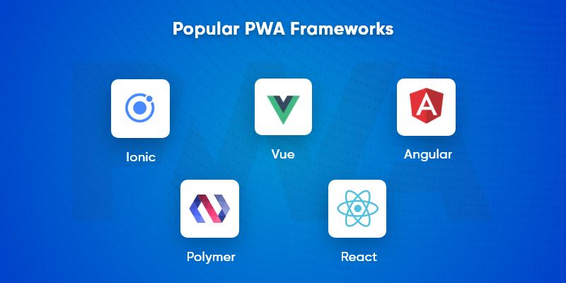

# 1. Introduccó

En aquesta unitat introductòria, anem a fer un breu repàs a les principals tecnologíes de què disposem a l'hora d'abordar la programació d'una aplicació per a dispositius mòbils.

Imaginem-nos que volem desenvolupar una aplicació mòbil. Què és el primer que ens vindría al cap? Amb quin llenguatge programar-la? En quin entorn? Per a quins dispositius? Mòbil? Tauleta? Rellotge intel·ligent? Televisió?

Es tracta d'una pregunta un tant més complexa que quan ens plantegem fer una aplicació per a PC.

Com sabem, existeixen diverses plataformes i sistemes operatius per a dispositius mòbils. Anem a veure els principals.

## 1.1. Android

Android és un SO desenvolupat per Google i basat en el Kernel de Linux, fabricat específicament per a dispositius mòbils amb pantalla tàctil: telèfons mòbils, tauletes, rellotges intel·ligents, televisors o fins i tot, alguns cotxes. 

L'estrucutra d'Android es compon d'aplicacions que s'executen en un framework Java d'aplicacions orientades a objectes sobre el nucli de les biblioteques de Java. La màquina virutal de Java sobre la que s'executen aquestes aplicacions era Dalvik fins la versió 5.0, per canviar en versions posteriors a l'entorn Android Runtime (ART). La principal diferència entre estes màquines virtual era que Dakvik realitzava la compilació en temps d'execució, mentre que ART compila el Java bytecode durant la instal·lació de l'aplicació.

Les llibreríes que s'utilitzen estan escrites en llenguatge C, i inclouen un administrador d'interfície gràfica (surface manager), un framework OpenCore, una base de dades relacional SQLite, una interfície de programació gràficaOpenGL ES 2.0 3D, un motor de renderitzat WebKit, un motor gràfic SGL, SSL i una llibería estàndard de C.

Amb tot açò, el llenguatge per al desenvolupament en Android ha estat tradicionalment Java. Recentment, Google ha adoptat el llenguatge Kotlin com a llenguatge oficial de programació en Android, que és un llenguatge més potent i que genera codi executable directament a la JVM.

## 1.2.IOs

L'iOS és el sistema operatiu més venut per darrere d'Android, i és propietat de la multinacional Apple. Va ser creat per a l'iPhone, i posteriorment adoptat en l'iPod touch i l'iPad. IOS no permet la instal·lació en maquinari d'altres companyíes.

iOS aporta diversos elements de control, com lliscadors, interruprots i botons, donant una resposta a les ordres de l'usuari immediata i una intericie fluïda. L'usuari pot interactuar amb el sistema operatiu mitjançant gestos, lliscaments, tocs, pessics... 

iOS deriva de macOS, i aquest de Darwin BSD, que és un sistema opratiu de tipus Unix.

L'arquitectura d'iOS compta amb quatre capes d'abstracció: la capa del nucli del OS, la capa de *Serveis Principals*, la capa de *mitjans* i la capa de *Cocoa Touch*

El desenvolupament d'aplicacions de forma nativa per a iOS passa per llenguatges com Objective-C i Swift.

# 2. Tipus d'aplicacions mòbils

Tal i com hem vist, el desenvolupament d'una aplicació mòbil que funcione de forma nativa en determinat dispositiu passa pel desenvolupament en les tecnologíes pròpies d'aquest.

No obstant això, existeixen diverses tencologíes que amb els seus avantatges i inconvenients pretenen abarcar el desenvolupament multiplataforma en el seu sentit més ampli.

Tenint en compte la *proximitat* al codi natiu de cada plataforma, podem distingir diferents tipus d'aplicaicons (de la menys pròxima a la més):

* Aplicacions responsive (Webapps)
* Aplicacions híbrides 
* Aplicacions web progressibes (PWAs)
* Apliccions compilades
* Aplicacions natives

Expliquem primer aquesta última i anem acostant-nos a ella poc a poc.

## 2.1. Aplicacions natives

Són aquelles que es desenvolupen específicament per al sisema operatiu en què es van a executar, i per tant, aprofitaran millor tots els seus recursos. A més, permeten accedir a totes les funcionalitats de les plataformes, i sempre tindrem disponible abans que ningú qualsevol novetat o característica nova.

Per al desenvolupament natiu en Android utilitzarem Java o Kotlin, mentre que pera Android Objective-C i Swift (iOS), i no es necessita cap pas addicional per portar el codi a codi natiu (bytecode).

Tot açò dóna com a resultat aplicacions fluïdes i que ofereixen la millor experiència d'usuari. Com a punt negatiu, tindrem un increment del cost de producció i manteniment.

## 2.2. Aplicacions web responsive (webapps)

Es tracta d'aplicacions basades en tecnología web: *HTML+CSS+Javascript*, i que per tal d'executar-se, necessiten únicament un navegador web. El fet de ser *responsive* implica que la seua interfície s'adapte a qualsevol dispositiu.

Per a aquest tipus d'aplicaicons, no és necessari desenvolupar res en codi natiu, i són totalment multiplataforma, ja que per executar-se ho fan sobre el propi navegador web del sistema operatiu en què estiguen, bé siga Android, iOS, Windows, Linux o Mac.

Així doncs, disposem d'un únic codi per executar-se en totes les plataformes, amb la contra que no oferiran una experiència de navegació tan bona a l'usuari com les apps natives, sobretot si es tracta d'apliccions complexes.

## 2.3. Aplicacions híbries 

Les aplicacions híbrides fan referència a aquelles que utilitzen tecnología web per construïr un lloc web en HTML+CSS+JS i carreguen aquest en un *webview*. Un *webview* no és més que un navegador web sense la barra de navegació i altres opcions, de manera que aparentment, és com si fos una aplicació nativa del dispositiu.

A més, les aplicacions híbrides poden accedir a través d'aquest navegador a algunes característiques del dispositiu, com la ubicació, acceleròmetres, etc.

Els frameworks més utilitzats per a aquest tipus d'aplicacions són ***Ionic i Phonegap***. Es tracta de dos frameworks molt utilitzats per desenvolupadors d'aplicaicons web per tal de realitzar aplicacions per a dispositius mòbils. La idea rere estos frameworks és senzilla: S'empaqueta l'aplicació web, en codi HTML+CSS+JS junt amb el *webview*. Aquest component sí que estarà en codi natiu per a cada sistema, però l'aplicació web és exactament la mateixa. El desavantatge d'aquestes tecnologíes és que reaccionen d'una forma més lenta, ja que s'han de comunicar amb el lloc web per tal d'obtenir gran part dels continguts.

Aquest tipus d'aplicacions, sería equiparable a tecnologies com *Electron* o *nwjs* en entorns d'escriptori.

## 2.4. Aplicaicons web progressives

Un poc més a prop de les aplicacions natives estan les aplicacions web prgressives, que estan revolucionant el panorama actual. Aquestes aplicacions incrementen i avancen en les funcionalitats segons el dispositiu mòbil en què vagen a executar-se, per tal de treure'n major potencial (s'adapten de forma *progressiva* al dispositiu)

Aquestes aplicacions aporten a l'usuari gran part dels avantatges de les aplicacions natives, però amb el desenvolupament en base a tecnologíes web. A més, a diferència de les aplicacions híbrides, permeten el funcionament sense connexió o amb mala connexió al servidor. 

Hi ha multitud de frameworks per al desenvolupament de PWAs, entre els que es troben els principals frameworks per a desenvolupament web: React PWA Libraty, Angular PWA Framework, Vue PWA Framework, Ionic PWA Framework, Svelte, PWA Builder o Polymer.
 
{ width=400px }

## 2.5. Aplicacions compilades

Es tracta de tecnologíes que pretenen utilitzar només un llenguatge de programació per tal de generar aplicacions mòbils natives. La idea general és treballar amb una única tecnología i llenguatge de programació i que el codi compilat que es genera, siga codi natiu a les diferents plataformes.

Algunes de les tencologíes més utilitzades en aquest tipus d'aplicaicons són:

* **React Native i Native Script**: ***React*** és un framework creat per Facebook, que utilitza el llenguatge Javascript i la llibrería React, el què permet crear interfícies basades en els seus components. En aquestes aplicacions, el codi javascript s'executa en un fil d'execució a banda, mentre que els elements de la interfície d'usuari són compilats a llenguatge màquina. Per la seua banda, ***NativeScript*** ens permet crear aplicacions natives mitjançant Javascript pur o bé utilitzant altres llibreríes com Angular o Vue. També porta diversos components preconstruïts per utilitzar a les interfícies d'usuari. A l'igual que React Navive, no treballen amb HTML.

* **Flutter**: És un framework desenvolupat i mantingut per Google, que utilitza el llenguatge de programació *Dart*. La idea és que s'escriga tot el codi en Dart, i es compile a codi natiu que s'execute completament al dispositiu. Així doncs, Flutter sí que compila a ARM i genera llibreríes C/C++, pel que età més a prop del codi natiu, i per tant és més ràpid. La forma de treballar de Flutter és dissenyar interfícies d'usuari anomenades *widgets*. Flutter ja compta amb  uns sèrie de widgets predeterminats, com botons, barres de navegació, etc.

## Alguns enllaços d'interès

* https://americavirtual.net/desarrollo-aplicaciones-multiplataforma/
* https://medium.com/@noebranagan/https-medium-com-noebranagan-hablemos-de-multiplataforma-2ba36fb25265
* https://www.21twelveinteractive.com/flutter-vs-react-native-vs-ionic-vs-nativescript/
* https://www.ftxinfotech.com/blog/react-native-vs-ionic-vs-flutter-vs-phonegap/
