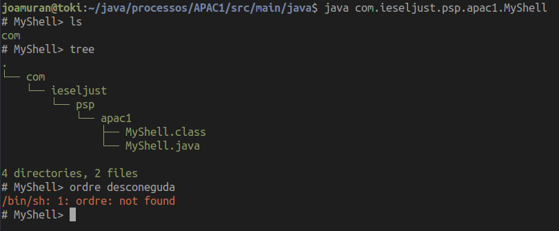
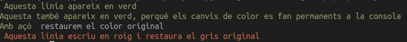

# Unitat 1: Activitat Pràctica d'Avaluació Contínua

L'activitat pràctica d'avaluació contínua de la primera unitat consisteix en un parell d'exercicis, que aniran englobats dins el mateix paquet Java com.ieseljust.psp.apac1. 

Creeu una estructura de carpetes com la següent, seguint els estàndards de java:

```shell
.
+-- src
    +-- main
        +-- java
            -++ com
                +-- ieseljust
                    +-- psp
                        +-- apac1
```

Tots els fonts (.java) aniran ubicats dins la carpeta *apac1*, i correspondran al paquet `com.ieseljust.psp.apac1`. És a dir:

* La primera línia de cada font serà `packagecom.ieseljust.psp.apac1`.
* A més, per executar cada aplicació, des del directori src/main/java, farem `java com.ieseljust.psp.NomDeLaClasse`.

## Exercici 1. MyShell.

Creeu una classe anomenada MyShell, que siga un intèrpret d'ordres de Bash. El resultat serà el següent:



El funcionament de l'aplicació és el següent:

* Escriu un prompt `# MyShell>`, i està a l'espera que introduim alguna ordre.
* Quan s'introdueix alguna ordre, llança un procés que executa aquesta, capturant el resultat, i mostrant-lo per pantalla, tenint en compte el següent:
  * Si el resultat és correcte (eixida estàndard del procés), l'eixida la mostra en verd.
  * Si el resultat no és correcte (eixida d'error del procés), l'eixida es mostra en roig.
  * Cal tindre en compte que algunes ordres de tipus builtin (aquelles interpretades directament per bash) [^1], no donaran error, però no s'executaran. No és l'objectiu d'aquesta pràctica la implementació d'aquestes funcionalitats, sinò la gestió de processos, pel que aquest comportament es dóna per correcte.
  * El programa eixirà quan detecte l'ordre `quit` com a entrada.

[^1]: http://manpages.ubuntu.com/manpages/bionic/man7/bash-builtins.7.html

Per tal de *pintar* l'eixida per pantalla, no cal més que especificar el color als mateixos `println` en forma de cadena de text. Per exemple:

```java
System.out.println("\u001B[32m Aquesta línia apareix en roig");
System.out.println("Aquesta també apareix en roig, perquè els canvis de color es fan permanents a la consola");
System.out.println("Amb açò \u001B[0m restaurem el color original");
System.out.println("\u001B[31m Aquests línis escvriu en verd i restaura el gris original \u001B[0m");
```

Obté el següent resultat:




## Exercici 2. Programació multiprocés.

Creeu un programa multiprocés que obtinga el valor màxim dels elements d'un vector generat aleatòriament, de longitud indicada per l'usuari com a únic argument, i aprofitant totes les capacitats multiprocés de la màquina (tots els processadors disponibles).

Per exemple, la següent crida:

```
java com.ieseljust.psp.ObteMaximMultiproces 1000
```

Obtindrà el màxim número d'un vector del 1.000 elements generats aleatòriament.

### Consideracions i ajudes:

* Caldrà desenvolupar un programa a banda que calcule el màxim d'una sèrie de valors especificats com a arguments. (`java com.ieseljust.psp.calculaMaxim 10 3123 123 99929 213 432 123 123`). Aquestes quantitats seràn enters llargs, entre 0 i el valor màxim per a aquest tipus, representat per `Long.MAX_VALUE`. Tingueu en compte que els arguments d'un programa en Java es representen com a un vector d'Strings, pel que caldrà fer les corresponents conversions quan siga necessari.
* Caldrà dividir la tasca **en tants processos com processadors tinga l'ordinador** (haurem d'utilitzar la classe Runtime per a això). Si utilitzeu una màquina virtual, tingueu en compte que aquesta només té un processador assignat. Podeu afegir-li'n en la configuració d'aquesta.
* Aquesta divisió del problema, implicarà la divisió del vector original en tantes parts com processos anem a llançar. En aquest punt segurament necessitem crear nous vectors que siguen subvectors de l'original. Per a això, ens pot ser útil el mètode **System.arraycopy**: `System.arraycopy(arrayOriginal, posició_inicial_en_array_original, arrayOnVaLaCopia, posicio_inicial_al_vector_copia_(generalment_0), numero_elements_a_copiar);`
* Tal i com hem fet a l'exercici del sumatori, caldrà esperar les respostes de cada procés llançat i calcular finalment el màxim de tots. Aquest últim càlcul pot fer-se a la mateixa classe principal o llençant un nou procés altre procés.
* Alguns mètodes que ens poden resultar útils són:

```java
/* Donat un ArrayList d'strings */
ArrayList<String> el_meu_arraylist = new ArrayList<String>();
/* Podem afegir elements simples: */
params.add("java");
/* O concatenar-li el contingut d'un altre vector*/
params.addAll(Arrays.asList(args));
```

```java
/* La següent expressió obté un enter llarg aleatori 
   entre 0 i el valor especificat amb MAX
   i el converteix a String */
String.valueOf((long) (Math.random() * MAX) + 1);
```

Un possible exemple de l'eixida de l'aplicació sería el següent:

```shell
$ java com.ieseljust.psp.apac1.ObteMaximMultiproces 100000
Dividint la tasca en 4 processos
Llançant el procés 0 per fer càlculs de 0 fins a 25000
Llançant el procés 1 per fer càlculs de 25001 fins a 50001
Llançant el procés 2 per fer càlculs de 50002 fins a 75002
Llançant el procés 3 per fer càlculs de 75003 fins a 99999
S'han finalitzat els dos processos. Esperant els búffers.
Esperant al buffer 0
Esperant que es plene el buffer
Maxim parcial del procés 0=9221975700441651201
Esperant al buffer 1
Esperant que es plene el buffer
Maxim parcial del procés 1=9223198816394112001
Esperant al buffer 2
Esperant que es plene el buffer
Maxim parcial del procés 2=9222854824348106753
Esperant al buffer 3
Esperant que es plene el buffer
Maxim parcial del procés 3=9222605503125530625
Màxim valor del vector: 9223198816394112001
```
En aquest exemple, s'ha generat un vector de 100.000 enters llargs aleatoris, entre 0 i el màxim valor representable.En aquest cas, l'ordinador consta de quatre nuclis, pel que s'ha dividit la tasca en quatre processos: el primer busca el màxim entre les posicions 0 i 25000 del vector, el sevon entre la 25001 i la 50001, el tercer entre le 50002 i la 75002, i el quart entre la 75003 i la 99999. Com veiem, s'obtenen quatre resultats, i finalment, es mostra el màxim de tots ells.