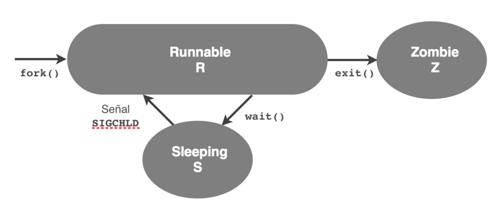
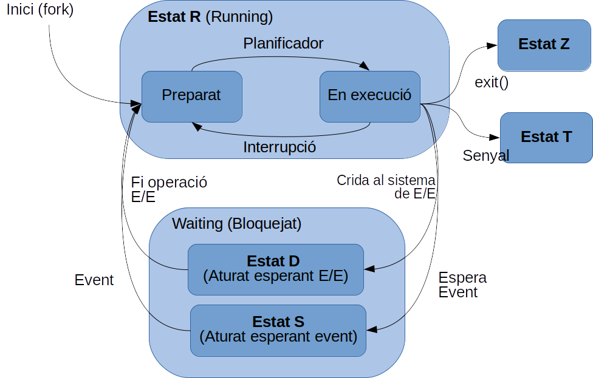
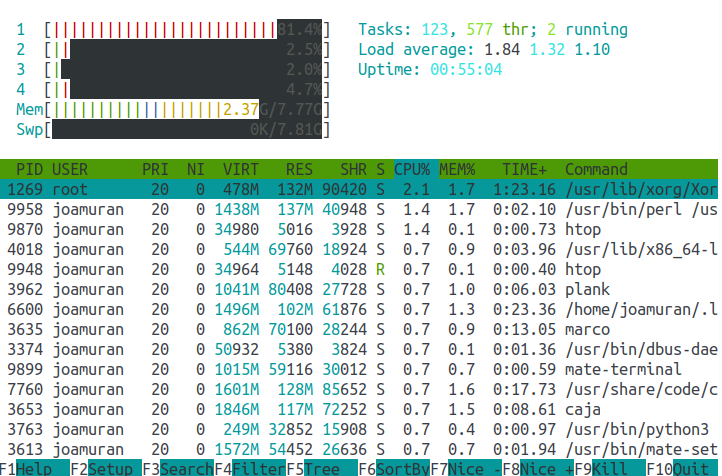
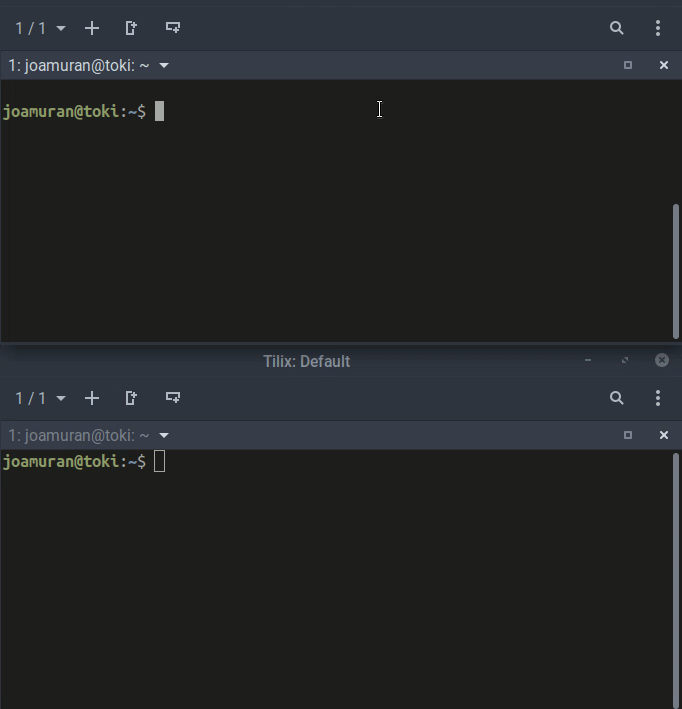

# Introducció

En aquest document, anem a veure la visió del sistema operatiu sobre els processos, tant pesats com lleugers (threads), i la relació que tenen amb els serveis del sistema, així com alguns mecanismes de comunicació entre ells. Veurem els diferents conceptes, i les ordres del sistema operatiu que ens ajuden a gestionar i obtenir informació sobre processos i serveis.

# 1. Processos i estats d'un procés

 Els programari d'un ordinador es troba emmagatzemat al disc, en forma de fitxers executables. Quan llancem un fitxer executable, el sistema crea un procés amb un identificador, i ha d'assignar-li certs recursos per possibilitar l'execució, com memòria, temps de processament (CPU), i accés a fitxers i dispositius d'entrada i eixida.

 Així doncs, podem dir que *un procés no és més que una instància d'un programa en execució, al que s'han assignat determinats recursos del sistema.*

 Els sistemes basats en Unix, com és del cas de Linux segueixen un model d'estats sobre el que es defineixen transicions, i es representa en forma de graf. Les transicions d'un a altre estat es produeixen com a conseqüència d'una crid al sistema o d'un event. 

 

A la **figura \ref{estats}** veiem els tres estats següents:

* **R:** *Running or Runnable (on run queue)*: Procés en execució o a la cua d’execució.
* **S:** *Interruptible sleep (waiting for an event to complete)*: Aturat a l’espera d’algun event.
* **Z:** *defunct ("zombie" process, terminated but not reaped by its parent)*: Procés finalitzat a l’espera d’informar al procés pare.

Aquests estats passen d’un a altre a través de certes *transicions*:

* **Inici del procés**: S’inicia un procés (crida al sistema fork()), i aquest passa a estar llest per executar-se (preparat). De la cúa de processos preparats passarà a executar-se quan ho decidisca el planificador.
* **Transició R→S**: El procés passa d’estar en execució a estar bloquejat, a l’espera (wait()) que finalitze un procés fill.
* **Transició S→R**: El procés passa de bloquejat a execució. Quan finalitza un procés fill, informa al procés pare (SIGCHILD) per indicar que ha finalitzat.
* **Transició R→Z**: Quan finalitza el procés, passa a estat Z (Zombie) o Finalitzat. Aquest procés, no s’elimina de memòria fins que el procés pare recull amb el wait() el codi que el fill retorna en finalitzat amb exit().
  
Encara que al gràfic s’ha mostrat l’estat S, poden haver diverses situacions de bloqueig:

* Pendent que finalitze una operació d’entrada i eixida. (Estat **D:** *Uninterrumpible Sleep – Usually IO*)
* Aturat per una senyal del propi treball (un sleep, per exemple): (Estat **T:** *Time*).
Aturar degut a algun procés de depuració. (Estat **t**: *tracing*)

Podem veure els estas ampiats a la **figura \ref{estats2}**

{ width=350px }

## 1.1. Utilitats relacionades amb els processos

### Top, htop i atop

**top**

L'ordre `top` mostra en temps real l’activitat del processador, amb una llista de les tasques que més estan consumint aquest recurs, permetent manipular també processos. `Top` pot classificar les diferents tasques per ús de CPU, de memòria o temps d’execució. Les característiques que mostra es poden configurar bé per ordres interactives o per fitxers de configuració.
Entre la informació que mostra, podem trobar valors generals, com el nombre de processos del sistema, en cadascun dels estats, i diversos consums tant de CPU com de memòria.
Per a cada procés, mostra, per defecte la següent informació: 

* PID del procés
* Usuari que l’ha llançat (USER)
* Prioritat (PR) 
* Nice (NI)
* Consum de memòria Virtual (VIRT) en Kb.
* Memòria Resident (RES) o física.
* Memòria compartida (SHR) disponible per a la tasca (que podria compartir-se amb altres processos).
* Estat (S) del procés.
* Percentatge de CPU utilitzat des de la última actualització. (%CPU)
* Percentatge de memòria fśica utilitzat. (%MEM)
* Temps total de CPU utilitzat per l’aplicació des que va començar.  (TIME+)
* Ordre (COMMAND) que va llançar el procés.


```shell
$ top
top - 14:51:53 up  8:21,  1 user,  load average: 0,04, 0,05, 0,04
Tasks: 268 total,   1 running, 266 sleeping,   0 stopped,   1 zombie
%Cpu(s):  1,9 us,  0,9 sy,  0,1 ni, 96,2 id,  0,9 wa,  0,0 hi,  0,0 si,  0,0 st
KiB Mem :  8084828 total,   477512 free,  5270308 used,  2337008 buff/cache
KiB Swap:  9762812 total,  9594072 free,   168740 used.  1730572 avail Mem 

  PID USER      PR  NI    VIRT    RES    SHR S  %CPU %MEM     TIME+ COMMAND
 1477 root      20   0  857036 319012 288424 S   6,7  3,9   5:46.83 Xorg
13175 jose      20   0 4740712 795016 733624 S   6,7  9,8  13:30.75 VirtualBox
    1 root      20   0  119916   5568   3704 S   0,0  0,1   0:01.97 systemd
    2 root      20   0       0      0      0 S   0,0  0,0   0:00.00 kthreadd
    3 root      20   0       0      0      0 S   0,0  0,0   0:00.10 ksoftirqd/0
    5 root       0 -20       0      0      0 S   0,0  0,0   0:00.00 kworker/0:0H
    7 root      20   0       0      0      0 S   0,0  0,0   0:07.16 rcu_sched
    8 root      20   0       0      0      0 S   0,0  0,0   0:00.00 rcu_bh
```

Sintaxi de top:

```shell
top -hv|-bcHiOSs -d secs -n max -u|U user -p pid -o fld -w [cols]
```

Algunes opcions d’interès:

* **secs**: Interval entre actualitzacions (es canvia amb l’ordre interactiva s)
* **n max**: Indica el nombre d’iteracions/refrescos abans de finalitzar. Si no s’indica, es repeteix contínuament.
* *c**: Mostra tota la línia d’ordres que ha llançat cada procés. 
* **b**: Batch mode, en lloc del mode interactiu. Va mostrant per pantalla els resultats, sense possibilitat d’interacció. Pot usar-se en combinació amb l’opció n, per tal de limitar el nombre d’iteracions (si no, hauriem de finalitzar el procés manualment).
* **H**: Mostra informació relativa també als processos lleugers (threads).
* **o camp**: Permet ordenar l’eixida pel camp especificat. 
* **O**: Ens mostra els camps d’ordenació possibles per a l’opció «o camp». Cal tindre en compte que aquest camp s’especifica en l’idioma indicat en $LANGUAGE.
* **p**: Especificat en forma -p1 -p2 -p3... mostra els processos amb els PIDs espeficificats.
* **U | u**: Filtra els processos per usuari propietari. Aquesta opció és incompatible amb l’opció «p», indicada anteriorment.

**htop**

L’ordre htop és una versió millorada de top, més fàcil d’interpretar, i que permet realitzar certes funcions sobre els processos, com modificar-los la prioritat o aturar processos.



Per defecte no ve instal·lada en Ubuntu, pel que caldrà instal·lar-la amb `sudo apt-get install htop`.

**atop**

L’ordre atop, a l'igual que htop, no es troba instal·lada per defecte en molts sistemes, pel que caldria instal·lar-la. Es tracta d’un monitor de processos en temps real que mostra també informació sobre la CPU, la memòria, la xarxa, l’usuari, la prioritat de processos, etc. Podem trobar més informació de l’eina a la seua web: https://www.atoptool.nl.

**Pidof i pgrep**

Ambdues ordres serveixen per preguntar per l’identificador de procés (PID) que concorde amb un nom de programa. La principal diferència és que pgrep admet patrons de recerca, tal com fa l’ordre grep.

```shell
$ pidof bash
27197 20138 16768 16620 16364 16290 9389 9133 9117 8995 8338 2050
```

```
$ pidof ash
$ pgrep bash
2050
8338
8995
9133
9389
16290
16364
16620
16768
20138
27197

$ pgrep ash
2050
8338
8995
9133
9134
9389
13357
16290
16364
16620
16768
20138
27197
```


### ps (Process Status)

Es tracta d’una de les eines més utilitzades, i ens mostra una instantània dels processos actuals. L’ordre admet opcions de diferent tipus: les opcions UNIX, precedides per un guió (-), les opcions BSD que no utilitzen cap guió, i les opcions GNU, que van precedides per dos guions (--).

Podem consultat totes les opcions disponibles al manual de `ps`. A continuació anem a veure a mode d'exemple els usos més comununs d'aquesta ordre, tot i que s'admeten moltes més opcions:

**ps**

Si no afegim cap paràmetre, mostra els processos de l'usuari actual:

```
$ ps
  PID TTY          TIME CMD
 4154 pts/0    00:00:00 bash
 4851 pts/0    00:00:00 ps
```

L'eixida que ens dóna conté:

* **PID**: L'id del procés.
* **TTY**: La terminal des d'on s'ha iniciat el procés o procés principal. Si apareix un interrogant indica que no hi ha terminal de control.
* **TIME**: Temps de CPU utilitzat pel procés des que va començar.
* **CMD**: Ordre que va llençar el procés.
Com podem comprovar al manual de ps (man ps), aquesta ordre té moltes opcions, i moltes possibles combinacions entre la sintaxi BSD, UNIX i GNU.


**ps -e**

Mostra de tots els processos el PID, la TTY, el temps i l’ordre que s’ha llançat.
```shell
  PID TTY          TIME CMD
    1 ?        00:00:02 systemd
    2 ?        00:00:00 kthreadd
    3 ?        00:00:00 ksoftirqd/0
   ...
27831 pts/13   00:00:00 bash
31280 pts/16   00:00:00 bash
```
**ps -ef**

Mostra tots els processos amb un format d’eixida més complet, indicant l’usuari que l’ha llançat, el PID del procés pare, el percentatge de CPU (C) i l’hora d’inici del procés:

```
UID        PID  PPID  C STIME TTY          TIME CMD
root         1     0  0 06:30 ?        00:00:02 /sbin/init splash
root         2     0  0 06:30 ?        00:00:00 [kthreadd]
root         3     2  0 06:30 ?        00:00:00 [ksoftirqd/0]
root         5     2  0 06:30 ?        00:00:00 [kworker/0:0H]
...
jose     27831  9629  0 11:43 pts/13   00:00:00 /bin/bash
root     30805     2  0 12:09 ?        00:00:00 [kworker/3:0]
jose     31280  9629  0 12:44 pts/16   00:00:00 /bin/bash
```

**ps --pid pid, i ps --ppid pid**

Les opcions en format GNU pid i ppid permeten especificar un identificador de procés concret per a ps.

```
$ pgrep firefox
11805

$ ps --pid 11805

  PID TTY          TIME CMD
11805 ?        00:08:48 firefox
```

**ps aux**

Es tracta del cas d’ús més estés, utilitzant una sintaxi tipus BSD. Mostra tots els processos de tots els usuaris (a), en format orientat a l'usuari (u), i eliminant la restricció de que el procés tinga una tty associada (x). Bàsicament, el que ve a dir és que mostra tots els processos que s'estan executant al sistema, siga de l'usuari que siga.

Veiem un exemple:

```shell
$ ps aux 

USER       PID %CPU %MEM    VSZ   RSS TTY      STAT START   TIME COMMAND
root         1  0.0  0.0 120364  6584 ?        Ss   20:14   0:01 /sbin/init splash
root         2  0.0  0.0      0     0 ?        S    20:14   0:00 [kthreadd]
...
root        31  0.0  0.0      0     0 ?        SN   20:14   0:00 [ksmd]
joamuran  4150  0.3  0.9 961412 81388 ?        Sl   20:42   0:06 tilix
joamuran  4154  0.0  0.0  25552  5628 pts/0    Ss   20:42   0:00 /bin/bash
...
joamuran  5328  0.0  0.0  40096  3376 pts/0    R+   21:17   0:00 ps aux
joamuran  5329  0.0  0.0  12316   848 pts/0    S+   21:17   0:00 more
```

Una variant de `ps aux` es `ps auxe`, que a més de la informació anterior, mostra també l'entorn en què s'ha invocat el procés.

```shell
$ ps auxe 
USER       PID  %CPU %MEM  VSZ   RSS TTY      STAT START   TIME COMMAND
jose     31280  0.0  0.0  27772  6408 pts/16   Ss+  12:44   0:00 /bin/bash [] ... LANGUAGE=ca_ES@valencia:ca_ES:en ... LC_NAME=es_ES.UTF-8 XDG_VTNR=7 ...
```

Veiem ara com interpretem estes eixides. Del PID, TTY, TIME i CMD ja hem parlat. La resta de camps tenen el següent significat:

* **USER**:  Usuari que ha iniciat el procés.
* **%CPU**: Percentatge de CPU utilitzat.
* **%MEM**: Percentatge de memòria
* **VSZ**: Memòria Virtual utilitzada en Kb.
* **RSS**: "Resident Set Size": Memòria física (no de SWAP) que utilitza una tasca (en Kb).
* **STAT**: Estat en què es troba el procés.
* **START**: Hora d'inici del procés.

Parem-nos ara en el camp STAT, que indica l'estat en que es troba el procés. Segons la pàgina del manual de ps, els estats que un procés pot presentar són:

* **D**: Interromput. Es tracta d'un procés bloquejat o dormit a l'espera d'una senyal, generalment relacionat amb l'Entrada/Eixida.
* **R**: En execució o preparat per executar-se.
* **S**: Suspès. Procés bloquejat a l'espera que es produisca un event.
* **T**: Aturat per una senyal de control.
* **t** : Procés aturat per a la depuració.
* **X**: Procés mort (no hauria d'aparéixer mai)
* **Z**: Procés difunt o  "zombie". Indica que el procés ha finalitzat, però encar ano li ha tornat el valor amb exit al seu pare.

A banda d'estos estats, poden aparéixer alguns caràcters acompanyant l'estat en qüestió:

* **<**: Té una prioritat major que la normal.
* **N**: Té una prioritat menor que la normal.
* **L**: Té pàgines bloquejades en memòria.
* **s**: És un procés líder d’una sessió (és ell qui ha iniciat una sessió)
* **l**: és un procés multifil.
* **+**: Està en el grup de processos en primer pla.

Una forma molt comuna d'utilitzat ps és en combinació amb tuberíes i filtrant pel nom d'un procés concret, per tal d'obtenir informació relativa a aquest: 

```shell
 ps aux | grep tilix
joamuran  4150  0.2  1.0 992600 88164 ?        Sl   20:42   0:10 tilix
joamuran  5989  0.0  0.0  16976  1020 pts/0    S+   22:01   0:00 grep --color=auto tilix
```

### pstree

L’ordre pstree permet visualitzar tots els processos en forma d’arbre, de manera que indica la relació entre ells. D’entre les opcions més comunes, podem descatar:

* **-p:** per indicar el PID dels processos, 
* **-a**: per indicar l’ordre completa executada.
* **-n**: Ordena els processos pel PID en lloc del nom, que és l’opció per defecte.

```
$ pstree

systemd-+-ModemManager-+-{gdbus}
        |              `-{gmain}
        |-NetworkManager-+-dhclient
        |                |-dnsmasq
        |                |-{gdbus}
        |                `-{gmain}
        |-Telegram-+-{MTP::internal::}
        |          |-{QDBusConnection}
        |          |-8*[{QThread}]
        |          |-{QXcbEventReader}
        |          |-2*[{Qt HTTP thread}]
        |          `-{Qt bearer threa}
        |-VBoxSVC-+-VirtualBox-+-{ACPI Poller}
        |         |            |-{ATA-0}
                       ....
```

L’ordre pstree també admet indicar un PID de procés (pstree PID), per tal de mostrar només l’arbre de processos corresponent a ell.  
Aturem-nos ara en la primera línia, per veure el procés pare causant de tot: Systemd.

# 2. Threads

Els threads o processos lleugers són processos que comparteixen determinats recursos, com l'espai de direccions, variables, fitxers oberts, alarmes, senyals, etc.

L'opció -L de l'ordre ps ens permet veure els threads del sistema:

```
UID        PID  PPID   LWP  C NLWP STIME TTY          TIME CMD
root         1     0     1  0    1 19:08 ?        00:00:04 /sbin/init splash
root         2     0     2  0    1 19:08 ?        00:00:00 [kthreadd]
root         3     2     3  0    1 19:08 ?        00:00:00 [ksoftirqd/0]
root         5     2     5  0    1 19:08 ?        00:00:00 [kworker/0:0H]
root         7     2     7  0    1 19:08 ?        00:00:02 [rcu_sched]
...
root      1020     1  1020  0    3 19:08 ?        00:00:02 /usr/sbin/NetworkManager --no-daemon
root      1020     1  1147  0    3 19:08 ?        00:00:00 /usr/sbin/NetworkManager --no-daemon
root      1020     1  1155  0    3 19:08 ?        00:00:00 /usr/sbin/NetworkManager --no-daemon
```

En aquesta eixida ens interessen les columnes LWP (Light Weight Process), que indica l'identificador del thread, i NLWP (Number of LightWeight Processes), que indica el número de processos lleugers o threads del procés.
En l'exemple, si ens fixem amb el procés del Network Manager, traiem les següents conclussions:

* La columna NLWP indica que existeixen 3 threads del Network Manager.
* Aqests threads tenen LWP 1020, 1147 i 1155.
* Els tres threads es corresponen al mateix procés, el 1020, que és invocat directament per systemd (PID 1).

# 3. Dimonis i serveis

Els dimonis (*daemon*) són processos que s'executen en segon pla, sense terminal (tty), ni interfície gràfica, esperant que ocórrega algun event al sistema o li arribe alguna petició de servei.

Un bon exemple de dimoni és un servidor web, que espera una sol·licitud per enviar una pàgina web, o un servidor ssh que espera que s'inicie alguna sessió.

També hi existeixen dimonis que no són tan visibles com els qui ofereixen serveis, i que realitzen tasques com escriure al log del sistema (rsyslog) o mantindre la precisió del rellotge del sistema (ntpd).

En la majoría de sistemes Linux a les versions més recents (Debian>=8 Jessie, Fedora>=15, Mandriva>=2011, Arch>=2012, CenOS>=7, Ubuntu>=15.04) els serveis són administrats per **Systemd**.

Systemd (system daemon) és un dimoni dissenyat per al nucli de Linux, i que s'executa en l'espai d'usuari, convertint-se en el procés pare de tots els processos en aquest espai. El disseny proveeix a priori un millor entorn de treball per tal d'expressar les dependències de servei, millorant el paral·lelisme en l'arrencada del sistema i reduint la sobrecàrrega de la shell. Fins fa relativament poc temps, el sistema encarregat de la posada en marxa del sistema era Init, heretat de System V i BSD. Els sistemes actuals, han reemplaçat aquest sistema per Systemd.

Les tres principals funcionalitats de Systemd són:

* Proporcionar un mecanisme d'administració del sistema i els serveis,
* Oferir un framework de desenvolupament de programari,
* Oferir un mecanisme de connexió entre les aplicacions i el nucli de Linux.

Systemd reemplaça a la seqüència d'arrencada de Linux, així com els diferents nivells d'execució controlats per l'init tradicional, així com l'execució dels scripts sota el seu control (/etc/init.d/*, /etc/rc0.d/, /etc/rc1.d, ... ,/etc/rc6.d, /etc/rcS.d). A més, integra altres servies com la gestió del login, la connexió en calent de dispositius (udev), la programació de tasques periòdiques (reemplaç del cron), etc.
Systemd es presuposa doncs més ràpid en l'arrencada i l'apagat, degut a que els processos d'arrencada es realitzen de forma paral·lela, i els serveis s'inicien per esdeveniments. Per exemple, quan s'inicia el servei de xarxa, es llança un esdeveniment que indica que el servei (de xarxa) ja està disponible, i per tant, tots els serveis que depenen del servei de xarxa, poden iniciar-se (és a dir, es llancen paral·lelament tots els serveis que depenen de la xarxa, mentre que als sistemes anteriors ho feien de forma seqüencial).

### Systemctl

La interfície que proporcions Systemd per interactuar amb els serveis és `systemctl`, i ens permet realitzar múltiples operacions:

* Aturada, arrencada, reinici i recàrrega d'un servei (de forma immediata):
    * systemctl stop servei.service
    * systemctl start servei.service
    * systemctl restart servei.service
    * systemctl reload servei.service
    * systemctl reload-or-restart servei.service (si no estem segurs que el servei implemente reload)

Fixem-nos que el nom del servei acaba amb `.service`. Systemd, a banda de serveis, i durant l'arrencada al sistema també controla altres recursos, com els punts de muntatge, els dispositius, etc. Aquests recursos, en nomenclatura de Systemd s'anomenen "unitats", i es representen en fitxers l'extensió dels quals indica el tipus de recurs (`.service`, `.target`, `.device`, `.socket`... ). Com que estem referint-nos a serveis, ens centrarem en les unitats de tipus `.service`.

* Activant o desactivant serveis en l'arrencada del sistema:
    * systemctl enable servei.service: Crea un enllaç al fitxer de servei del sistema al lloc on systemd busca els fitxers de configuració dels serveis d'arrencada. Si no es tracta d'un servei natiu de systemd, fa ús de l'eina systemd-sysv-install, per fer-ho retrocompatible.
    * systemctl disable servei.service: Elimina l'enllaç creat amb enable.

* Consultar l'estat d'un servei:
    * systemctl status servei.service

Veiem-ne un exemple:

```
$ systemctl status apache2.service 
● apache2.service - The Apache HTTP Server
   Loaded: loaded (/lib/systemd/system/apache2.service; enabled; vendor preset: enabled)
  Drop-In: /lib/systemd/system/apache2.service.d
           `-apache2-systemd.conf
   Active: active (running) since Mon 2018-09-10 21:39:12 CEST; 3h 17min ago
  Process: 7727 ExecReload=/usr/sbin/apachectl graceful (code=exited, status=0/SUCCESS)
  Process: 1201 ExecStart=/usr/sbin/apachectl start (code=exited, status=0/SUCCESS)
 Main PID: 1274 (apache2)
    Tasks: 6 (limit: 4915)
   CGroup: /system.slice/apache2.service
           |-11274 /usr/sbin/apache2 -k start
           |-7738 /usr/sbin/apache2 -k start
           |-7739 /usr/sbin/apache2 -k start
           |-7740 /usr/sbin/apache2 -k start
           |-7741 /usr/sbin/apache2 -k start
           `-7742 /usr/sbin/apache2 -k start
```

Com veiem, ens dóna una descripció del servei, i informació diversa sobre la seua configuració i els processos relacionats. Com veiem, el servei té 6 processos (Tasks) associats, cadascun amb un PID diferent, però tots associats al mateix CGroup. Els CGroups (contorl groups) és una caracterísica del kernel de linux que limita els recursos d'un conjunt de processos, per temes se seguretat. 

Altres opcions que admet systemctl són:

* `systemctl is-active servei.service`: retorna active o inactive, en funció de si és o no actiu.
* `systemctl is-enabled servei.service`: retorna enabled o error, segons si es troba o no activat en l'inici, és a dir, que té un enllaç a la carpeta de configuració d'arrancada.
* `systemctl is-failed servei.service`: retorna active, si es troba actiu, inactive si s'ha aturat de forma intencionada, o failed si ha hagut algun error)


# 4. Comunicació entre processos

En aquest apartat veurem alguns mecanismes de comunicació entre processos a nivell de sistema operatiu.

## 4.1. Comunicació mitjançant entrada i eixida

Una de les formes més senzilles que ofereix el sistema operatiu per comunicar processos és a través de l'entrada i l'eixida. Anem a fer un repàs a aquests mecanismes, així com diferents formes d'execució de processos en la shell.

### Redireccions

Com sabem, cada procés té associats tres fitxers per possibilitar la seua comunicació:

* **stdin**, amb descriptor de fitxer 0, que representa per on rep dades el procés (generalment associat a l'entrada de teclat de la terminal)
* **stdout**, amb descriptor de fitxer 1, que representa on bolca la seua eixida el procés (generalment associat a la pantalla de la terminal)
* **stderr**, amb descriptor de fitxer 2, i que representa l'eixida estàndard per als errors (generalment associat a la pantalla del terminal)

Estos descriptors, poden ser redirigits per tal d'aconseguir que la informació s'envie o s'agafe de fitxers en lloc de fer-ho de l'entrada o eixida estàndard.

* **Redirecció de l'entrada estàndard (<)**: Redirigeix l'entrada de dades d'un procés des d'un fitxer en lloc de fer-ho des de teclat. Quan utilitzem <<, agafem l'entrada per a l'ordre línia per línia, fins trobar l'etiqueta indicada.

```shell
  cat << END (END=Ctrl+D)
```

* **Redirecció de l'eixida estàndard (> i >>)**: permet redirigir l'eixida del procés a un fitxer, eliminant el seu contingut (operador >), o afegint el resultat al final (>>).

``` 
banner Salut! > hola.txt
```

*(Possiblement, l'ordre banner no la tingueu instal·lada al sistema. El paquet que la incorpora és sysvbanner)*

Altre exemple. Amb dos terminals obertes, en la primera esbrinem quin és l'identificador de terminal amb `tty`:

```shell
$ tty
/dev/pts/2
```

I **des d'altra terminal**, li enviem, per exemple l'eixida d'un ls:

```
$ ls > /dev/pts/2
```
* **Redirecció de l'eixida d'error estàndard: (2>, 2>>):** Funciona de la mateixa manera que la redirecció de l'eixida estàndard, però amb l'eixida d'error.

```
$ find -name "*.txt" 2> /dev/null
```

Per altra banda, també podem fer combinacions d'entrada i eixida:

```
cat << END > fitxer.txt 
```
Aquest fitxer, llegirà de l'entrada estàndard fins que introd introduim Ctrl+D i ho bolcarà sobre el fitxer fitxer.txt.

### Execució en segon plan (&)

Com sabem, quan llancem una ordre, aquesta s'executa en primer pla, i no torna el control a l'usuari fins que finalitza. Per tal de deixar el procés en execució sense que lleve el control a l'usuari, podem llançar el procés en segon pla, amb:

```shell
ordre &
```

Aquesta ordre, com podem comprovar retorna el PID del procés en segon pla entre corxetes.

Exemple:

```
$ sleep 10 &
[1] 8498
$ ps
  PID TTY          TIME CMD
 8138 pts/2    00:00:00 bash
 8498 pts/2    00:00:00 sleep
 8502 pts/2    00:00:00 ps
```

#### Seqüències d'ordres (;)

Amb l'operador ; podem construir llistes d'ordres que s'executen seqüencialment:

```
sleep 3; echo "fi"
```
*Exercici*: Comproveu la diferència entre les dues instruccions següents i intenteu entendre'n el funcionament. Quina és la diferència d'utilitzar els parèntesi o no?

```
$ sleep 3; echo "fi" &
```

```
$ (sleep 3; echo "fi") &
```

### Canonades (|)

Les canonades (pipes) permeten connectar l'eixida estàndard d'un procés amb l'entrada estàndard d'altre, establint així una relació de productor-consumidor.

* Ús: `productor | consumidor`

Veiem un exemple. Suposem que tenim un usuari (anomenat *usuari*) connectat per ssh a la nostra màquina, podem enviar-li un missatge amb write. Amb la següent ordre, el que farem serà enviar-li en resultat de l'execució de l'ordre "banner Hola!":

```
 $ banner Hola! | write usuari
```

 Amb açò, l'eixida de l'ordre banner és enviada a l'usuari *usuari* (connectat a una altra terminal de la mateixa màquina).

## 4.2. Comunicació amb variables d'entorn i de la shell

Existeixen dos tipus de variables quan parlem de Bash: variables locals a la shell, i variables d'entorn. Les variables d'entorn  (definides amb EXPORT), poden ser utilitzades com a mecanisme de comunicació entre processos.

Veiem-ho amb un exemple:

* Fitxer p1.sh

```shell
#!/bin/bash
MYVAR="Variable";
echo "Hola, soc el procés 1, i tinc definida la variable $MYVAR"
echo "Invoque a p2.sh i m'espere que acabe:"
./p2.sh
echo "p2.sh ha finalitzat amb eixida $?"
echo "Estat dels processos:"
ps -o pid,ppid,cmd,state
```

* Fitxer p2.sh

```shell
#!/bin/bash
echo "Hola, soc el procés 2, i puc accedir a $MYVAR"
echo "Estat dels processos:"
ps -o pid,ppid,cmd,state
sleep 5
exit 3
```

Quan llancem l'script p1.sh, l'eixida que obtenim és la següent:

```
Hola, soc el procés 1, i tinc definida la variable Variable
Invoque a p2.sh i m'espere que acabe:
Hola, soc el procés 2, i puc accedir a 
Estat dels processos:
  PID  PPID CMD                         S
 6268  6264 /bin/bash                   S
16864  6268 /bin/bash ./p1.sh           S
16865 16864 /bin/bash ./p2.sh           S
16866 16865 ps -o pid,ppid,cmd,state    R
p2.sh ha finalitzat amb eixida 3
Estat dels processos:
  PID  PPID CMD                         S
 6268  6264 /bin/bash                   S
16864  6268 /bin/bash ./p1.sh           S
16868 16864 ps -o pid,ppid,cmd,state    R
```


Com podem vore, quan s'invoca a p2.sh des de p1.sh no es té accés a la variable $MYVAR, definida en l'script p1.sh, però en canvi, des del procés p1 sí que es pot accedir al valor que retorna l'script p2.sh.

Per tal de poder transmetre el valor d'aquesta variable, podem definir-la com a una variable d'entorn amb export:

```
export MYVAR="Variable";
```

## 4.3. Comunicació mitjançat senyals

Les senyals són interrupcions de programari que avisen a un procés, durant el seu temps d'execució, que s'ha produit un esdeveniment. Aquestes senyals són enviades pel kernel al procés tot i que pot ser altre procés qui les genere. Algunes d'aquestes senyals, podran ser també interpretades com a ordres que rep el procés.

### L'ordre Kill

Per tal d'enviar senyals a un procés fem ús de l'ordre kill, amb la següent sintaxi:

```
kill -número de senyal PID
```

Si no especifiquem res, la senyal que s'envia és la número 15.
Els números de senyal més comuns són:

* **1**: Permet aturar i reiniciar un servei (**SIGHUP**). 
* **2**: Interrupció (Ctrl +c: **SIGINT**)
* **9**: Terminació abrupta del procés. (**SIGKILL**)
* **15**: Terminació controlada del procés (**SIGTERM**)

Amb kill -l podem obtindre una llista de totes les senyals que podem enviar amb kill.
Veiem alguns exemples senzills:

* `kill 1234 4321`:  Sense especificar senyal, envia SIGTERM als processos especificats, de manera que sol·licita la finalització de l'execució dels processos indicats amb els PIDs.
* `kill -9 1234`: Fará que el procés amb PID 1234 isca de forma immediata (sense fer cap pregunta), enviant-li la senyal SIGKILL. Cal anar amb compte amb esta ordre perquè fa que el procés no acabe d'una manera neta, podent deixar fitxers oberts o peticions pendents.
* `kill -19 1234`: Suspèn el procés amb PID 1234, enviant-lo la senyal SIGSTOP. 
* `Kill -18 1234`: Reanudaria l'execució del procés 1234, enviant-lo la senyal SIGCONT.

### L'ordre killall

Amb killall podem enviar-li una senyal concreta a tots els processos amb el mateix nom.

Per exemple:

* `killall -HUP apache2`: Envia la senyal SIGHUP (1) a tots els processos apache2 del sistema, amb el que provoca que, si es tracta d'un daemon, aquest es reinicie.

### Captura de senyals: L'orde trap

Amb l'ordre trap podem capturar senyals i realitzar certes accions en resposta a aquesta senyal. La sintaxi de trap és:

```
trap 'Ordres' [llista_de_senyals]
```

El següent exemple ilustra un xicotet exemple d'ús:

```bash
#!/bin/bash

# Definim una funció que compta d'1 a 5,
# amb pauses d'un segon

compta(){
    for i in {0..5}; do
        echo $i
        sleep 1
    done
}

# Escrivim els següents missatges quan es reben les senyals 5 i 9
trap 'echo capturant SIGKILL?' 9      # Compte, podem fer el
                                      # procés "indestructible"!
trap 'echo capturant SIGTERM' 15

# Ignorem la interrupció 2 (SIGINT), mentre 
# executem la funció compta.

trap '' 2 # Si no posem cap ordre, simplement ignorem la senyal
echo "Ignorant SIGINT"
compta

# Ara la capturem i executem una funció quan es rep SIGINT
trap 'capturadora' 2
echo "Capturant SIGINT"

capturadora(){
   echo "Has polsat Ctrl+C. Espera un moment."
}

compta

# Ara deixem de capturar la senyal
trap - 2
echo "Ara podeu interromple l'execució"
compta
```

Veiem un exemple de l'execució, en el que llancem vàries interrupcions (Ctrl+C) a l'script.

```bash
$ ./test.sh 

Ignorant SIGINT
0
1
^C^C2
3
4
5
Capturant SIGINT
0
1
^CHas polsat Ctrl+C. Espera un moment.
2
^CHas polsat Ctrl+C. Espera un moment.
3
4
5
Ara podeu interromple l'execució
0
1
^C
```

## 4.4. Mecanismes IPC (Inter-Process Communication)

Podriem dir que els mecanismes vistos fins ara possibiliten una comunicació entre processos de manera indirecta, aprofitant característiques del sistema, com l'entrada i l'eixida.

A continuació veurem alguns mecanismes ideats específicament per a la comunicació entre processos, bé en la mateixa màquina o en màquines remotes.

### Canonades amb nom (cúes de missatges)

Bash ens permet la creació de canonaes amb nom (named pipes) que actúen com una cúa FIFO. Una canonada amb nom no és més que un tipus de fitxer especial sobre el que els processos poden llegir i escriure:

* Des de la terminal 1: Creem la canonada i ens quedem llegint fins que s'escriu alguna cosa.

```bash
mkfifo cola
cat cola
```
Veurem com el procés no finalitza, sinò que queda a l'espera que entre informació en la cúa.

* Ara, des d'una altra terminal (terminal 2), comprovem si el fitxer "cola" és una canonada amb nom i escrivim "hola" en ella, de manera que el missatge serà rebut a la terminal 1.

```bash
[ -p cola ] && echo "hola" > col
```

Cal tenir en compte que es tracta d'un mecanisme bloquejant: Quan un productor escriu alguna cosa a la canonada, es queda a l'espera que el consumidor la llisca, i si la canonada està buida, quan un consumidor intenta llegir, queda bloquejat fins que algun productor escriu. Per altra banda, cal considerar també que diversos productors poden escriure en la canonada, i quan el consumidor llisca la canonada, obtindrà tots els missatges que s'han deixat.

### Comunicació amb sockets

Els sockets permeten la comunicació entre processos situats en diferents màquines, i s'especifiquen mitjançant una adreça IP i un número de port (bé TCP o UDP).

Bash permet establir connexions amb sockets TCP/UDP mitjançant els seudo-camins /dev/tcp i /dev/udp. Cal tindre en compte que no es tracta de fitxers reals, sinò d'un mecanisme del sistema operatiu, que tracta, entre d'altres coses, els sockets com si foren fitxers, de manera que sobre ells es poden realitzar les mateixes operacions.

La sintaxi per establir una connexió a un socket en bash és:

```bash
$ exec {descriptor_de_fitxer}<>/dev/{protocol}/{host}/{port}
```

Sent el descriptor de fitxer un número positiu diferent de 0, 1 i 2 (ja que estos són utilitzats per a stdin, stdout i stderr).

Podem indicar que el socket siga bidireccional (<>) o unidireccional (< ó >).

Veiem-ho amb un exemple: per connectar-nos a Google, fariem:

```bash
$ exec 3<>/dev/tcp/www.google.com/80
```

Per veure que tenim la connexió creada, podem consultar al directori proc els descriptors de fitxers en ús pel procés actual (referit amb $$):

```bash
$ file /proc/$$/fd/*
/proc/14942/fd/0:   symbolic link to /dev/pts/1
/proc/14942/fd/1:   symbolic link to /dev/pts/1
/proc/14942/fd/2:   symbolic link to /dev/pts/1
/proc/14942/fd/3:   broken symbolic link to socket:[90052]
```

Com veiem, els descriptor 0, 1 i 2 estàn enllaçats a la terminal 1, i el descriptor 3, està enllaçat a un socket.

Per altra banda, amb lsof (ordre que llista els fitxers utilitats per un procés), podem veure les connexions establertes pel procés actual ($$, que és el 14942 en este cas):

```bash
$ lsof -p $$
COMMAND   PID     USER   FD   TYPE DEVICE SIZE/OFF    NODE NAME
...
bash    14942 joamuran    3u  IPv4  90052      0t0     TCP toki:45022->any-in-2678.1e100.net:http (ESTABLISHED)
...
```

Ara, a través d'aquesta connexió podem enviar una petició GET al descriptor de fitxer amb un echo:

``` 
$ echo "GET /" >&3
$  cat <&3
<HTML><HEAD><meta http-equiv="content-type" content="text/html;charset=utf-8">
<TITLE>301 Moved</TITLE></HEAD><BODY>
<H1>301 Moved</H1>
The document has moved
<A HREF="http://www.google.com/">here</A>.
</BODY></HTML>
```
...

#### L'eina socat

Amb l'eina socat podem establir una comunicació bidireccional de flux de btyes entre dos canals, bé siguen tuberies, sockets, etc. 

La sintaxi bàsica és:

```
socat [opcions] [adeça0] [adreça1]
```

Amb açò, estableix un canal de comunicació entre les adreces indicades. Aquestes adreces poden contindre paraules clau, i aquestes poden tindre valors, especificats de la forma CLAU:valor. Per exemple:

En una terminal escrivim:

```bash
$ socat -u TCP-LISTEN:5555 STDOUT
```

Veurem que es queda a l'espera, ense fer res. Amb açò, hem establert un canal unidireccional (opció -u) entre un socket TCP que escoltarà en el port 5000 (TCP-LISTEN:5555), i escriurà el que rep per pantalla (STDOUT).

Si des d'una altra terminal escrivim:

```
socat -u STDIN TCP:127.0.0.1:5555
```

El que farem és redirigir l'eixida estàndard (STDIN) al port TCP 55555 de la màquina local (127.0.0.1:5555).

Amb açò, el que haurem creat és un procés que llegeix la informació del socket 127.0.0.1:5555 i altre que escriu informació en aquest. A efectes pràctics, el que escrivim per la terminal 2, li arribarà doncs a la terminal 1.

 
*Aquesta imatge és un gif animat. Podeu vore-la completa a la versió online.*
