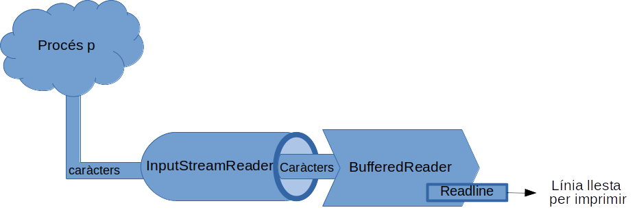

# 1. Conceptes

La programació concurrent és aquella en la que els programes poden tindre diversos processos o fils d'execució, que col·laboren per tal de realitzar un treball, aprofitant al màxim el rendiment de sistemes amb diversos nuclis.

La programació concurrent pot ser paral·lela i distribuïda:

* La **programació paral·lela** consisteix en la creació de programes que s'executen en un sol ordinador, tinga o no diversos nuclis (si només té un nucli, reparteix el tmos de procés entre diverses tasques)
* La **programació distribuïda** consisteix en la creació de programari que s'executa en diferents ordinadors, i que es comuniquen a través d'una xarxa. 


# 2. Creació de processos en Java: La classe processBuilder

En Java podem crear processos fent ús de la classe ProcessBuilder.

Amb aquesta classe podem crear un procés de la següent forma:

```java
ProcessBuilder pb;
pb = new ProcessBuilder(ruta_al_programa_a_executar);
pb.start();
```

***Exemple 1***

Veiem un exemple complet que llança per exemple el Firefox. El següent fitxer s'anomena **launcher.java**:

```java
public class launcher {
    public static void main(String[] args) {
        try{
            String app="firefox";
            ProcessBuilder pb;
            System.out.println("Starting "+app);
            pb=new ProcessBuilder(app);
            pb.start();
            System.out.println(app+" launch finished");
            
        } catch (Exception e){
            e.printStackTrace();
        }

    }
 }
```
Compilem i llancem el procés:

```bash
$ javac launcher.java 
joamuran@toki:~/java/processos$ java launcher 
Starting firefox
firefox launch finished
```

I veurem com es llança el firefox.

La classe ProcessBuilder és la classe recomanada des de Java 1.5 per a la creació de processos. Aquesta, en realitat, es tracta d'una classe auxiliar de la classe **Process**. Quan creem un nou objecte de la classe ProcessBuilder, com el seu nom indica creem un *Creador de Processos*, amb unes característiques concretes (com és l'ordre que es llançarà al procés, i els seus arguments). La instanciació de l'objecte de la classe Process, es produeix quan invoquem al mètode start de Process Builder. D'aquesta manera, si invoquem, per exemple dues vegades el mètode start, crearem dos instàncies de la classe Process (i.e. dos processos diferents.)


***Exemple 2***

Veiem el mateix exemple, però creant dos processos de Firefox (**fitxer launcher2.java**):

```java
public class launcher2 {
    public static void main(String[] args) {
        try{
            String app="firefox";
            Process p1, p2;
            ProcessBuilder pb;

            pb=new ProcessBuilder(app);

            p1=pb.start();
            p2=pb.start();

            System.out.println("Primera instànicia de "+app+" amb PID "+p1.pid());
            System.out.println("Segona instància de "+app+" amb PID "+p2.pid());
  
        } catch (Exception e){
            e.printStackTrace();
        }

    }
 }
```

Veiem alguns detalls del programa:

* Hem declarat p1 i p2 com a objectes de la classe Process, però tingueu en compte que no els hem creat (no hem fet un `new Process`. Açò es deu a que la classe Process és una classe abstracta, i no pot ser instanciada. Quan fem la crida al mètode start, ja és aquest qui s'encarrega d'instanciar-lo amb la classe java.lang.ProcessImpl, que és una classe final.
* La classe `Process`, des de la versió 9 de java, disposa d'un mètode anomenat `pid()`, que ens retorna l'identificador del procés.
  
* Com podem comprovar doncs, s'han creat dos processos, amb un pid diferent cadascun:

```bash
$ javac launcher2.java
$ java launcher2
Primera instànicia de firefox amb PID 7081
Segona instància de firefox amb PID 7085
```

### Alguns mètodes més de ProcessBuilder

La classe ProcessBuilder admet diversos mètodes més, com podem veure a [https://docs.oracle.com/javase/10/docs/api/java/lang/ProcessBuilder.html](https://docs.oracle.com/javase/10/docs/api/java/lang/ProcessBuilder.html). Alguns dels més interessants són `directory()`, per tal d'indicar el directori de treball en què s'executarà l'ordre que li indiquem, `command()`, per especificar l'ordre a executar si no l'hem indicat en la creació, i `environment()`, si volem especificar les variables d'entorn de l'execució.


# 3. Les classes Process i Runtime

> ***Documentació***
>
> * [https://docs.oracle.com/javase/10/docs/api/java/lang/Runtime.html](https://docs.oracle.com/javase/10/docs/api/java/lang/Runtime.html)
> * [https://docs.oracle.com/javase/10/docs/api/java/lang/Process.html](https://docs.oracle.com/javase/10/docs/api/java/lang/Process.html)

## 3.1. La classe `Runtime`

L'API de Java per a la gestió de processos, a banda de la classe ProcessBuilder i Process, es completa amb la classe Runtime. Veiem quina és la funcionalitat d'aquestes.

La classe `Runtime` encapsula l'entorn d'execució d'un programa. Es tracta també d'una classe abstracta, i no es pot instanciar. Si volem obtindre l'entorn d'execució d'un programa, podem fer ús del mètode estàtic `Runtime.getRuntime()`. Veiem el seu ús en un exemple:

***Exemple 3***

```java
// package com.eljust.psp;

public class RuntimeDemo {

   // r serà una referència a l'entorn d'execució actual
   protected Runtime r=Runtime.getRuntime();


   protected void mostraInfo(){
      // r.availableProcessors() ens diu els processadors que tenim disponibles
      System.out.println("Processadors disponibles: "+ this.r.availableProcessors());
   }

   protected void mostraEntorn(){
      
      // r.totalMemory() ens indica la quantitat de memòria reservada per a la JVM
      System.out.println("Memòria Total: "+this.r.totalMemory());
      
      // r.freeMemory() ens indica la memòria lliure en la JVM
      System.out.println("Memòria Lliure: "+this.r.freeMemory());
      
      // Per calcular la memòria ocupada, restem la memòria lliure a la memòria total
      System.out.println("Memòria ocupada: "+(this.r.totalMemory()-this.r.freeMemory()));
   }

   protected void NetejaFem(){
      this.r.gc();
   }

   public static void main(String[] args) throws Exception {

      RuntimeDemo rd=new RuntimeDemo();

      rd.mostraInfo();
      System.out.println("\nEstat inicial..");

      // Anem a crear uns quants objectes per plenar memòria
      rd.mostraEntorn();
      for(int i=0;i<=10000;i++){
            new Object();
      }
      
      System.out.println("\nEstat després de crear 10.000 objectes..");
      rd.mostraEntorn();
      
      // I ara invoquem el recol·lector de fem, perquè ens netege les referències
      rd.NetejaFem();

      // I tornem a obtindre les mateixes dades
      System.out.println("\nEstat després de cridar el recol·lector de fem..");
      rd.mostraEntorn();
   }
}
```

Compilem i executem el programa:

```shell
$ javac RuntimeDemo.java
$ java RuntimeDemo
Processadors disponibles: 4

Estat inicial..
Memòria Total: 132120576
Memòria Lliure: 130023424
Memòria ocupada: 2097152

Estat després de crear 10.000 objectes..
Memòria Total: 132120576
Memòria Lliure: 129727760
Memòria ocupada: 2392816

Estat després de cridar el recol·lector de fem..
Memòria Total: 10485760
Memòria Lliure: 9563448
Memòria ocupada: 922312
```

Com veiem, després de la creació de 10.000 objectes la memòria ocupada és major que l'estat inicial, i posteriorment, després d'invocar el recol·lector de fem, aquesta és considerablement menor. 

Per altra banda, cal dir també que la classe `Runtime` disposa d'un mètode sobrecarregat anomenat `exec()` que permet llençar ordres en processos separats. Podeu donar-li un cop d'ull a la documentació d'aquesta classe per veure com funciona el mètode. De tota manera, i com ja hem comentat, la forma recomanada de crear processos és amb la classe ProcessBuilder.

## 3.2. La classe `Process`

Tornem a la classe Process, de la que ja hem parlat una mica abans. Com hem dit, la classe `Process` és una classe abstracta -no es pot instanciar- i està definida al paquet java.jang. Quan s'invoca al mètode `exec` d'una instància de la classe `Runtime`, es retorna un objecte de la classe `Process`, que encapsula la informació de l'entorn d'execució del procés. Així doncs, amb el mètode `exec` de `Runtime`, tenim una altra forma de crear processos, alternativa a `ProcessBuilder.start()`.

La classe `Process` retornada per `Runtime.exec` i `ProcessBuilder.start()`, pot utilitzar-se per tal de realitzar operacions d'entrada i eixida dels processos, comprovar l'estat en què un procés ha finalitzat, esperar a què aquest acabe, o finalitzar-lo forçosament.

Cal tindre en compte, que a diferència de Bash, els processos creats d'aquesta forma no tenen una consola associada (tty), pel que no podem redirigir les entrades o eixides estàndard (stdin, stdout i stderr). Per a això, podem accedir a través de streams oferits per diversos mètodes de la classe Process. Alguns dels més comuns són:

* `InputStream getErrorStream()`: Retorna el flux d'entrada connectat a l'eixida d'error del procés.
* `InputStream getInputStream()`: Retorna el flux d'entrada connectat a l'eixida estàndard del procés.
* `OutputStream getOutputStream()`: Retorna el flux d'eixida connectat a l'entrada normal del procés.

**Compte!** Quan utilitzem aquestos tres mètodes, caldrà tindre en compte que els búffers d'entrada i eixida tenen una longitud limitada, pel que si no es s'escriuen i llegeixen tot seguit poden arribar a bloquejar el subprocés.

* `int exitValue()`: Retorna el codi d'eixida del procés executat.
* `Boolean isAlive()`: Comprova si el procés fill segueix en execució.
* `int waitFor()`: Espera que el procés fill finalitze. El valor enter que s'obté és el codi d'eixida del procés.
* `Boolean waitFor(long timeOut, TimeUnit unit)`: Es tracta d'una sobrecàrreca del mètode anterior, en la que podem especificar el temps d'espera. Retornarà cert si el procés segueix en execució després del temps indicat i fals en cas contrari.
* `void destroy()`, `Process destroyForcibly()`: Forcen la terminació del procés. 

***Exemple 4***

Veiem una modificació de l'Exemple 1 en què utilitzem algunes d'aquestes funcions:

```java
import java.util.concurrent.TimeUnit;

public class launcher3 {
    public static void main(String[] args) {
        try{
            String app="pluma";
            ProcessBuilder pb;
            Process p;
            Boolean isProcessDead;

            System.out.println("Iniciant "+app);
            pb=new ProcessBuilder(app);

            p=pb.start();
            System.out.println(app+" s'ha carregat. Esperant 3 segons");

            // WaitFor retorna un booleà dient si el procés està en execució al cap dels segons que li diem
            isProcessDead=p.waitFor(3, TimeUnit.SECONDS);

            if (!isProcessDead){ 
                // Destruim el procés si aquest segueix "viu"
                    System.out.println("Destruint l'aplicació "+app);
                    p.destroy(); 
                }
            
            // Esperem que el procés estiga destruit
            // per a això, cal comprovar el mètode isAlive
            // Mentre el procés estiga viu escriurem un missatge
            // El fet d'utilitzar el comptador és per no 
            // sobrecarregar l'eixida
        
            int comptador=0;
            while(p.isAlive()) {
                comptador++;
                if (comptador==10000){
                    System.out.println("El procés segueix viu..");
                    comptador=0;
                }
            };

            System.out.println("El procés s'ha detsruit.");

     
        } catch (Exception e){
            e.printStackTrace();
        }

    }
 }
```
Veiem l'eixida de la compilació i l'execució:

```shell
$ javac launcher3.java
$ java launcher3
Iniciant pluma
pluma s'ha carregat. Esperant 3 segons
Destruint l'aplicació pluma
El procés segueix viu..
El procés segueix viu..
El procés segueix viu..
El procés segueix viu..
El procés segueix viu..
El procés segueix viu..
El procés segueix viu..
El procés s'ha detsruit.

```

# 4. Gestionant l'entrada i eixida dels processos

Anem a veure un exemple de com treballar amb els streams d'entrada i eixida dels processos. El següent exemple mostra com executar una ordre del sistema operatiu i redirigir l'eixida del procés a l'eixida estàndard:

```java

import java.io.BufferedReader;
import java.io.InputStreamReader;

public class StreamsIODemo {

   public static void main(String[] args) {

      System.out.println
         ("------------- Calendari de l'any 2020 -----------------");
      try {

        // En primer lloc, creem l'objecte ProcessBuilder, 
        // i l'inicialitzem amb l'ordre que anem a utilitzar.
         ProcessBuilder pb = new
            ProcessBuilder("cal", "2020");

        // Llancem el procés, i recollim l'objecte 
        // Process que ens retorna.
         Process p=pb.start();

         // Llegim l'eixida del procés amb getInputStream,
         // I la bolquem per pantalla, passant-la per InputStreamReader
         BufferedReader br=new BufferedReader(
            new InputStreamReader(
               p.getInputStream()));
            String line;
            while((line=br.readLine())!=null){
               System.out.println(line);
            }
      } catch (Exception e) {
         e.printStackTrace();
      }
      System.out.println
         ("-----------------------------------------------");
   }
}
```

Com podem vore, hem de fer ús de les classes java.io.BufferedReader i java.io.InputStreamReader. Com hem comentat, el mètode `getInputStream()` de la classe `Process`, ens retorna el flux d'entrada connectat a l'eixida del procés. És a dir, l'eixida del procés, ens l'ofereix com un flux de dades. Per tal de poder llegir-lo, necessitem un objecte de la classe `InputStreamReader` inicialitzat amb el flux que ens ofereix el procés. I finalment, un objecte de la classe `BufferedReader`, que llegeix d'aquest `InputStreamReader`.

Gràficament, quedaría així: El procés envía un flux de caràcters que connectem amb `InputStreamReader` a través del mètode `getInputStream` del procés. Aquest flux de caràcters va emmagatzemant-se en l'objecte de tipus `BufferedReader`, fins que té una línia preparada, que llegim amb `readLine`.



***Sobre la codificació de caràcters***

Un aspecte a tindre en compte quan treballem amb streams és la codificació de la informació que s'intercanvia entre els processos, i que depèn del sistema operatiu en què estiguem treballant. La majoría de sistemes (GNU/Linux, Mac OS, Android, iOS..) fan ús de la codificació UTF-8, basada en l'estàndard Unicode. Per la seua banda, MS Windows utilitza els seus propis formats, incompatibles amb la resta, com Windows-Western. Així que per tractar les dades correctament en Java quan fem ús de mecanismes de comunicació entre processos més avançats, caldrà tindre en compte el tipus de codificació que el propi sistema utilitza.


## 4.1. Redirecció a fitxers

L'eixida d'un procés, també pot redirigit-se a un fitxer. Una forma de fer-ho és mitjançant la classe FileWriter:

```java
import java.io.BufferedReader;
import java.io.BufferedWriter;
import java.io.File;
import java.io.FileWriter;
import java.io.InputStreamReader;

public class StreamsIODemo2 {

   public static void main(String[] args) {

      try {

        // En primer lloc, creem l'objecte ProcessBuilder, 
        // i l'inicialitzem amb l'ordre que anem a utilitzar.
         ProcessBuilder pb = new
            ProcessBuilder("cal", "2020");

        // Llancem el procés, i recollim l'objecte 
        // Process que ens retorna.
         Process p=pb.start();

         // Llegim l'eixida del procés amb getInputStream,
         // a través d'InputStreamReader i BufferedReader
         BufferedReader br=new BufferedReader(
            new InputStreamReader(
               p.getInputStream()));

               // I bolquem l'eixida a un nou fitxer, amb un 
               // BufferedWriter, i de forma molt similar
               // a l'exemple anterior
               BufferedWriter bw=new BufferedWriter(
                  new FileWriter(new File("calendari2020.txt")));
                  String line;
                  while((line=br.readLine())!=null){
                     bw.write(line+"\n");
                  }
                  bw.close();

      } catch (Exception e) {
         e.printStackTrace();
      }
   }
}
```

Com podem comprovar, aquest exemple és molt paregut a l'anterior, amb la diferència que en lloc de mostrar la línia que obtenim del BufferedReader per pantalla, l'escrivim a través d'un BufferedWriter a un fitxer anomenat `calendar20.txt`.


## 4.2. Redirecció a fitxers amb ProcessBuilder

La classe `ProcessBuilder` ens oferix una forma més senzilla de redirigir l'eixida d'un procés que hem creat a un fitxer: el mètode `redirectOutput`. Amb aquest mètode, simplement haurem d'indicar en quin fitxer volem escriure l'eixida d'un procés.

```java
import java.io.File;

public class StreamsIODemo3 {

   public static void main(String[] args) {

      try {

        // En primer lloc, creem l'objecte ProcessBuilder, 
        // i l'inicialitzem amb l'ordre que anem a utilitzar.
        ProcessBuilder pb = new ProcessBuilder("cal", "2020");

        // Redirigim l'eixida del procés a un fitxer
        pb.redirectOutput(new File("calendari2020_v2.txt"));

        // Llancem el procés
         pb.start();

      } catch (Exception e) {
         e.printStackTrace();
      }
   }
}
```

Com veiem, aquesta solució és bastant més senzilla que la de l'exemple anterior.

# 5. Programació multiprocés

Quan volem realitzar una aplicació en la que diferents processos col·laboren entre ells, intercanviant informació i sincronitzant-se, per tal de resoldre un problema, hem de tindre en compte les següents pautes:

1. Identifica en primer lloc quina o quines funcions van a realitzar l'aplicació i quina relació hi ha entre elles.
2. Distribueix les diferents funcions en processos, i estableix els mecanismes de comunicació entre ells. Cal tindre en compte també, que aquesta comunicació implica certa pèrdua de temps, pel que és convenient que aquesta comunicació siga mínima.
3. Una vegada hem descomposat i dividit el problema, realitzem la implementació de la solució plantejada.

***Exemple***
Veiem un exemple senzill. Volem calcular la suma de tots els números existents entre dos números concrets. Per exemple, si donem com a paràmetres d'entrada 3 i 7, obtindrem la suma de 3+4+5+6+7. Com veiem, es tracta d'un problema bastant senzill. Per tal de millorar el rendiment, anem a dividir el problema en dues parts iguals; és a dir, si volem fer la suma entre 1 i 100, farem la suma entre 1 i 50 en un procés i entre 51 i 100 en altre, realitzant la suma d'ambdós resultats al final.

Per a això, crearem dos classes en Java:

* Una classe que s'encarregue de realitzar la suma pròpiament dita entre dos números.
* Una classe que s'encarregue de dividir l'entrada i crear els processos corresponents per realitzar les sumes.

Hem incorporat el codi a un paquet anomenat com.psp.sumatori, i els fitxers creats són Suma.java i Runner.java.

**Fitxer com/psp/sumatori/Suma.java**

```java
package com.psp.sumatori;

public class Suma {
    public Long suma(long n1, long n2){
            /* Realitza la suma entre tots els números
               compresos entre n1 i n2
            */
            long result=0;
            for (long i=n1;i<=n2;i++){
                    result=result+i;
            }
            return result;
    }

    public static void main(String[] args){
        Suma s=new Suma();
        // La llista d'arguments és un vector d'strings,
        // pel que cal convertir-los a enters llargs (LONG).
        Long r=s.suma(Long.parseLong(args[0]),Long.parseLong(args[1]));

        // El resultat el bolcarem per l'eixida estàndard
        System.out.println(r);
    }

}
```

**Fitxer com/psp/sumatori/Runner.java**

```java
package com.psp.sumatori;

import java.io.BufferedReader;
import java.io.InputStreamReader;

public class Runner {
    public Long run (Long n1, Long n2){
        /* Aquesta classe s'encarrega d'invocar 
           la classe com.psp.sumatori.Suma en un
           procés, i retorna un enter llarg amb la suma.
           Per tal de comunicar-se amb Suma, 
           com que aquesta escriu per la seua eixida
           estàndard el resultat, l'haurem de llegir amb
           el mètode getInputStream de la classe Process
           i processar-lo com un Stream d'entrada, com 
           hem vist anteriorment.
        */
        ProcessBuilder pb;
        try {
            // Creem un objecte de la classe processBuilder
            pb = new ProcessBuilder("java","com.psp.sumatori.Suma",
                                n1.toString(),
                                n2.toString());

            // Llancem el procés
            Process p=pb.start();

            // Llegim l'eixida estàndard
            BufferedReader br=new BufferedReader(
                                  new InputStreamReader(
                                       p.getInputStream()));
            String line;
            while((line=br.readLine())!=null){
                // Quan tenim una línia (que serà la única eixida)
                // la retornem al programa principal convertida en Long.
                return Long.parseLong(line);
                }

        } catch (Exception e) {
            e.printStackTrace();
        }
                return 0L;
    }

    public static void main(String[] args){
        Runner r=new Runner();

        // Comprovem el nombre d'arguments
        if (args.length!=2) {
            System.out.println("Nombre d'arguments incorrecte.");
            System.exit(0); 
        };

        // Convertim els paràmetres a números
        Long index1=Long.parseLong(args[0]);
        Long index2=Long.parseLong(args[1]);

        // Ordenem els índex, per si el primer és major que el segon
        if (index1>index2){
            Long tmp=index1;
            index1=index2;
            index2=tmp;
        }

        // Particionem el rang de valors en dos rangs iguals
        Long meitat=((index2-index1)/2)+index1;

        // Invoquem els processos per realitzar els càlculs
        Long sumand1=r.run(index1, meitat);
        Long sumand2=r.run(meitat+1, index2);

        // Obtenim finalment el resultat
        System.out.println(sumand1+"+"+sumand2+"="+(sumand1+sumand2));
    }
}
```

Fixem-nos en el codi. El mètode `main` de la classe `Runner` és qui s'encarrega de capturar l'entrada al programa i dividir el rang d'entrada en dos subrangs, per invocar al mètode `run` amb cadascuna de les parts i després combinar els resultats.

Anem a veure quin és el resultat. En primer lloc, compilem les dues classes (tinguem en compte que estem fent dues classes d'un mateix maquet com.psp.sumatori, pel que cal tindre l'estructura de directoris adeqüada):

```shell
$javac com/psp/sumatori/Suma.java
$javac com/psp/sumatori/Runner.java
```

Una vegada compilats, podem llençar el programa, donant-li, per exemple que ens calcule la suma de números de l'1 al 100:

```shell
$java com.psp.sumatori.Runner 1 100
1275+3775=5050
```
Com veiem, ha dividit el problema en dos parts, i hem obtingut el resultat, però... com afecta el paral·lelisme que hem aplicat a millorar la solució? Realment, obté temps d'espera millors?

Per a això, anem a fer ús de l'ordre de Bash `time`, que ens dóna el temps que tarda en realitzar-se un procés. Com que la classe `Suma` també es pot llençar des de l'intèrpret d'ordres, mesurarem què tarda cada classe per al mateix rang de valors.

Veiem què tarda en fer la suma del rang 1..100 la classe `Suma`:

```shell
$ time java com.psp.sumatori.Suma 1 100
5050

real	0m0,146s
user	0m0,160s
sys	0m0,033s
```
No està malament... 0,146 segons. Veiem el mateix amb la classe Runner:

```shell
$ time java com.psp.sumatori.Runner 1 100
1275+3775=5050

real	0m0,500s
user	0m0,723s
sys	0m0,083s
```
Com veiem, el resultat és el mateix, però el temps d'execució (0,5s) ha segut considerablement superior. Com ens podem explicar açò?

Una possible explicació pot ser el que coneixem com *canvi de context*. El canvi de context és el moment en què el processador passa d'estar executant un procés a executar-ne altre. Al nostre cas, tenim un procés principal (Runner) i dos subprocessos més (Suma). El fet d'haver de dividir el problema i gestionar més d'un procés, és possible que faça que per a problemes relativament menuts es perda més temps realitzant aquestes tasques que resolent el problema en sí.

Veiem què passa amb rangs més grans:

```shell
$ time java com.psp.sumatori.Suma 1 10000000
50000005000000

real	0m0,147s
user	0m0,171s
sys	0m0,024s
```

```shel
$ time java com.psp.sumatori.Runner 1 10000000
12500002500000+37500002500000=50000005000000

real	0m0,542s
user	0m0,770s
sys	0m0,071s
```

En aquest cas, sembla que segueix sent més lent el fet d'utilitzar computació paral·lela... és possible que el problema siga un altre... Revisa el codi del mètode `run`. Veus alguna cosa estranya?

Fixem-nos en el següent tros de codi:

```java
        // Llegim l'eixida estàndard
        BufferedReader br=new BufferedReader(
                              new InputStreamReader(
                                   p.getInputStream()));
        String line;
        while((line=br.readLine())!=null){
            // Quan tenim una línia (que serà la única eixida)
            // la retornem al programa principal convertida en Long.
            return Long.parseLong(line);
            }
```
Es tracta de la lectura de l'eixida del procés `suma`. Als fitxers d'exemple de la unitat, disposes del fitxer `Runner.java` amb diversos missatges de depuració `(System.out.println)`, que indiquen el seguiment de l'execució del programa. 

El codi de dalt, completat amb aquests missatges és el següent:

```java
    Process p=pb.start();
    System.out.println("Hem llançat el procés amb start");

    // Llegim l'eixida estàndard
    BufferedReader br=new BufferedReader(
                          new InputStreamReader(
                               p.getInputStream()));
    System.out.println("Hem creat el búffer de lectura. Esperant que s'ompliga");
    String line;
    while((line=br.readLine())!=null){
        System.out.println("Buffer preparat");
        // Quan tenim una línia (que serà la única eixida)
        // la retornem al programa principal convertida en Long.
        return Long.parseLong(line);
        }
```

Executa la classe Runner amb els següents paràmetres i observa'n el resultat:

```bash
$ java com.psp.sumatori.Runner 1 10000000000
Anem a llançar el primer run
Anem a llançar el procés.
Hem llançat el procés amb start
Hem creat el búffer de lectura. Esperant que s'ompliga  ---> {..pausa..}
Buffer preparat
Anem a llançar el segon run
Anem a llançar el procés.
Hem llançat el procés amb start
Hem creat el búffer de lectura. Esperant que s'ompliga  ---> {..pausa..}
Buffer preparat
S'han finalitzat els dos processos. Calculant.
-5946744071209551616+606511855080896768=-5340232216128654848
```

Independentment de l'error del resultat, ja que hem desbordar la capacitat dels enters llargs amb la suma, si ens fixem, el procés ha fet dues aturades, concretament, cadascuna d'elles entre els missatges `Hem creat el búffer de lectura. Esperant que s'ompliga`i `Buffer preparat`. Què ens indica açò? Doncs que l'ordre `while((line=br.readLine())!=null)` que està a l'espera que s'òmpliga el búffer és una ordre **bloquejant**. Això significa que tot i que hajam dividit el problema en dos processos, fins que no es llegeix el búffer d'eixida d'un, no es llança el següent procés. Es tractaría doncs d'un mal disseny, ja que realment, no llancem els processos en paral·lel, sinò que llancem el segon quan el primer ha acabat, ja que ens estem esperant a la resposta del segon.

Una possible solució a açò és la que es mostra en la classe Runner2, i que consisteix a llançar el procés, i en lloc d'esperar que el búffer estiga preparat, es retorna el BufferedReader corresponent al procés, de manera que es puga llençar el segon de forma simultània, i després llegir ja, un rere l'altre els resultats dels búffers.

Veiem el codi resultant:

**Fitxer com/psp/sumatori/Runner2.java**

```java
package com.psp.sumatori;

import java.io.BufferedReader;
import java.io.InputStreamReader;

public class Runner2 {
    public BufferedReader run (Long n1, Long n2){
        /* Aquesta classe s'encarrega d'invocar 
           la classe com.psp.sumatori.Suma en un
           procés, i retorna un enter amb la suma.
           Per tal de comunicar-se amb Suma, 
           com que aquesta escriu per la seua eixida
           estàndard el resultat, l'haurem de llegir amb
           el mètode getInputStream de la classe Process
           i processar-lo com un Stream d'entrada, com 
           hem vist anteriorment.
        */
        ProcessBuilder pb;
        try {
            // Creem un objecte de la classe processBuilder
            pb = new ProcessBuilder("java","com.psp.sumatori.Suma",
                                n1.toString(),
                                n2.toString());

            // Llancem el procés
            System.out.println("Anem a llançar el procés.");
            Process p=pb.start();
            System.out.println("Hem llançat el procés amb start");

            // Capturant l'eixida estàndard
            BufferedReader br=new BufferedReader(
                                  new InputStreamReader(
                                       p.getInputStream()));
            
            System.out.println("Es retorna el BufferedReader");
            return br;

        } catch (Exception e) {
            e.printStackTrace();
        }
                return null;
    }

    public long readFromBuffer(BufferedReader br){
        /*
        Nova funció que llegeix del BufferedReader que li passem
        com a paràmetre i retorna l'eixida del procés en format Long.
         */
        try{
            
            String line;
            while((line=br.readLine())!=null){
                System.out.println("Esperant que es plene el buffer");
                // Quan tenim una línia (que serà la única eixida)
                // la retornem al programa principal convertida en Long.
                return Long.parseLong(line);
                }

        } catch (Exception e) {
            e.printStackTrace();
        }
        return 0L;

            
    }

    public static void main(String[] args){
        Runner2 r=new Runner2();

        // Comprovem el nombre d'arguments
        if (args.length!=2) {
            System.out.println("Nombre d'arguments incorrecte.");
            System.exit(0); 
        };

        // Convertim els paràmetres a números
        Long index1=Long.parseLong(args[0]);
        Long index2=Long.parseLong(args[1]);
        

        // Ordenem els índex, per si el primer és major que el segon
        if (index1>index2){
            Long tmp=index1;
            index1=index2;
            index2=tmp;
        }

        // Particionem el rang de valors en dos rangs iguals
        Long meitat=((index2-index1)/2)+index1;

        // Invoquem els processos per realitzar els càlculs
        System.out.println("Anem a llançar el primer run");
        BufferedReader br1=r.run(index1, meitat);
        System.out.println("Anem a llançar el segon run");
        BufferedReader br2=r.run(meitat+1, index2);
        System.out.println("S'han finalitzat els dos processos. Esperant els búffers.");

        long sumand1=r.readFromBuffer(br1);
        System.out.println("S'ha llegit el primer búffer. Esperant el segon.");
        long sumand2=r.readFromBuffer(br2);
        System.out.println("S'ha llegit el segon búffer. Calculant resultat.");
        
        // Obtenim finalment el resultat
        System.out.println(sumand1+"+"+sumand2+"="+(sumand1+sumand2));
    }
}
```
Si compilem i comprovem l'eixida:

```shell
$ javac com/psp/sumatori/Runner2.java
$ java com.psp.sumatori.Runner2 1 10000000000
Anem a llançar el primer run
Anem a llançar el procés.
Hem llançat el procés amb start
Es retorna el BufferedReader
Anem a llançar el segon run
Anem a llançar el procés.
Hem llançat el procés amb start
Es retorna el BufferedReader
S'han finalitzat els dos processos. Esperant els búffers.
Esperant que es plene el buffer                        ---> {..pausa..}
S'ha llegit el primer búffer. Esperant el segon.       ---> {..pausa..}
Esperant que es plene el buffer
S'ha llegit el segon búffer. Calculant resultat.
-5946744071209551616+606511855080896768=-5340232216128654848
```

Si executeu l'exemple, veureu que es realitzen dues pauses més breus cap al final, per llegir els búffers, però no ha hagut bloqueig abans de llançar el segon procés. Hem aconseguit, doncs, llençar els processos en paral·lel, encara que al final ens hajam d'hagut d'esperar que els búffers estigueren preparats.

Calculem ara el temps requerit per cada exemple, per comprovar-ne el funcionament. Farem la suma de tots els números entre 1 i 9.999.999.999:

```shell
$ time java com.psp.sumatori.Suma 1 9999999999
-5340232226128654848

real	0m7,620s
user	0m7,642s
sys	0m0,028s
```
```shell
$ time java com.psp.sumatori.Runner 1 9999999999
-5946744071209551616+606511845080896768=-5340232226128654848

real	0m8,102s
user	0m8,341s
sys	0m0,076s
```

```shell
$ time java com.psp.sumatori.Runner2 1 9999999999
-5946744071209551616+606511845080896768=-5340232226128654848

real	0m6,162s
user	0m10,234s
sys	0m0,088s
```

Com ja hem comentat anteriorment, el resultat no és correcte, ja que hem desbordat la capacitat d'emmagatzemament dels enters llargs, però el que ens interessa, el temps de resposta, hem pogut comprovar com, finalment, el paral·lelisme incorporat a la classe Runner2 és l'opció més eficient, amb un temps de 6,162 segons front a 7,62 segons dels càlculs sense paral·lelisme, i de 8,102 segons de la suma paral·lelitzada amb un disseny ineficient.

# 6. Conclussions

En aquest document hem vist com crear processos amb Java, mitjançant la classe ProcessBuilder, i hem vist les classes Runtime i Process per obtindre informació del sistema i per gestionar processos respectivament.

També hem vist com comunicar processos a través de la redirecció dels fluxos d'entrada i eixida d'aquests. En temes posteriors veurem altres mecanismes més eficients de comunicació, com els sockets.